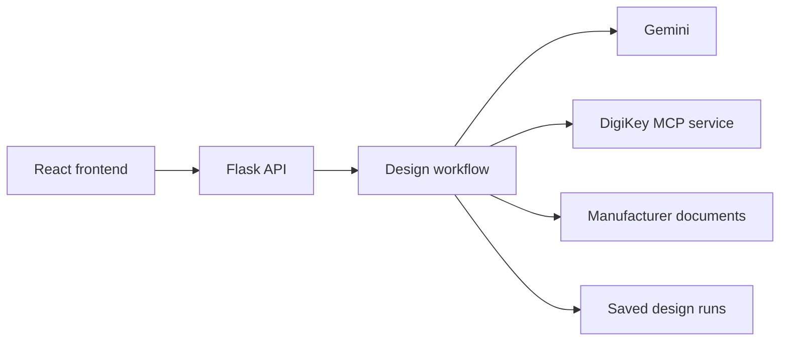

# Architecture

Jigsaw has a React single-page frontend, a Flask backend, and a local DigiKey MCP service.
The backend manages the design workflow and saved state. Gemini handles planning, source
interpretation, and review; application code handles catalog lookups, document downloads,
calculations, and persistence.

## Design workflow

1. Plan functional blocks and ask for clarification when needed.
2. Select exact catalog parts and read their manufacturer documents.
3. Establish a common operating configuration and add any missing functional components.
4. Run compatibility checks and model review, with a limited number of correction attempts.

The BOM covers functional components, including regulators, level translators, and drivers
needed by the device. Ordinary decoupling, pull-ups, feedback networks, and reset/boot
circuitry are recorded as notes for schematic design. Explicitly requested passives and
all selected parts are checked for their intended roles.

Review covers requested functions, supplies, current demand, logic levels, interfaces, and
resource compatibility. An identified functional or electrical error produces a failed verdict.
A completed review with no identified error passes; an unfinished review without an identified
error has no verdict. Missing evidence and unresolved quantities remain in diagnostics.
The generated BOM still requires engineering review before schematic design or purchasing.

## Data and persistence

[`DesignRun`](../backend/models.py) stores requirements, assumptions, component placements,
catalog offers, sources, configuration, findings, and usage. Each component represents one
physical placement. Model inputs and purchasing rows are derived from this record.

[`RunStore`](../backend/run_store.py) validates snapshots and writes them atomically as JSON.
Runtime data lives outside the source tree by default; see
[configuration](development.md#configuration) for storage settings. Refinement creates a
child run and preserves its parent. Changes to selected parts or source evidence require
the operating configuration and review to be rebuilt.

Purchasing rows group matching manufacturer, part number, and component package, multiply
placements by board quantity, and apply minimum quantities, order multiples, and price breaks.
Ordinary packaging is preferred to custom reeling with unquoted fees. Missing prices and
stock remain unknown. Reports show the quoted parts subtotal alongside checkout notes.

## Documents and checks

[`DocumentStore`](../backend/documents.py) downloads public HTTPS documents with size limits,
validated redirects, pinned DNS addresses, and TLS hostname verification. Original bytes are
cached by content hash. PDF sources provide extracted text and original pages; HTML sources
provide text and links.

Evidence links source statements and numerical values to selected parts, document pages,
and operating conditions. Calculations reference these values explicitly. References that
cannot be resolved remain diagnostic and do not become verified figures.

Code checks calculate supply ranges, summed current demand, logic thresholds, address
conflicts, regulator headroom, and thermal estimates under the recorded operating conditions.
Model review assesses source interpretation, operating conditions, resource feasibility,
and functional dependencies.

## Frontend

The run ID in the URL selects the saved design. `useDesignRun` manages generation, refinement,
cancellation, and snapshot loading. Ordered server-sent events update the active design;
responses from obsolete requests are ignored. Browser history restores saved runs through GET.

Reports show the functional BOM, purchasing details, assumptions, schematic notes, and
identified failures. The system map displays recorded relationships between components.
CSV exports contain purchasing rows; JSON exports include the complete report and diagnostics.

## Runtime

The backend accepts one active run per process. Work runs in the HTTP request handler, with
limits on model calls, tokens, source reads, supplier calls, and corrections. Detected
disconnects and restarts mark unfinished runs as interrupted; runs are not automatically resumed.

The DigiKey service supports HTTP and STDIO MCP transports. HTTP binds to loopback, rejects
browser origins, and limits retained sessions. OAuth authentication and catalog lookup share
an operation deadline. The backend reconnects an expired session once within that deadline.

The backend has no authentication or coordination between workers and is intended for
local or private use.
