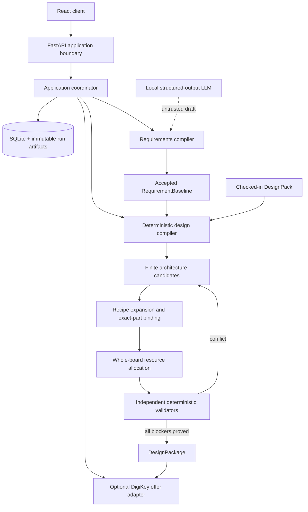

# Jigsaw backend architecture

**Status:** authoritative implementation design  
**Date:** 2026-09-13  
**Scope:** a free, local-first, single-user side project that compiles natural-language embedded-system requirements into an evidence-backed pre-layout logical design and exact engineering BOM (EBOM) inside a deliberately supported design family  
**Supersedes:** the earlier multi-agent/DigiKey pipeline and the earlier proposal that made KiCad generation part of the core acceptance predicate

## 1. Executive decision

Jigsaw is a **bounded design compiler**, not a collection of LLM agents, a catalog search assistant, or a PCB-layout system.

The backend accepts natural-language intent, converts it into a user-approved requirement baseline, deterministically searches a finite set of reviewed design recipes and exact-part profiles, expands every required support circuit, allocates board-wide resources, checks the resulting logical design across declared operating scenarios, and derives an exact-MPN EBOM from that checked design.

The canonical result is a `DesignPackage`:

```text
DesignPackage
├── accepted requirement baseline
├── architecture and decision record
├── concrete logical design
│   ├── exact component instances and package pins
│   ├── typed interfaces and physical nets
│   ├── rails and power roles
│   ├── MCU pin/peripheral/resource allocation
│   └── configuration and operating modes
├── discharged support-circuit obligations
├── exact-MPN hierarchical and flat EBOM
├── deterministic check results and margins
├── evidence manifest
├── firmware/configuration contract
└── downstream layout and physical-test constraints
```

An optional request-scoped `ProcurementPreview` prices exact MPNs from verified candidates; it is returned live, never persisted, and cannot mutate the engineering artifact.

A BOM is never the source of truth. It is a projection of the checked logical design. The same components can be connected into a working or broken circuit; therefore a flat list cannot itself establish compatibility.

The strongest v1 result is:

> **PRELAYOUT_VERIFIED_WITHIN_PACK:** The accepted requirements are inside an independently reviewed pack's applicability envelope; every required function and mandatory pre-layout support obligation is represented in the logical design; every blocking check passed for every declared scenario using admitted exact-part evidence; and the EBOM was derived from that checked design. The result is conditional on its enumerated physical assumptions and downstream constraints. Layout, signal/power integrity, EMC, manufacturability, safety certification, firmware behavior beyond declared resource/configuration contracts, and physical hardware performance are not claimed.

### 1.1 Fixed architectural decisions

| Question | V1 decision |
|---|---|
| Process model | One explicit deterministic compiler and a persisted application workflow |
| LLM role | Requirement drafting only; never trusted for compatibility, explanations of record, or release status |
| Circuit representation | A typed hierarchical logical design held in ordinary Python/Pydantic objects |
| Graph database | None |
| Circuit DSL/HDL | None; reviewed Python recipe builders construct the logical design through a small typed API |
| Design breadth | One finite embedded-board pack with bounded composition and exact part allowlists |
| Search | Deterministic depth-first enumeration with early pruning and complete-search accounting |
| Solver | None in v1 |
| Electrical validation | Pure deterministic validators over serialized design data and admitted evidence |
| Component truth | Checked-in exact-part profiles sourced from manufacturer documents and primary standards |
| DigiKey | Optional exact-MPN offer lookup after technical feasibility; no electrical truth |
| RAG/vector search | None in v1 |
| MCP | Removed from the internal path |
| LangChain/LangGraph | Removed |
| KiCad | Not part of v1 or its release predicate |
| Persistence | SQLite for mutable application state plus immutable per-run JSON/CSV artifacts |
| Deployment | One local FastAPI process and one dedicated background worker thread; no authentication or distributed infrastructure |

### 1.2 Scope boundary

Jigsaw automates the formalizable pre-layout portion of embedded-board design:

1. normalize requirements;
2. choose a supported architecture;
3. choose exact anchors, packages, configurations, and interfaces;
4. allocate rails, pins, buses, addresses, clocks, and debug resources;
5. instantiate mandatory support circuitry;
6. calculate and select exact passives and discretes;
7. construct a schematic-equivalent logical connectivity witness;
8. perform deterministic pre-layout checks;
9. produce a complete EBOM and evidence report.

It does not place or route a board and does not claim properties that require layout or measurement. A downstream constraint is emitted whenever the pre-layout result assumes something the eventual layout must satisfy.

## 2. Ground-up derivation

The architecture follows from the product claim rather than from the current repository.

### 2.1 Natural language cannot be the accepted engineering input

User prose routinely omits operating modes, maxima, tolerances, quantities, environmental bounds, and implementation assumptions. Structured model output fixes syntax but not meaning.

**Required consequence:** compilation begins only from an immutable, user-approved `RequirementBaseline`. The original text, every material source span, every normalized requirement, every assumption, and every unresolved clause remain traceable.

### 2.2 Compatibility is relational

Part compatibility depends on how components are powered, connected, configured, and used. Rail ranges, peak loads, driver roles, digital thresholds, I2C addresses, reset states, package pins, and support components cannot be checked from independent catalog rows.

**Required consequence:** the canonical artifact is a logical design with exact instances, terminals, nets, resources, configurations, and operating scenarios.

### 2.3 A complete EBOM requires support-circuit expansion

Anchors induce support obligations. An MCU may require package-specific decoupling, boot/reset, debug, clocks, and internal-regulator capacitors. A sensor may require local bypassing and address configuration. An I2C bus requires one board-scoped pull-up network. A regulator requires input/output networks whose valid values depend on its exact variant and operating envelope.

**Required consequence:** Jigsaw is anchor-first but recipe-expanded. It does not stop at anchors, and it does not ask an LLM to invent arbitrary circuits.

### 2.4 Manufacturer evidence and distributor metadata have different jobs

Distributor metadata is optimized for discovery and commerce. It does not reliably preserve min/typ/max semantics, operating conditions, suffix applicability, pin behavior, stability requirements, or reference-topology constraints. DigiKey also states that keyword-search price and availability can be stale and directs real-time use to product details ([DigiKey API FAQ](https://developer.digikey.com/faq/products-plans-and-apis)).

**Required consequence:** blocking engineering checks consume checked-in claims tied to exact manufacturer documents or primary standards. Provider data supplies only request-scoped commercial observations for already known exact MPNs.

### 2.5 Pre-layout verification has a physical boundary

Some calculations can be proven only under a physical bound. I2C pull-up validity depends partly on total bus capacitance; regulator thermal performance depends partly on PCB copper; crystal and RF behavior can depend on layout parasitics. The NXP I2C specification explicitly relates pull-up bounds to voltage, sink capability, rise time, and bus capacitance ([NXP UM10204](https://www.nxp.com/docs/en/user-guide/UM10204.pdf)).

**Required consequence:** the compiler either proves the design under an explicit downstream bound or rejects the topology as unsupported. It never converts an unmodeled physical dependency into a green check.

### 2.6 Arbitrary electronics is not a finite verification domain

No small project can encode every analog, RF, power, safety, timing, thermal, and manufacturing rule. Verification can be meaningful only relative to a declared rule and evidence universe.

**Required consequence:** a `DesignPack` defines an executable applicability envelope, finite architecture grammar, exact part universe, recipes, validators, and exclusions. Requests outside the envelope produce `UNSUPPORTED`, not plausible-looking output.

### 2.7 Existing prior art demonstrates implementability

This architecture does not depend on a research result. Its core pattern has already been implemented in more general systems: Polymorphic Blocks uses hierarchical blocks, generators, abstract parts, parameter propagation, electrical checks, passive selection, and BOM/netlist generation, and has produced physical boards ([project documentation](https://github.com/BerkeleyHCI/PolymorphicBlocks)). Jigsaw deliberately implements a smaller, fixed-pack subset in ordinary Python.

## 3. System architecture



There are two deliberately separate workflows.

### 3.1 Design runtime

The user runtime consumes only accepted baselines and already admitted pack content. It performs no datasheet extraction, no automatic evidence admission, and no open-ended topology generation.

### 3.2 Pack authoring

Maintainers add exact-part profiles, recipes, evidence, validators, and fixtures through reviewed repository changes. Runtime discovery can report an unprofiled candidate as an unsupported suggestion, but that part cannot enter a verified design until it is added to a pack and passes pack tests.

This separation keeps untrusted document interpretation outside the release path.

## 4. Dependency architecture and code layout

The backend is one modular Python monolith.

```text
backend/
├── pyproject.toml
├── uv.lock
├── migrations/
│   └── 001_initial.sql
├── src/jigsaw/
│   ├── domain/
│   │   ├── values.py
│   │   ├── requirements.py
│   │   ├── parts.py
│   │   ├── design.py
│   │   ├── obligations.py
│   │   ├── checks.py
│   │   └── outputs.py
│   ├── packs/
│   │   ├── protocol.py
│   │   ├── registry.py
│   │   └── embedded_i2c_v1/
│   │       ├── pack.py
│   │       ├── requirements.py
│   │       ├── architecture.py
│   │       ├── recipes.py
│   │       ├── allocation.py
│   │       ├── validators.py
│   │       ├── parts/*.json
│   │       ├── evidence/*.json
│   │       └── fixtures/
│   ├── engine/
│   │   ├── match.py
│   │   ├── enumerate.py
│   │   ├── elaborate.py
│   │   ├── allocate.py
│   │   ├── verify.py
│   │   ├── rank.py
│   │   └── compile.py
│   ├── application/
│   │   ├── projects.py
│   │   ├── intake.py
│   │   ├── runs.py
│   │   ├── worker.py
│   │   ├── procurement.py
│   │   └── ports.py
│   ├── adapters/
│   │   ├── ollama.py
│   │   ├── digikey.py
│   │   ├── sqlite.py
│   │   └── artifacts.py
│   ├── api/
│   │   ├── main.py
│   │   ├── projects.py
│   │   ├── requirements.py
│   │   ├── runs.py
│   │   └── procurement.py
│   └── cli.py
└── tests/
```

The enforced dependency direction is:

```text
domain <- packs <- engine <- application <- api / cli
                                  ^
                               adapters
```

Rules:

- `domain` has no filesystem, database, network, clock, environment, or model imports.
- `packs` depend only on `domain`; pack builders are pure functions.
- `engine` depends only on `domain` and installed packs and is deterministic for a frozen input.
- `application/ports.py` defines `StructuredModel`, `OfferProvider`, and `ArtifactStore`; `application` imports only these protocols.
- `adapters` implement the application-owned side-effecting ports.
- `application` owns transactions, run state, approvals, and orchestration but contains no electrical rules.
- `api/main.py` is the sole composition root and wires application services to concrete adapters; other API modules and `cli` contain transport code only.
- An import-boundary test fails CI when these directions are violated.

## 5. Fixed implementation stack

| Concern | Implementation |
|---|---|
| Language | CPython `>=3.12,<3.13`, with the complete dependency set locked |
| Environment/lock | `uv`, committed `uv.lock`, and `uv sync --frozen` in local/CI setup |
| HTTP service | FastAPI and Uvicorn, bound to `127.0.0.1` by default |
| Boundary schemas | Pydantic v2 discriminated models |
| Units | Pint with a single `UnitRegistry(non_int_type=Decimal)`; persisted magnitudes are canonical decimal strings |
| Mutable state | Standard-library `sqlite3`, foreign keys enabled, WAL journal mode |
| Immutable artifacts | Canonical JSON and CSV in `data/runs/<run-id>/`, written by temporary file plus `os.replace` |
| HTTP clients | `httpx` with explicit timeouts and no implicit retries |
| Local model runtime | Ollama `qwen3:8b-q4_K_M`; JSON-Schema constrained; temperature zero; thinking disabled; resolved digest recorded |
| Tests | pytest, Hypothesis, Ruff, and Pyright |
| Logging | Structured JSON records with project/run/stage IDs; no LangSmith requirement |
| Process model | One Uvicorn process plus one standard-library background thread consuming the persisted queue |

Ollama accepts JSON Schema for structured output, including schemas generated by Pydantic ([Ollama structured outputs](https://docs.ollama.com/capabilities/structured-outputs)). Its official registry publishes the fixed `qwen3:8b-q4_K_M` artifact used here ([Ollama qwen3 tags](https://ollama.com/library/qwen3/tags)). V1 has no alternate runtime model or cloud fallback. Startup verifies the configured tag resolves to the digest admitted by the release configuration. That digest must pass the intake suite; otherwise natural-language intake is disabled while manual structured input remains available. A model can cause a bad draft or a clarification, but cannot cause a design to pass deterministic checks.

There is no ORM, migration framework, Redis, Celery, Temporal, PostgreSQL, graph store, vector store, container cluster, authentication service, or microservice boundary.

## 6. Canonical domain model

JSON is an encoding; the domain model and its constructors define the semantics. Every persisted object contains `schema_version`, uses stable IDs, and has a canonical serialization for hashing.

Hashing and identity rules are fixed:

- SHA-256 is computed over UTF-8 canonical JSON with the object's own hash field omitted.
- `RequirementBaselineContent.content_hash` excludes project/revision/database identity and includes all accepted semantic content.
- `PartProfile.profile_hash` includes every profile/claim reference and omits only `profile_hash`.
- `PackManifest.pack_hash` covers the complete engineering dependency closure but excludes `pack_hash`, `review_record`, and `bench_record`; those records bind to the resulting hash.
- `LogicalDesign.design_hash` covers baseline content hash, pack hash, exact design structure, scenarios, obligations, assumptions, and downstream constraints; it excludes run IDs and timestamps.
- `manifest.json` lists every other artifact hash but never its own; its detached hash is stored only in SQLite `artifacts.sha256`.
- Project, requirement-revision, run, and artifact IDs are standard-library UUIDv4 application identities. Functional block, instance, terminal-use, net, rail, obligation, check, and decision IDs are deterministic paths formed from recipe ID, scope path, and stable local index.
- All stored timestamps are RFC 3339 UTC ending in `Z` and live outside canonical engineering-content hashes.

Pack hashing sorts normalized POSIX relative paths, rejects symlinks/path traversal, and hashes each `path-length || path || byte-length || bytes` tuple. JSON/YAML engineering files are schema-validated and then hashed as canonical JSON; Python/source fixtures are hashed as repository bytes. The manifest entry is canonicalized with `pack_hash`, `review_record`, and `bench_record` omitted. The hash input file list is itself declared in and validated against the manifest, so an undeclared engineering file or a missing declared file rejects the pack.

All domain/pack models shown as `BaseModel` below inherit a shared `FrozenModel` with `ConfigDict(frozen=True, extra="forbid", strict=True)`. API request/read models use `extra="forbid"` and strict validation. Dictionary fields are allowed only as reference maps whose complete key sets are declared by the enclosing profile/manifest; loaders reject unknown or missing keys before compilation. Lists that represent sets are deduplicated and sorted by stable ID in constructors.

Canonical JSON is the UTF-8 encoding of `model_dump(mode="json")` after the model-specific hash field is excluded, with object keys sorted, `ensure_ascii=False`, separators `(',', ':')`, and no NaN/infinity or binary floats. Source text and evidence quotations retain their original Unicode code points; only provider MPN comparison performs NFC normalization. Golden vectors pin the exact bytes and digest.

### 6.1 Values and intervals

```python
DecimalString = Annotated[str, Field(pattern=r"^-?(0|[1-9][0-9]*)(\.[0-9]+)?$")]
CanonicalUnit = Literal[
    "1", "V", "A", "ohm", "F", "W", "Hz", "s", "degC", "m",
    "m^2", "K/W", "V/s"
]

class QuantityValue(BaseModel):
    value_type: Literal["QUANTITY"] = "QUANTITY"
    magnitude: DecimalString
    unit: CanonicalUnit

class Interval(BaseModel):
    value_type: Literal["INTERVAL"] = "INTERVAL"
    minimum: QuantityValue
    maximum: QuantityValue
    lower_inclusive: bool = True
    upper_inclusive: bool = True

class EnumValue(BaseModel):
    value_type: Literal["ENUM"] = "ENUM"
    value: str

class EnumSet(BaseModel):
    value_type: Literal["ENUM_SET"] = "ENUM_SET"
    values: list[str]

class BooleanValue(BaseModel):
    value_type: Literal["BOOLEAN"] = "BOOLEAN"
    value: bool

class IntegerValue(BaseModel):
    value_type: Literal["INTEGER"] = "INTEGER"
    value: int

ClaimValue = Annotated[
    QuantityValue | Interval | EnumValue | EnumSet | BooleanValue | IntegerValue,
    Field(discriminator="value_type"),
]
```

Engineering comparisons use normalized `Decimal` values. Persistent objects never use binary floating point. V1 supports only the units used by its pack: voltage, current, resistance, capacitance, power, frequency, time, temperature, length, and dimensionless ratios.

Construction rejects NaN and infinities, converts negative zero to `0`, strips insignificant trailing fractional zeros, and forbids exponent notation in persisted values. Unit conversion occurs before canonical serialization. Golden tests cover `-0`, equivalent exponent inputs at the parsing boundary, open/closed interval endpoints, and every allowed dimension.

### 6.2 Requirement intake objects

```python
RequirementKind = Literal[
    "POWER_INPUT", "CONTROLLER", "I2C_PERIPHERAL",
    "BOARD_OPTION", "ENVIRONMENT", "PACKAGE_PREFERENCE", "EXCLUSION"
]

class PowerInputRequirement(BaseModel):
    type: Literal["POWER_INPUT"] = "POWER_INPUT"
    source: Literal["USB_C_5V_POWER_ONLY"]
    input_voltage: Interval
    required_current: QuantityValue

class ControllerRequirement(BaseModel):
    type: Literal["CONTROLLER"] = "CONTROLLER"
    capability_ids: list[str]
    minimum_gpio_count: int

class I2CPeripheralRequirement(BaseModel):
    type: Literal["I2C_PERIPHERAL"] = "I2C_PERIPHERAL"
    capability_id: str
    quantity: Annotated[int, Field(ge=1, le=2)]
    maximum_bus_frequency: QuantityValue

class BoardOptionRequirement(BaseModel):
    type: Literal["BOARD_OPTION"] = "BOARD_OPTION"
    option: Literal["STATUS_LED"]
    quantity: Literal[1] = 1

class EnvironmentRequirement(BaseModel):
    type: Literal["ENVIRONMENT"] = "ENVIRONMENT"
    ambient_temperature: Interval
    usage_class: Literal["INDOOR_NON_SAFETY_CRITICAL"]

class PackagePreference(BaseModel):
    type: Literal["PACKAGE_PREFERENCE"] = "PACKAGE_PREFERENCE"
    preferred_packages: list[str]
    preferred_manufacturers: list[str]

class ExclusionRequirement(BaseModel):
    type: Literal["EXCLUSION"] = "EXCLUSION"
    prohibited_capability_id: str

RequirementPayload = Annotated[
    PowerInputRequirement
    | ControllerRequirement
    | I2CPeripheralRequirement
    | BoardOptionRequirement
    | EnvironmentRequirement
    | PackagePreference
    | ExclusionRequirement,
    Field(discriminator="type"),
]

class SourceClause(BaseModel):
    id: str
    start_codepoint: int
    end_codepoint: int
    text: str
    materiality: Literal["BLOCKING", "NON_BLOCKING"]
    disposition: Literal[
        "ENCODED", "AMBIGUOUS", "INFORMATIONAL", "UNSUPPORTED"
    ]
    requirement_ids: list[str]

class Requirement(BaseModel):
    id: str
    payload: RequirementPayload
    criticality: Literal["HARD", "PREFERENCE"]
    origin: Literal["EXPLICIT", "ACCEPTED_DEFAULT"]
    source_clause_ids: list[str]
    scenario_ids: list[str]

AssumptionKind = Literal[
    "INPUT_VOLTAGE_RANGE", "AMBIENT_TEMPERATURE_RANGE",
    "LOAD_CONCURRENCY"
]

class ProposedAssumption(BaseModel):
    id: str
    kind: AssumptionKind
    proposed_value: ClaimValue
    rationale: str
    required_for_pack_field: str
    source_clause_ids: list[str]

class AcceptedAssumption(BaseModel):
    id: str
    proposal_id: str
    kind: AssumptionKind
    accepted_value: ClaimValue

class LoadCase(BaseModel):
    id: str
    active_capability_ids: list[str]
    peak_event_ids: list[str]

OperatingMode = Literal[
    "UNPOWERED", "POWER_UP", "ACTIVE", "SLEEP", "PROGRAMMING", "POWER_DOWN"
]

class SteadyStateScenario(BaseModel):
    scenario_type: Literal["STEADY_STATE"] = "STEADY_STATE"
    id: str
    kind: Literal[
        "UNPOWERED_DETACHED", "ACTIVE_MAX", "ACTIVE_IDLE",
        "SLEEP_MIN_LOAD", "PROGRAMMING"
    ]
    mode: OperatingMode
    input_voltage: Interval
    ambient_temperature: Interval
    load_case_id: str
    external_drive_state: Literal["NONE", "DEBUG_ATTACHED_POWER_NEUTRAL"]

class TransitionScenario(BaseModel):
    scenario_type: Literal["TRANSITION"] = "TRANSITION"
    id: str
    kind: Literal["POWER_APPLY", "POWER_REMOVE"]
    mode: OperatingMode
    initial_input_voltage: Interval
    final_input_voltage: Interval
    input_ramp_rate: Interval
    ambient_temperature: Interval
    load_case_id: str
    external_drive_state: Literal["NONE", "DEBUG_ATTACHED_POWER_NEUTRAL"]
    validation_method: Literal["DATASHEET_BOUND"] = "DATASHEET_BOUND"

RequirementScenario = Annotated[
    SteadyStateScenario | TransitionScenario,
    Field(discriminator="scenario_type"),
]

class ClarificationQuestion(BaseModel):
    id: str
    clause_ids: list[str]
    pack_field_id: str
    question: str
    allowed_answers: list[ClaimValue]
    blocking: Literal[True]

class ClauseInterpretation(BaseModel):
    clause_id: str
    disposition: Literal["ENCODED", "AMBIGUOUS", "INFORMATIONAL", "UNSUPPORTED"]
    requirement_ids: list[str]

class AmbiguityProposal(BaseModel):
    source_clause_ids: list[str]
    explanation: str

class ModelProposedRequirement(BaseModel):
    id: str
    payload: RequirementPayload
    criticality: Literal["HARD", "PREFERENCE"]
    source_clause_ids: list[str]

class ModelIntakeProposal(BaseModel):
    clause_interpretations: list[ClauseInterpretation]
    proposed_requirements: list[ModelProposedRequirement]
    proposed_assumptions: list[ProposedAssumption]
    ambiguity_proposals: list[AmbiguityProposal]

class RequirementDraft(BaseModel):
    id: str
    project_id: str
    source_text: str
    normalized_source_text: str
    source_clauses: list[SourceClause]
    proposed_requirements: list[Requirement]
    proposed_assumptions: list[ProposedAssumption]
    load_cases: list[LoadCase]
    proposed_scenarios: list[RequirementScenario]
    clarification_questions: list[ClarificationQuestion]
    parent_revision_id: str | None

class ParseResult(BaseModel):
    outcome: Literal["READY_FOR_REVIEW", "NEEDS_INPUT"]
    requirement_revision_id: str
    blocking_question_ids: list[str]

class RequirementBaselineContent(BaseModel):
    schema_version: Literal["1"]
    source_text: str
    normalized_source_text: str
    clauses: list[SourceClause]
    requirements: list[Requirement]
    load_cases: list[LoadCase]
    scenarios: list[RequirementScenario]
    accepted_assumptions: list[AcceptedAssumption]
    exclusion_ids: list[str]
    content_hash: str

class AcceptanceRecord(BaseModel):
    id: str
    requirement_revision_id: str
    baseline_content_hash: str
    accepted_at: datetime

class RequirementBaseline(BaseModel):
    content: RequirementBaselineContent
    acceptance: AcceptanceRecord

class RequirementCoverage(BaseModel):
    requirement_id: str
    check_invocation_ids: list[str]
```

The v1 discriminated requirement union lives in `domain/requirements.py`; packs declare which existing tags and capability IDs they accept. V1 does not implement a general predicate language. Adding a new requirement shape requires a versioned domain-schema change. Price, region, build quantity, and stock constraints belong to `ProcurementRequest`, not the engineering baseline.

The LLM does not choose verification rule IDs. After pack matching, deterministic pack code creates `RequirementCoverage` and the validator independently checks coverage. Pack-derived work appears as design obligations, never as model-authored requirements.

Only an accepted baseline can enter design compilation. Any refinement creates a child draft and, after approval, a new immutable baseline. Existing designs are never mutated in place.

Acceptance records what the user agreed to; it does not turn unsupported or ambiguous engineering intent into supported input. Approval rejects a material `AMBIGUOUS` clause or an unaccepted proposed assumption. A material `UNSUPPORTED` clause may be preserved in an accepted record for audit, but compilation returns `UNSUPPORTED` until a child baseline explicitly removes or changes it. Every `ENCODED` clause links to at least one requirement; every accepted default links to an `AcceptedAssumption`.

### 6.3 Exact-part profiles and evidence

These identities are distinct:

```text
PartFamily -> ExactManufacturerPart -> SupplierSKU -> OfferObservation
```

Only `ExactManufacturerPart` participates in electrical verification. Supplier packaging and offers participate only in procurement.

```python
ObligationKind = Literal[
    "USB_CC_PULLDOWNS", "INPUT_BULK_CAPACITANCE", "LOCAL_DECOUPLING",
    "REGULATOR_INPUT_CAPACITANCE", "REGULATOR_OUTPUT_CAPACITANCE",
    "MCU_RESET_CONFIGURATION", "MCU_BOOT_CONFIGURATION", "DEBUG_ACCESS",
    "I2C_SHARED_PULLUPS", "I2C_UNIQUE_ADDRESS", "LED_CURRENT_LIMIT",
    "USB_VBUS_SINK_BOUNDARY", "NO_BACKFEED_PATH", "POWER_UP_BEHAVIOR"
]

class EvidenceRef(BaseModel):
    id: str
    authority: Literal["MANUFACTURER", "PRIMARY_STANDARD"]
    document_kind: Literal["DATASHEET", "ERRATA", "APPLICATION_NOTE", "STANDARD"]
    title: str
    revision: str
    url: str
    document_sha256: str
    page: str
    locator: str
    reviewed_by: str
    reviewed_at: date

ClaimKind = Literal[
    "RECOMMENDED_SUPPLY_RANGE", "ABSOLUTE_SUPPLY_RANGE",
    "MAX_CONTINUOUS_CURRENT", "MAX_PEAK_CURRENT", "QUIESCENT_CURRENT",
    "OUTPUT_VOLTAGE_RANGE", "DROPOUT_VOLTAGE", "JUNCTION_TEMPERATURE_MAX",
    "THERMAL_RESISTANCE", "LOGIC_VOH_MIN", "LOGIC_VOL_MAX",
    "LOGIC_VIH_MIN", "LOGIC_VIL_MAX", "PIN_SOURCE_CURRENT_MAX",
    "PIN_SINK_CURRENT_MAX", "PORT_AGGREGATE_CURRENT_MAX",
    "I2C_FREQUENCY_MAX", "I2C_ADDRESS_SET", "PIN_CAPACITANCE_MAX",
    "CAPACITANCE", "CAPACITANCE_EFFECTIVE_MIN", "CAPACITOR_ESR_RANGE",
    "RESISTANCE", "TOLERANCE", "VOLTAGE_RATING", "POWER_RATING",
    "INPUT_RAMP_RATE_RANGE", "STARTUP_TIME_MAX", "OUTPUT_OVERSHOOT_MAX",
    "REVERSE_CURRENT_MAX", "BROWNOUT_THRESHOLD_RANGE",
    "RESET_RELEASE_DELAY_RANGE", "USB_VBUS_CAPACITANCE_MAX"
]

class ApplicabilityCondition(BaseModel):
    configuration_ids: list[str] | None
    silicon_revision_ids: list[str] | None
    scenario_modes: list[OperatingMode] | None
    supply_voltage: Interval | None
    ambient_temperature: Interval | None
    output_current: Interval | None
    interface_frequency: Interval | None
    dc_bias_voltage: Interval | None
    signal_sink_current: Interval | None
    input_ramp_rate: Interval | None
    connected_capacitance: Interval | None
    service_time: Interval | None

class PropertyClaim(BaseModel):
    id: str
    kind: ClaimKind
    value: ClaimValue
    basis: Literal[
        "GUARANTEED_SPEC", "RECOMMENDED_OPERATING", "ABSOLUTE_STRESS",
        "TYPICAL", "DESIGN_GUIDANCE"
    ]
    qualifier: Literal["MINIMUM", "MAXIMUM", "RANGE", "EXACT", "ENUMERATED"]
    applicability: ApplicabilityCondition
    evidence_ref_ids: list[str]
    state: Literal["ADMITTED_FOR_PACK"]

TerminalRole = Literal[
    "POWER_INPUT", "POWER_OUTPUT", "GROUND", "DIGITAL_INPUT",
    "DIGITAL_OUTPUT", "DIGITAL_BIDIRECTIONAL", "OPEN_DRAIN",
    "PASSIVE", "NO_CONNECT", "EXPOSED_PAD"
]

class PinFunction(BaseModel):
    id: str
    kind: Literal["GPIO", "I2C_SDA", "I2C_SCL", "SWDIO", "SWCLK", "RESET"]
    peripheral_instance_id: str | None
    direction: Literal["INPUT", "OUTPUT", "BIDIRECTIONAL", "PASSIVE"]

ResetState = Literal[
    "HIGH_IMPEDANCE", "INTERNAL_PULL_UP", "INTERNAL_PULL_DOWN",
    "DRIVEN_LOW", "DRIVEN_HIGH", "ANALOG"
]

class TerminalConnectionRule(BaseModel):
    disposition: Literal["MUST_CONNECT", "MUST_NOT_CONNECT", "OPTIONAL"]
    required_when: ApplicabilityCondition

class TerminalProfile(BaseModel):
    number: str
    name: str
    electrical_role: TerminalRole
    functions: list[PinFunction]
    reset_state: ResetState | None
    connection_rules: list[TerminalConnectionRule]

class PartConfiguration(BaseModel):
    id: str
    selected_function_ids: dict[str, str]  # terminal number -> PinFunction.id
    mode_ids: list[str]

class ConditionalSupportRequirement(BaseModel):
    obligation_kind: ObligationKind
    required_when: ApplicabilityCondition
    provider_recipe_ids: list[str]

PartCategory = Literal[
    "CONNECTOR", "REGULATOR", "MCU", "SENSOR", "RESISTOR",
    "CAPACITOR", "LED"
]

class PartProfile(BaseModel):
    id: str
    manufacturer: str
    exact_mpn: str
    package: str
    temperature_grade: str
    silicon_revision_ids: list[str]
    category: PartCategory
    terminals: list[TerminalProfile]
    configurations: list[PartConfiguration]
    claims: list[PropertyClaim]
    support_requirements: list[ConditionalSupportRequirement]
    evidence_ref_ids: list[str]
    errata_disposition_ids: list[str]
    profile_hash: str

class ErratumDisposition(BaseModel):
    id: str
    errata_evidence_ref_id: str
    affected_profile_ids: list[str]
    applicability: ApplicabilityCondition
    disposition: Literal["MITIGATED_BY_RULE", "MITIGATED_BY_RECIPE", "NOT_APPLICABLE"]
    rule_or_recipe_ids: list[str]
    rationale: str
```

Every external factual blocking operand comes from an `ADMITTED_FOR_PACK` claim. Chosen policy limits are typed `PACK_CONSTANT` operands; physical facts not guaranteed by a source are typed assumptions with downstream constraints; calculations expose all inputs. Typical values and design guidance do not prove hard bounds. Absolute-stress limits do not define recommended operation. Family-level evidence is accepted only when its stated applicability includes the exact suffix and package. Conflicting required claims or an applicable erratum without a disposition fail pack loading.

Applicability semantics are deliberately finite: values within one listed dimension are OR; different dimensions are AND; `None` means unconstrained; an empty list is invalid. The candidate's exact configuration and the evaluation scenario must be contained by every non-null interval/list. There is no Boolean expression language.

Part profiles and evidence are checked-in JSON, with evidence records stored once under `evidence/*.json` and referenced by ID. `LoadedPack` owns immutable maps of profiles, claims, and evidence. Promotion into a pack occurs through ordinary code review and pack tests. Runtime model output and distributor responses cannot create admitted claims.

### 6.4 Architecture plan and logical design

The architecture plan records functional intent before exact elaboration:

```python
class FunctionalBlock(BaseModel):
    id: str
    capability_id: str
    quantity: int
    parent_block_id: str | None

class FunctionalLink(BaseModel):
    id: str
    kind: Literal["POWER", "GPIO", "I2C"]
    endpoint_block_ids: list[str]

class PlannedRail(BaseModel):
    id: str
    nominal_voltage: QuantityValue
    source_block_id: str
    load_block_ids: list[str]

class DesignChoice(BaseModel):
    slot_id: str
    value_id: str

class DecisionSlot(BaseModel):
    id: str
    kind: Literal["RECIPE", "PART", "CONFIGURATION", "RESOURCE", "VALUE"]
    legal_choice_ids: list[str]

class ArchitecturePlan(BaseModel):
    id: str
    pack_id: str
    root_recipe_id: str
    functional_blocks: list[FunctionalBlock]
    typed_links: list[FunctionalLink]
    power_tree: list[PlannedRail]
    decision_slots: list[DecisionSlot]
```

The checked source of truth is `LogicalDesign`:

```python
class ComponentInstance(BaseModel):
    id: str
    reference: str
    role_id: str
    exact_part_profile_id: str
    package: str
    generated_by_recipe_id: str
    parent_block_id: str

class Endpoint(BaseModel):
    instance_id: str
    terminal_number: str
    function_id: str | None

class PowerNetSemantics(BaseModel):
    type: Literal["power"]

class GroundNetSemantics(BaseModel):
    type: Literal["ground"]

class DigitalNetSemantics(BaseModel):
    type: Literal["digital"]
    driver_mode: Literal["PUSH_PULL", "OPEN_DRAIN", "TRI_STATE"]

NetSemantics = Annotated[
    PowerNetSemantics | GroundNetSemantics | DigitalNetSemantics,
    Field(discriminator="type"),
]

class Net(BaseModel):
    id: str
    name: str
    endpoints: list[Endpoint]
    semantics: NetSemantics

class PowerConnectionSemantics(BaseModel):
    type: Literal["power"]
    rail_id: str

class GPIOConnectionSemantics(BaseModel):
    type: Literal["gpio"]
    direction: Literal["INPUT", "OUTPUT", "BIDIRECTIONAL"]

class I2CConnectionSemantics(BaseModel):
    type: Literal["i2c"]
    bus_id: str
    controller_block_id: str
    target_block_ids: list[str]
    frequency: QuantityValue

ConnectionSemantics = Annotated[
    PowerConnectionSemantics | GPIOConnectionSemantics | I2CConnectionSemantics,
    Field(discriminator="type"),
]

class SignalNetBinding(BaseModel):
    signal_id: str
    net_id: str

class TypedConnection(BaseModel):
    id: str
    provider_block_id: str
    consumer_block_ids: list[str]
    signal_net_bindings: list[SignalNetBinding]
    semantics: ConnectionSemantics

class RailScenarioBounds(BaseModel):
    scenario_id: str
    guaranteed_voltage: Interval
    guaranteed_source_current: QuantityValue
    required_load_current: QuantityValue

class RailLoadDemand(BaseModel):
    scenario_id: str
    load_instance_id: str
    continuous_current_max: QuantityValue
    peak_current_max: QuantityValue | None
    peak_duration_max: QuantityValue | None

class PowerRail(BaseModel):
    id: str
    source_ports: list[Endpoint]
    load_ports: list[Endpoint]
    power_net_id: str
    ground_net_id: str
    scenario_bounds: list[RailScenarioBounds]
    load_demands: list[RailLoadDemand]

class PinAllocation(BaseModel):
    type: Literal["pin"]
    id: str
    controller_instance_id: str
    consumer_block_id: str
    terminal_number: str
    pin_function_id: str
    peripheral_instance_id: str | None
    scenario_ids: list[str]

class PeripheralAllocation(BaseModel):
    type: Literal["peripheral"]
    id: str
    controller_instance_id: str
    peripheral_instance_id: str
    owner_connection_id: str
    scenario_ids: list[str]

class BusMembershipAllocation(BaseModel):
    type: Literal["bus_membership"]
    id: str
    bus_id: str
    participant_instance_id: str
    role: Literal["CONTROLLER", "TARGET"]
    scenario_ids: list[str]

class I2CAddressAllocation(BaseModel):
    type: Literal["i2c_address"]
    id: str
    bus_id: str
    target_instance_id: str
    address: int
    scenario_ids: list[str]

class ReservedResourceAllocation(BaseModel):
    type: Literal["reservation"]
    id: str
    owner_instance_id: str
    resource_kind: Literal["DEBUG_PIN", "RESET_PIN", "BOOTSTRAP_PIN", "INTERRUPT"]
    resource_ids: list[str]
    scenario_ids: list[str]

class ClockAllocation(BaseModel):
    type: Literal["clock"]
    id: str
    consumer_instance_id: str
    clock_source_id: str
    frequency: Interval
    scenario_ids: list[str]

ResourceAssignment = Annotated[
    PinAllocation | PeripheralAllocation | BusMembershipAllocation |
    I2CAddressAllocation | ReservedResourceAllocation | ClockAllocation,
    Field(discriminator="type"),
]

class ConfigurationSetting(BaseModel):
    setting_id: str
    value: ClaimValue

class ConfigurationRecord(BaseModel):
    id: str
    instance_id: str
    profile_configuration_id: str
    selected_function_ids: dict[str, str]
    settings: list[ConfigurationSetting]

class EvaluationScenario(BaseModel):
    id: str
    requirement_scenario_id: str
    configuration_record_ids: list[str]

class DesignDecision(BaseModel):
    id: str
    slot_id: str
    selected_value_id: str
    rejected_value_ids: list[str]
    reason_code: str

class FirmwareSetting(BaseModel):
    instance_id: str
    setting_id: str
    value: ClaimValue
    required_in_scenario_ids: list[str]

class FirmwareContract(BaseModel):
    resource_assignments: list[ResourceAssignment]
    settings: list[FirmwareSetting]

class DebugProbeContract(BaseModel):
    connector_instance_id: str
    target_reference_net_id: str
    probe_may_source_target_rail: Literal[False] = False
    probe_may_drive_when_target_unpowered: Literal[False] = False

class LogicalDesign(BaseModel):
    id: str
    design_hash: str
    baseline_hash: str
    pack_hash: str
    architecture_id: str
    blocks: list[FunctionalBlock]
    instances: list[ComponentInstance]
    typed_connections: list[TypedConnection]
    nets: list[Net]
    rails: list[PowerRail]
    resources: list[ResourceAssignment]
    configurations: list[ConfigurationRecord]
    debug_probe_contract: DebugProbeContract
    requirement_scenarios: list[RequirementScenario]
    evaluation_scenarios: list[EvaluationScenario]
    decisions: list[DesignDecision]
    design_obligations: list[DesignObligation]
    physical_assumptions: list[PhysicalAssumption]
    downstream_constraints: list[DownstreamConstraint]
```

The graph is stored as lists with maps/indexes constructed during evaluation. No graph library or graph database is required. V1 has exactly one populated assembly: every instance in `LogicalDesign.instances` is populated. Optional features are represented by distinct candidates, never by DNP state or implicit assembly variants.

### 6.5 Obligations

V1 distinguishes missing logical design work from work intentionally left to physical design.

```python
class ObligationDefinition(BaseModel):
    kind: ObligationKind
    severity: Literal["BLOCKING", "DIAGNOSTIC"]
    required_check_rule_ids: list[str]

class DesignObligation(BaseModel):
    id: str
    kind: ObligationKind
    trigger_provenance_ids: list[str]
    scope_kind: Literal["INSTANCE", "NET", "BUS", "RAIL", "BOARD", "SCENARIO"]
    scope_id: str
    provider_instance_ids: list[str]
    discharge_check_ids: list[str]

class ExpectedObligationKey(BaseModel):
    kind: ObligationKind
    scope_kind: Literal["INSTANCE", "NET", "BUS", "RAIL", "BOARD", "SCENARIO"]
    scope_id: str
    scenario_id: str | None

class ExpectedCheckKey(BaseModel):
    rule_id: str
    subject_ids: tuple[str, ...]
    scenario_id: str | None

PhysicalAssumptionKind = Literal[
    "I2C_INTERCONNECT_CAPACITANCE_MAX",
    "USB_VBUS_PARASITIC_CAPACITANCE_MAX",
    "LDO_EFFECTIVE_THERMAL_RESISTANCE_MAX",
    "MINIMUM_LDO_COPPER_AREA",
    "DECOUPLER_MAX_PLACEMENT_DISTANCE",
    "MCU_FIRMWARE_MODE_CURRENT_MAX",
    "DEBUG_PROBE_POWER_NEUTRAL"
]

class PhysicalAssumption(BaseModel):
    id: str
    kind: PhysicalAssumptionKind
    bound: ClaimValue
    scenario_ids: list[str]
    required_by_check_ids: list[str]
    basis: Literal["PACK_LIMIT", "ACCEPTED_USER_ASSUMPTION"]
    source_ids: list[str]

class InstructionParameter(BaseModel):
    name: str
    value: ClaimValue

class DownstreamConstraint(BaseModel):
    id: str
    kind: PhysicalAssumptionKind
    assumption_id: str
    scenario_ids: list[str]
    affected_ids: list[str]
    required_by_check_ids: list[str]
    instruction_code: str
    instruction_parameters: list[InstructionParameter]
    downstream_method: Literal[
        "LAYOUT_REVIEW", "PCB_DRC", "THERMAL_REVIEW",
        "SIGNAL_INTEGRITY_REVIEW", "FIRMWARE_REVIEW", "BENCH_TEST"
    ]
    state: Literal["UNVERIFIED_DOWNSTREAM"] = "UNVERIFIED_DOWNSTREAM"
```

Obligation severity comes only from the immutable pack's `ObligationDefinition`; serialized candidate data cannot downgrade it. Every blocking `DesignObligation` must be discharged before release.

A blocking check that depends on capacitance, thermal resistance, copper area, placement, or another physical value must cite a typed `PhysicalAssumption`. Its matching `DownstreamConstraint` gives a deterministic instruction for checking that assumption later. Prose such as “keep traces short” cannot discharge the dependency. A downstream constraint is allowed only when the logical design has been proved under its explicit bound and the pack's claim excludes downstream satisfaction. If no safe bound is available, the pack rejects the candidate.

### 6.6 Independent verification plan and check results

```python
class MarginDefinition(BaseModel):
    name: str
    guard_scale: QuantityValue  # strictly positive and dimensionally compatible

class RuleDefinition(BaseModel):
    id: str
    version: str
    evaluator_id: str
    severity: Literal["BLOCKING", "DIAGNOSTIC"]
    margin_definitions: list[MarginDefinition]
    rule_evidence_ref_ids: list[str]

class ExpectedObligation(BaseModel):
    key: ExpectedObligationKey
    requirement_ids: list[str]
    trigger_provenance_ids: list[str]

class ExpectedCheck(BaseModel):
    key: ExpectedCheckKey
    requirement_ids: list[str]
    obligation_keys: list[ExpectedObligationKey]

class CheckInvocation(BaseModel):
    id: str
    rule_id: str
    rule_version: str
    subject_ids: list[str]
    scenario_id: str | None
    requirement_ids: list[str]
    obligation_keys: list[ExpectedObligationKey]

class VerificationPlan(BaseModel):
    requirement_coverage: list[RequirementCoverage]
    expected_obligations: list[ExpectedObligation]
    check_invocations: list[CheckInvocation]
    plan_hash: str

class CheckOperand(BaseModel):
    name: str
    value: ClaimValue
    source_kind: Literal[
        "REQUIREMENT", "PROPERTY_CLAIM", "DESIGN_VALUE",
        "CALCULATION", "PACK_CONSTANT", "PHYSICAL_ASSUMPTION"
    ]
    source_id: str
    property_claim_id: str | None
    matched_applicability: ApplicabilityCondition | None

class CheckMargin(BaseModel):
    name: str
    signed_slack: QuantityValue
    normalized_slack: DecimalString

class CalculationTrace(BaseModel):
    id: str
    calculator_id: str
    calculator_version: str
    formula_id: str
    input_operand_names: list[str]
    result: ClaimValue

class CheckResult(BaseModel):
    id: str
    invocation_id: str
    outcome: Literal["PROVED", "DISPROVED", "UNKNOWN", "NOT_APPLICABLE"]
    operands: list[CheckOperand]
    calculations: list[CalculationTrace]
    margins: list[CheckMargin]
    finding_code: str
    explanation: str
```

Rules:

- `VerificationPlan` is deterministically derived from the accepted baseline, exact profiles/configurations, typed connections, rails, scenarios, and the frozen pack rule set. Recipes cannot add, remove, or change its severity.
- Every `CheckInvocation` has exactly one `CheckResult`; a missing, duplicate, extra, or mismatched result is a blocking coordination failure.
- Missing, conflicting, or inapplicable operands produce `UNKNOWN`.
- Rule severity comes only from the loaded pack's `RuleDefinition`; any serialized severity field is rejected.
- A checker exception fails the application run with a stable tooling error; it is not a check result.
- A blocking conjunction is `PROVED` only when every applicable child is `PROVED`.
- Any blocking `DISPROVED` rejects the candidate.
- Any blocking `UNKNOWN` prevents a verified result.
- An all-`NOT_APPLICABLE` set cannot discharge a hard requirement.
- V1 has no waiver that converts a failed or unknown result into a pass.
- Explanations are rendered from deterministic finding templates and recorded operands. They are never LLM-authored.
- For each numeric margin, `normalized_slack = signed_slack / guard_scale` from the referenced immutable `MarginDefinition`. Unit mismatch, absent scale, zero/negative scale, or a missing applicable margin produces `UNKNOWN`.

### 6.7 EBOM and design package

```python
class EngineeringBOMLine(BaseModel):
    part_profile_id: str
    exact_mpn: str
    manufacturer: str
    package: str
    display_value: str | None
    quantity_per_board: int
    references: list[str]
    role_ids: list[str]
    instance_ids: list[str]
    profile_hash: str

class RunManifest(BaseModel):
    schema_version: Literal["1"]
    input_hash: str
    baseline_content_hash: str | None
    pack_hash: str | None
    application_version: str
    application_source_tree_hash: str
    dependency_lockfile_hash: str
    python_version: Annotated[str, Field(pattern=r"^3\.12\.[0-9]+$")]
    model_exchange_hash: str | None
    artifact_hashes: dict[str, str]  # logical path -> SHA-256; excludes manifest.json

class UsedRecipeEvidence(BaseModel):
    recipe_id: str
    recipe_version: str
    recipe_hash: str
    evidence_refs: list[EvidenceRef]

class EvidenceManifest(BaseModel):
    property_claims: list[PropertyClaim]
    evidence_refs: list[EvidenceRef]
    rule_definitions: list[RuleDefinition]
    recipes: list[UsedRecipeEvidence]
    physical_assumptions: list[PhysicalAssumption]

class DesignPackage(BaseModel):
    baseline: RequirementBaseline
    pack_manifest: PackManifest
    architecture: ArchitecturePlan
    design: LogicalDesign
    verification_plan: VerificationPlan
    checks: list[CheckResult]
    engineering_bom: list[EngineeringBOMLine]
    evidence_manifest: EvidenceManifest
    firmware_contract: FirmwareContract

class VerifiedCandidateRef(BaseModel):
    design_hash: str
    package_artifact_id: str
    engineering_rank: int

class SearchSummary(BaseModel):
    visited_nodes: int
    complete_candidates: int
    rejected_candidates: int
    pruned_by_reason: dict[str, int]
    node_limit: int
    search_complete: bool

class VerifiedCompilation(BaseModel):
    result_type: Literal["VERIFIED"] = "VERIFIED"
    release_label: Literal[
        "AUTOMATICALLY_CHECKED_DRAFT", "PRELAYOUT_VERIFIED_WITHIN_PACK"
    ]
    selected: VerifiedCandidateRef
    verified_alternates: list[VerifiedCandidateRef]
    search_summary: SearchSummary

class UnsupportedCompilation(BaseModel):
    result_type: Literal["UNSUPPORTED"] = "UNSUPPORTED"
    outcome: Literal["UNSUPPORTED"] = "UNSUPPORTED"
    unmatched_requirement_ids: list[str]
    unsupported_source_clause_ids: list[str]

class NoFeasibleCompilation(BaseModel):
    result_type: Literal["NO_FEASIBLE"] = "NO_FEASIBLE"
    outcome: Literal["NO_FEASIBLE_DESIGN_IN_PACK"] = "NO_FEASIBLE_DESIGN_IN_PACK"
    rejection_artifact_id: str
    search_summary: SearchSummary

class InconclusiveCompilation(BaseModel):
    result_type: Literal["INCONCLUSIVE"] = "INCONCLUSIVE"
    outcome: Literal["INCONCLUSIVE"] = "INCONCLUSIVE"
    reason_code: Literal["SEARCH_NODE_LIMIT_REACHED"]
    search_summary: SearchSummary

CompilationResult = Annotated[
    VerifiedCompilation | UnsupportedCompilation |
    NoFeasibleCompilation | InconclusiveCompilation,
    Field(discriminator="result_type"),
]
```

Model validators require `search_complete=true` for verified and no-feasible results and `false` for inconclusive results. Reaching the node cap after finding one or more valid candidates is still `INCONCLUSIVE`; those candidates may be retained as diagnostics but receive no release label because the fixed ranking universe was not exhausted.

The EBOM builder groups every instance in `LogicalDesign`; optional features produce separate compiled designs rather than assembly variants. It cannot accept independently supplied BOM rows. Manufacturer, exact MPN, package, and display value are rederived from `part_profile_id`; every line traces back to instances. The hierarchical view is derived from `parent_block_id` and is never a separately authored BOM.

“Complete EBOM” has a precise v1 meaning: every board-level electrical or mechanical component instantiated by the supported logical design has an exact manufacturer MPN and quantity. It excludes the fabricated PCB, solder/paste, assembly consumables, enclosure, cables, fasteners, and packaging unless the pack explicitly instantiates one of them as a component.

Every procurement-selectable alternate is a complete immutable `DesignPackage` artifact containing its design, checks, and EBOM; `VerifiedCandidateRef` points to that artifact. A live procurement preview may reference those hashes in its response but is not an artifact.

`RunManifest` is a sibling run artifact, never embedded in a `DesignPackage`; this avoids a self-referential package/manifest hash. Its `artifact_hashes` omits only `manifest.json`, whose detached hash is stored in the artifact index.

The evidence manifest is the exact transitive closure of property claims, rule/recipe sources, physical assumptions, and source documents consumed by blocking check operands. A document reference without the exact consumed claim, qualifier, applicability match, and calculation trace is insufficient.

## 7. Design-pack contract

The pack is the unit of engineering capability and the boundary of every verification claim.

```python
class PackApplicability(BaseModel):
    supported_requirement_kinds: list[RequirementKind]
    input_voltage: Interval
    input_ramp_rate: Interval
    ambient_temperature: Interval
    supported_scenario_kinds: list[
        Literal[
            "UNPOWERED_DETACHED", "POWER_APPLY", "ACTIVE_MAX", "ACTIVE_IDLE",
            "SLEEP_MIN_LOAD", "PROGRAMMING", "POWER_REMOVE"
        ]
    ]
    maximum_i2c_devices: int
    i2c_frequency: QuantityValue
    maximum_i2c_interconnect_capacitance: QuantityValue
    maximum_usb_vbus_capacitance: QuantityValue
    conservative_usb_source_current: QuantityValue
    maximum_continuous_load: QuantityValue
    maximum_peak_load: QuantityValue

class ReviewFindingDisposition(BaseModel):
    finding_id: str
    severity: Literal["BLOCKING", "DIAGNOSTIC"]
    state: Literal["RESOLVED", "ACCEPTED_DIAGNOSTIC"]
    resolution: str

class PackReviewRecord(BaseModel):
    reviewer: str
    reviewer_qualification: str
    reviewed_pack_hash: str
    checklist_version: str
    finding_dispositions: list[ReviewFindingDisposition]
    reviewed_artifact_hashes: dict[str, str]
    errata_inventory_checked_at: date
    reviewed_at: date

class BenchBuildRecord(BaseModel):
    build_id: str
    logical_design_hash: str
    schematic_hash: str
    pcb_hash: str
    ebom_hash: str
    instance_pin_net_mapping_checklist_hash: str
    procedure_hash: str
    result_artifact_hashes: list[str]
    tested_at: date

class PackBenchRecord(BaseModel):
    tested_pack_hash: str
    builds: list[BenchBuildRecord]

class PackManifest(BaseModel):
    id: str
    version: str
    schema_version: str
    applicability: PackApplicability
    root_recipe_ids: list[str]
    part_profile_hashes: dict[str, str]
    errata_disposition_hashes: dict[str, str]
    recipe_hashes: dict[str, str]
    validator_versions: dict[str, str]
    rule_spec_hashes: dict[str, str]
    obligation_definitions: list[ObligationDefinition]
    rule_definitions: list[RuleDefinition]
    limits_hash: str
    ranking_policy_id: str
    ranking_policy_version: str
    load_case_definition_hashes: dict[str, str]
    max_search_nodes: int
    max_complete_candidates: int
    max_instances_per_candidate: int
    max_obligations_per_candidate: int
    max_recipe_expansions_per_candidate: int
    max_expansion_depth: int
    exclusion_ids: list[str]
    review_record: PackReviewRecord | None
    bench_record: PackBenchRecord | None
    pack_hash: str
```

`review_state` and `empirical_state` are derived, not asserted: a review record yields `INDEPENDENTLY_REVIEWED` only when its `reviewed_pack_hash` equals the loaded dependency-closure hash and its checklist is complete; a bench record yields `REFERENCE_VARIANTS_TESTED` only under the analogous hash and result checks.

A complete review record contains no blocking finding except `RESOLVED`; only diagnostic findings may use `ACCEPTED_DIAGNOSTIC`. Every reviewed artifact hash and the errata-inventory date are verified during loading.

Each pack contains:

- an executable applicability predicate;
- a fixed requirement vocabulary and completeness questions;
- one or more finite root architecture recipes;
- finite exact-part candidate lists;
- anchor-support and board-shared recipes;
- exact-part profiles and evidence;
- resource allocation rules;
- deterministic validators;
- validator-owned coverage rules that derive expected obligations and check invocations independently of recipe output;
- a lexicographic ranking policy;
- explicit exclusions and downstream constraints;
- positive, boundary, negative, and mutation fixtures.

### 7.1 Recipe model

Recipes are trusted, checked-in Python functions using the typed domain construction API. Data such as part candidates and fixed values remains in JSON. Jigsaw does not build or interpret a general circuit language.

```python
class RecipeMetadata(BaseModel):
    id: str
    version: str
    category: Literal["ROOT", "ANCHOR_SUPPORT", "SHARED_RESOURCE", "LEAF"]
    dependency_recipe_ids: list[str]
    provides_obligation_kinds: list[ObligationKind]
    evidence_ref_ids: list[str]
    maximum_expansions: int

class RecipeContext(BaseModel):
    baseline_content_hash: str
    architecture_id: str
    scope_id: str
    selected_profile_ids: list[str]
    selected_configuration_ids: list[str]
    typed_connection_ids: list[str]
    rail_ids: list[str]
    scenario_ids: list[str]

class Recipe(Protocol):
    metadata: RecipeMetadata

    def applicable(
        self,
        context: RecipeContext,
        partial: PartialDesign,
    ) -> bool: ...

    def decisions(
        self,
        partial: PartialDesign,
    ) -> list[DecisionSlot]: ...

    def elaborate(
        self,
        partial: PartialDesign,
        choice: DesignChoice,
    ) -> PartialDesign: ...

@dataclass
class PartialDesign:
    architecture: ArchitecturePlan
    instances: list[ComponentInstance]
    typed_connections: list[TypedConnection]
    nets: list[Net]
    rails: list[PowerRail]
    resources: list[ResourceAssignment]
    configurations: list[ConfigurationRecord]
    decisions: list[DesignDecision]
    obligations: list[DesignObligation]
    physical_assumptions: list[PhysicalAssumption]
    downstream_constraints: list[DownstreamConstraint]
    unresolved_slots: list[DecisionSlot]

class RuleSpec(Protocol):
    id: str
    definition_id: str
    trigger_type_ids: tuple[str, ...]
    dependency_rule_ids: tuple[str, ...]
    maximum_emissions: int
    sound_on_partial: bool

    def derive_expected(
        self,
        baseline: RequirementBaseline,
        design: PartialDesign,
        profiles: Mapping[str, PartProfile],
    ) -> tuple[list[ExpectedObligation], list[ExpectedCheck]]: ...

class Validator(Protocol):
    definition: RuleDefinition

    def evaluate(
        self,
        invocation: CheckInvocation,
        design: LogicalDesign,
        baseline: RequirementBaseline,
        profiles: Mapping[str, PartProfile],
    ) -> CheckResult: ...

@dataclass(frozen=True)
class LoadedPack:
    manifest: PackManifest
    profiles: Mapping[str, PartProfile]
    evidence_refs: Mapping[str, EvidenceRef]
    root_recipes: tuple[Recipe, ...]
    rule_specs: tuple[RuleSpec, ...]
    validators: tuple[Validator, ...]
```

Recipe categories are:

1. **Root board recipe** — owns the supported board topology and which optional functional recipes may be composed.
2. **Anchor-support recipe** — expands an exact configured device into its mandatory local circuitry.
3. **Shared-resource recipe** — creates one board- or bus-scoped implementation such as an I2C pull-up network.
4. **Leaf selection recipe** — binds a calculated passive or simple discrete slot to an exact admitted MPN.

The root recipe controls composition. Users cannot combine arbitrary recipes. Declared recipe and rule dependencies are acyclic; pack loading rejects cycles. Runtime counters enforce every declared maximum. Alternative topologies are distinct finite candidates. Shared resources are explicit board-scoped blocks, not deduplicated after independent component expansion.

### 7.2 Obligation resolution

Recipes do not author the obligation oracle that judges their own completeness. Pack `RuleSpec` functions independently derive expected obligations and check invocations from the accepted baseline, selected exact profiles/configurations, typed connections, rails, and scenarios. Provider recipes add design elements advertising declared provider capabilities; the verification planner, not the recipe, materializes `DesignObligation` records by matching those elements to expected keys. New elements can trigger additional rule specs.

V1 therefore uses a bounded fixed-point worklist over declared acyclic rule/recipe dependencies:

```text
select root recipe and exact/configured anchors
  -> independently derive expected obligation/check keys
  -> bind approved provider recipes for unresolved expected obligations
  -> elaborate provider instances, nets, and resources
  -> independently derive again from the expanded partial design
  -> unify only explicitly shareable board/bus obligation keys
  -> stop at a fixed point or a declared expansion limit
  -> planner materializes obligations and invocations from expected keys
  -> match declared provider elements and executed results exactly
```

An unknown obligation type, missing provider, undeclared emission, cyclic dependency, expansion-limit breach, or unresolved blocking obligation rejects the candidate. There is no generic AND/OR theorem prover.

### 7.3 Pack loading

`PackRegistry.load()` performs all static checks before accepting a pack:

- schema and canonical-hash validation;
- unique recipe, profile, evidence, rule, and terminal IDs;
- exact profile/evidence references resolve;
- every blocking claim is `ADMITTED_FOR_PACK`;
- every manufacturer erratum found in the profile's recorded errata inventory at pack review has a hash-bound applicability disposition, and changing an errata source hash invalidates review;
- no equal-scope conflicting claims;
- the declared recipe and rule dependency graphs are acyclic;
- all expansion/search/instance/obligation bounds are positive and enforced at runtime;
- every design obligation type has at least one provider in the pack;
- every blocking rule has positive, negative, unknown-input, and mutation fixtures;
- every root/profile candidate list is nonempty and every candidate is an exact, orderable MPN rather than a family name or wildcard;
- every required numeric interval has both endpoints, every source locator resolves, every numeric rule has positive guard scales, and no loaded string contains an unbound `TBD` or `TODO` marker;
- golden, lower-boundary, upper-boundary, failure, missing-evidence, serialized-design mutation, and provider-recipe mutation fixtures exist for every blocking rule/obligation class;
- validator-owned expected obligation/check keys can be derived for every supported baseline/profile/connection/scenario class;
- the pack's manifest hash matches its complete dependency closure. Object hashes are computed with their own hash field omitted.

Pack loading does not claim to prove termination of arbitrary Python. The trusted pack implementation is reviewed code; its declared dependency DAG and deterministic counters bound valid semantic expansion between calls. CI executes the maximum-envelope fixture on the pinned release runner and records elapsed time as a performance regression metric only. Wall-clock time is never used to classify engineering feasibility.

A pack that fails loading is unavailable to all design runs.

## 8. Requirements workflow

Natural-language intake is an auditable translation step, not the design engine.

### 8.1 Deterministic pre-processing

Before the model call, the backend:

1. stores the exact source text and creates a normalized copy by replacing `CRLF`/bare `CR` with `LF`;
2. creates a contiguous, non-overlapping `SourceClause` partition over the complete Unicode source, using Unicode code-point offsets; delimiters and whitespace remain represented;
3. extracts obvious quantities and units without assigning semantics;
4. supplies the one installed pack's requirement schema and supported vocabulary to the model.

Clauses concatenate code-point-for-code-point to `normalized_source_text`. The untouched `source_text` remains beside it for audit. Model output references clause IDs and may identify a subspan wholly inside one clause. It may not invent offsets or overlapping top-level clauses.

### 8.2 Structured model draft

One model call proposes:

- atomic requirements linked to exact source spans;
- explicit assumptions;
- ambiguities;
- dispositions for every deterministic source clause.

The model receives no tools. Its output is validated against `ModelIntakeProposal`. Deterministic intake code then maps only registered capability/field IDs, replaces assumption hints only with exact pack-defined default options, applies the named pack's fixed questions, constructs all seven required scenario/load-case records, and assembles `RequirementDraft`. An unregistered ID/value becomes a visible ambiguity. The model cannot create scenario kinds, allowed answer sets, default values, applicability limits, or verification mappings. One schema-validation failure receives one repair request containing only validation errors; a second failure ends the `PARSE` run with lifecycle `FAILED` and error code `MODEL_SCHEMA_INVALID`.

### 8.3 Deterministic intake checks

The backend then checks:

- every non-whitespace source range belongs to at least one source clause;
- source clauses form an exact contiguous partition and every clause has one disposition;
- every material clause is encoded, ambiguous, unsupported, or informational; assumptions are separately linked proposals, never a clause disposition;
- numeric values and negations are preserved in the normalized form;
- units are dimensionally valid;
- hard intervals are nonempty;
- duplicate requirements agree;
- explicitly contradictory requirements are surfaced;
- the requirement tag/criticality matrix is fixed: package/manufacturer preferences are `PREFERENCE`; requested functions, power/environment limits, and exclusions are `HARD`;
- the draft contains exactly the seven named pack scenarios with complete accepted bounds and load cases;
- every hard requirement receives deterministic pack-derived coverage after pack matching;
- every material pack-required field is present or becomes a clarification question.
- no `BLOCKING` clause marked `AMBIGUOUS` or `UNSUPPORTED` can proceed to a verified compile.

### 8.4 Acceptance

The UI renders original spans beside normalized meanings, assumptions, scenarios, and exclusions. The user may edit the structured draft. Acceptance creates an immutable baseline and canonical hash.

The compiler never runs from chat history or an unaccepted draft. A refinement request creates a child draft and semantic diff; after acceptance, the entire bounded compile is rerun from the new baseline. Full recomputation is the fixed v1 invalidation strategy.

## 9. Deterministic design compiler

The compiler is a pure function of an accepted baseline and an installed pack snapshot:

```python
def compile_design(
    baseline: RequirementBaseline,
    pack: LoadedPack,
) -> CompilationResult:
    ...
```

It performs no model calls, HTTP requests, database writes, filesystem reads, or clock reads.

### 9.1 Pack match

Pack applicability is a deterministic predicate over normalized requirements and scenarios. An LLM recommendation or textual similarity cannot establish support.

The compile request names the installed `embedded_i2c_v1` pack. If that pack supports the baseline, it is compiled; otherwise the result is `UNSUPPORTED` with exact unmatched requirements and source clauses. Pack-registry overlap is a startup configuration error in v1. A future multi-pack system must require explicit pack selection and must not cross-rank results from different assurance universes.

### 9.2 Candidate enumeration

V1 uses depth-first backtracking with early constraint propagation:

```text
for each applicable root recipe:
  create partial architecture
  choose the unresolved decision slot with the fewest legal candidates
  for each candidate in stable profile-ID order:
    bind the choice
    elaborate newly triggered recipes and obligations
    allocate newly constrained resources
    run only rule checks declared sound on partial designs
    backtrack chronologically on a concrete disproved conflict
  run the full validator portfolio on every complete candidate
```

All alternatives in the declared finite universe are either evaluated or rejected with a deterministic pruning reason. Candidate ordering affects performance, never coverage. There is no model-pruned beam search.

Search termination is explicit:

- at least one fully proved candidate: rank and return the best plus verified alternates;
- every finite candidate disproved: `NO_FEASIBLE_DESIGN_IN_PACK`;
- the manifest's deterministic search-node limit is reached: `INCONCLUSIVE`, never infeasible;
- a checker or pack function raises: the `COMPILE` run fails with a stable tooling error code and has no engineering outcome.

Only a rule whose frozen metadata has `sound_on_partial=True` may prune a partial candidate, and only when every operand required for its counterexample is bound and its result is concretely `DISPROVED`. `UNKNOWN`, a missing operand, or any condition that later elaboration could repair cannot prune. Search is chronological DFS; diagnostics retain subject IDs and rejection reasons, but v1 does not claim conflict-directed backjumping.

The initial pack's candidate universe is capped by deterministic manifest counters. Maximum-envelope CI records wall-clock performance on the pinned release runner as a regression measurement, never as a semantic cutoff. A bound breach other than the search-node limit is `PACK_CONTRACT_VIOLATION`: the run fails and produces no engineering outcome.

### 9.3 Elaboration

Elaboration performs four coupled tasks:

1. bind exact anchors and configurations;
2. expand package/configuration-specific support recipes;
3. create typed links, exact terminals, and physical nets;
4. emit design elements with declared provider capabilities and typed downstream constraints for independent comparison with the verification plan.

An anchor is not considered bound until its support recipes have expanded successfully. A regulator choice that cannot satisfy its capacitor, dropout, or dissipation requirements is rejected even if the regulator's headline voltage/current looks suitable.

### 9.4 Resource allocation

The allocator uses deterministic backtracking for:

- power-rail source/load membership;
- continuous and peak current budgets by scenario;
- MCU alternate-function pins and peripheral instances;
- I2C controller/target roles and addresses;
- interrupt lines;
- programming/debug pins;
- reset/bootstrap states;
- status-LED GPIO assignment when that branch is selected.

Every allocation is persisted in `LogicalDesign`. Firmware-dependent settings are emitted in `FirmwareContract`; application firmware correctness is outside the claim.

### 9.5 Calculation and exact leaf binding

Recipe calculators use worst-case intervals and admitted guarantees. They calculate feasible ranges before selecting a preferred nominal value and exact part.

Examples in the v1 pack include:

- USB-C power-only CC pull-down selection;
- LDO input/output effective-capacitance and voltage-rating constraints;
- LDO dropout and conservative dissipation bounds;
- local bypass capacitor requirements;
- I2C pull-up minimum/maximum resistance including tolerance;
- LED current-limiting resistance and resistor power;
- reset/boot pull resistors.

Each abstract slot is finally bound to an exact admitted MPN. If no exact profile satisfies the calculated range and derating policy, the candidate fails.

### 9.6 Engineering ranking and live procurement reranking

Verification and preference are separate. Only fully proved candidates reach the compiler's engineering ranking. Its fixed lexicographic order is:

1. greatest minimum normalized electrical margin;
2. accepted package/manufacturer engineering preferences;
3. lowest component count;
4. stable design hash as the final deterministic tie-breaker.

For each applicable blocking numeric check, robustness is the minimum of its recorded normalized margins; candidate robustness is the minimum across those checks. Mandatory guard bands are pass/fail conditions before ranking. Because all blocking evidence must already be admitted and pack review maturity is global, neither evidence strength nor procurement data appears in engineering ranking.

The compile result retains a bounded list of complete immutable verified candidate packages. A later live procurement preview queries every retained candidate and reranks them by hard availability/packaging/price constraints, then extended price. It can recommend a different already verified package, but it never introduces an unverified part or changes a check result. Price can choose among technically valid candidates; it can never compensate for a failed or unknown engineering check.

## 10. Validator portfolio

Validators consume the serialized `LogicalDesign`, baseline, and loaded profiles. They do not inspect recipe-local objects. Expansion and checking reside in separate modules and do not share predicate implementations.

### 10.1 Requirement coverage and non-vacuity

- every hard requirement maps to one or more applicable blocking checks;
- every requested function maps to an instantiated and connected functional block;
- capability semantics match exactly: an admitted temperature IC can satisfy `BOARD_TEMPERATURE`; it cannot prove ambient-air or surface-temperature accuracy without a separately qualified physical/environmental model;
- every source clause retains its accepted disposition;
- every design-derived requirement traces to its recipe/part trigger;
- all-`NOT_APPLICABLE` checks cannot satisfy a hard requirement;
- a disconnected component cannot satisfy a functional requirement.

The validator does not trust the recipe's emitted obligation/check list as complete. Pack `RuleSpec` functions construct the immutable `VerificationPlan` independently from the accepted baseline, exact selected profiles/configurations, typed connections, physical nets, rails, and scenarios. The generated design's obligations and returned results must match that plan exactly for every required context. Unexpected keys/results are rejected unless the plan declares them as diagnostics. Selecting an exact MCU profile independently triggers checks for every applicable mandatory supply pin and support condition; creating an I2C typed connection independently triggers controller/target role, address, logic-level, speed, bus-capacitance, and shared-pull-up checks. This catches a provider recipe that omits both a support part and its candidate-side obligation.

### 10.2 Structure and exact identity

- stable unique block, instance, terminal, net, resource, and reference IDs;
- exact MPN, package, and terminal/pin map consistency;
- every terminal and mechanical contact has one explicit disposition, including duplicate power/ground pins, exposed pads, NC pins, connector shell contacts, unused MCU pins, sensor alert/address pins, and oscillator pins;
- every mandatory power, ground, exposed-pad, reset, boot, and programming pin is handled;
- no prohibited short, floating mandatory input, contradictory driver, or hidden power path;
- interface-level typed links agree with their physical nets;
- configuration-selected pin functions match the exact package;
- the single-assembly invariant holds: every serialized instance is populated and no DNP/variant field is accepted;
- each instance appears exactly once in the EBOM projection with correct multiplicity.

### 10.3 Power

For every declared scenario:

- exactly one source port is active on each rail; source OR-ing, dual-source operation, and implicit back-power paths are unsupported;
- the guaranteed rail/source-output interval, including tolerance and scenario variation, is contained within every load's recommended-input interval after applying the pack's required margin;
- absolute maximum is reported separately and never used as an operating bound;
- continuous and declared peak source budgets cover the sum of guaranteed maximum demands for every concurrently active load, including regulator ground current, minimum-load networks, dividers, the LED branch, and both I2C pull-ups at their worst simultaneous low state; a load without an applicable maximum-current claim makes the result `UNKNOWN`;
- regulator input range, output accuracy, dropout, current rating, and quiescent behavior satisfy the scenario;
- LDO dissipation uses `P_max = (Vin_max - Vout_min) * Iload_max + Vin_max * Iq_max`; `Tj_max = Tamb_max + P_max * theta_effective_max`. The thermal-resistance/copper value is a typed physical assumption tied to an exact downstream constraint; a missing bound is `UNKNOWN`;
- input and output capacitors satisfy exact-variant capacitance, ESR, tolerance, bias, temperature, and voltage-rating constraints represented by the pack;
- reverse-current and backfeed paths are disproved for every supported scenario;
- the programming probe is an external contract, never a board BOM line: it may neither source the target rail nor drive target pins while the board is unpowered;
- the mandatory `POWER_APPLY` scenario proves the admitted LDO input-ramp/startup envelope and the MCU reset/brownout guarantee needed to enter a defined state, while `POWER_REMOVE` proves the declared rundown/reverse-current boundary. Brownout or replug behavior outside those transition envelopes is explicitly outside pack applicability, not silently passed.

For the USB-C power-only sink boundary, the plan additionally requires:

- one independent valid sink pull-down implementation on CC1 and one on CC2; the CC pins are not shorted together and no source-role pull-up is present;
- connector VBUS and ground pins are represented, shield treatment follows the single reviewed topology, and every VBUS-to-ground capacitance is counted;
- D+/D− and SBU terminals are explicitly not connected in the power-only topology;
- total VBUS capacitance/inrush and maximum board demand stay within the pack's conservative no-PD source contract;
- no USB data, Power Delivery, source-role, or dual-role claim is made; and
- the VBUS/input protection topology has exact-profile evidence for every protection claim. Otherwise the pack supports only an unprotected low-risk power-input topology and says so in its output.

The pack pins USB-IF's USB Type-C Cable and Connector Specification Release 2.5 as its primary interface rule source; later revisions require a new source hash, applicability review, and pack version ([USB-IF Release 2.5](https://www.usb.org/document-library/usb-type-cr-cable-and-connector-specification-release-25)).

### 10.4 Digital and configuration

- worst-case `VOH` is above `VIH` plus margin and worst-case `VOL` is below `VIL` minus margin at applicable source/sink current;
- push-pull, open-drain, tri-state, pull-up/down, and reset-state roles are compatible;
- per-pin source/sink current and MCU port/package aggregate-current limits include every concurrently active GPIO load, including the status LED;
- every MCU pin supports its assigned alternate function in the exact package;
- peripheral, pin, interrupt, clock, reset, debug, and bootstrap resources do not conflict;
- the selected internal clock's guaranteed tolerance, I2C kernel-clock derivation, and applicable errata support the configured bus timing;
- configuration choices used by checks appear in the firmware contract.

### 10.5 I2C

- exactly one controller role per bus;
- all targets support the selected voltage and bus speed;
- each target address is derived from its exact address-strap nets/profile rules rather than trusted from an allocation field, and addresses are unique in every configuration scenario;
- exactly one board-scoped pull-up network is present;
- pull-up resistance including tolerance satisfies sink-current and rise-time bounds;
- the rule computes `Rp_max = tr_max / (0.8473 * Cbus_max)` and `Rp_min = (VDD_max - VOL_max) / IOL` from NXP UM10204, then proves the resistor's full tolerance/temperature interval lies inside that feasible interval;
- total bus capacitance equals the sum of applicable guaranteed maximum participant pin capacitances plus the typed interconnect-capacitance bound; missing participant capacitance evidence is `UNKNOWN`;
- that total is inside both the selected-speed standard limit and the pull-up calculation envelope;
- every participant's pin mode is open-drain compatible.
- off-board buses, hot-plugged targets, and external I2C cables are unsupported.

### 10.6 Passives and support completeness

- every emitted support obligation has a provider and at least one discharge check;
- capacitor effective minimum remains adequate after represented tolerance, DC bias, temperature, and aging derating over the pack envelope;
- distinct required input, output, local-bypass, and bulk capacitors remain distinct physical instances even when EBOM grouping combines identical MPNs;
- resistor value tolerance, voltage rating, and power rating pass;
- each populated passive/discrete has an exact MPN and package;
- shared support networks have the correct scope and cardinality;
- deleting, duplicating, or substituting any required support instance causes a blocking failure.

### 10.7 Evidence applicability and closure

- every release-critical part claim applies to the exact manufacturer suffix, package, selected configuration, voltage/current/temperature range, and operating mode used by the invocation;
- a family datasheet claim is admissible only when the cited applicability text includes that exact suffix/package;
- qualifiers preserve min/typ/max and recommended/absolute semantics; typical or absolute-maximum values cannot prove recommended guaranteed operation;
- rule and recipe equations cite the governing primary standard or manufacturer source separately from their part operands;
- every operand traces to a baseline requirement, admitted property claim, serialized design value, deterministic calculation, pack constant, or typed physical assumption; and
- the evidence manifest equals the transitive closure of all claims and source records actually consumed. Missing or surplus release-critical references fail coordination.

### 10.8 Result coordination

The coordinator returns exactly one discriminated `CompilationResult`:

| Condition | Compile result |
|---|---|
| Named pack does not cover every claimed requirement/scenario | `UnsupportedCompilation` |
| Finite search is exhaustively rejected | `NoFeasibleCompilation` (`search_complete=true`) |
| Search-node cap is reached before exhaustion | `InconclusiveCompilation` (`search_complete=false`) |
| At least one candidate proves every applicable blocker | `VerifiedCompilation` |

A verified result receives `AUTOMATICALLY_CHECKED_DRAFT` when the pack is author-tested and `PRELAYOUT_VERIFIED_WITHIN_PACK` only when a valid independent review record binds the exact pack-closure hash. A tooling or pack-contract exception instead makes the application run lifecycle `FAILED`, records a stable `error_code`, and produces no compile result. Parse outcome `NEEDS_INPUT` is separate from compilation. Candidate-level check failures are search diagnostics; v1 has no `CHECKS_FAILED` compile outcome.

## 11. Assurance and release predicate

For baseline `B`, pack snapshot `P`, logical design `D`, admitted evidence `E`, checks `C`, and EBOM `M`, `PRELAYOUT_VERIFIED_WITHIN_PACK` is assigned if and only if:

```text
B is immutable and accepted
AND every material source clause has an accepted disposition
AND no blocking clause remains AMBIGUOUS or UNSUPPORTED
AND P deterministically supports every claimed engineering requirement and scenario
AND P has a valid independent review record bound to P's complete dependency hash
AND D belongs to P's finite root-recipe grammar
AND D contains exact instances, terminals, connections, resources, and configurations
AND every required function is instantiated and non-vacuously connected
AND every blocking expected obligation has the required provider cardinality and discharge invocations
AND the independently derived verification plan exactly matches generated obligations and returned results
AND every applicable blocking check invocation is PROVED
AND every hard coverage group whose semantics require proof has at least one applicable proving invocation
AND no blocking operand relies on missing, conflicting, typical-only, or inapplicable evidence
AND every populated instance binds an exact admitted MPN/package profile
AND M equals the deterministic populated-instance projection of D
AND every downstream physical dependency emitted by P's frozen rule set is represented by a typed physical assumption plus an explicit downstream constraint or by a pack exclusion
```

No LLM output, provider response, narrative explanation, user waiver, or absence of an error can satisfy any conjunct.

### 11.1 Orthogonal assurance fields

```text
requirements_state:
  DRAFT | ACCEPTED

coverage_state:
  SUPPORTED | UNSUPPORTED

technical_check_state:
  NOT_RUN | PASSED | FAILED | INCONCLUSIVE

release_label:
  NONE | AUTOMATICALLY_CHECKED_DRAFT | PRELAYOUT_VERIFIED_WITHIN_PACK

pack_review_state:
  AUTHOR_TESTED | INDEPENDENTLY_REVIEWED

pack_empirical_state:
  NOT_BENCH_TESTED | REFERENCE_VARIANTS_TESTED

procurement_state:
  NOT_REQUESTED | CURRENT | STALE | NO_QUALIFIED_OFFER | UNAVAILABLE

physical_validation_state:
  NOT_PERFORMED | TESTED_FOR_THIS_BUILD
```

`AUTOMATICALLY_CHECKED_DRAFT` means the same deterministic checks passed but the pack lacks an independent review record. `PRELAYOUT_VERIFIED_WITHIN_PACK` is independently reviewed model conformance. `REFERENCE_VARIANTS_TESTED` means representative pack designs were built; it does not claim that the current generated board was physically tested. Only a build-specific test record can set `TESTED_FOR_THIS_BUILD`.

Whenever any proving invocation consumes a `PhysicalAssumption`, every UI/report summary appends “proved under the listed assumptions” and links the exact downstream constraints. The shorter word “compatible” is never rendered without that qualification.

## 12. LLM boundary

The LLM is an untrusted language adapter.

### 12.1 Permitted operations

- propose `ModelIntakeProposal` requirements/assumptions linked to deterministic source clauses;
- identify ambiguities for deterministic pack-specific question generation;

### 12.2 Forbidden operations

- select exact parts from unqualified catalog results;
- decide pack applicability;
- create or alter accepted baselines;
- generate recipe code or executable Python;
- admit evidence;
- calculate authoritative electrical values;
- add/remove obligations or verification rules;
- decide compatibility;
- waive findings;
- assign final status;
- receive provider credentials or tools.

### 12.3 Adapter contract

```python
class ModelMessage(BaseModel):
    role: Literal["SYSTEM", "USER"]
    content: str

class ModelResult(BaseModel):
    provider: Literal["OLLAMA"] = "OLLAMA"
    model_tag: Literal["qwen3:8b-q4_K_M"]
    model_digest: str
    prompt_id: str
    prompt_hash: str
    response_schema_hash: str
    temperature: Literal[0] = 0
    thinking: Literal[False] = False
    raw_response: str
    parsed_response: dict | None
    validation_errors: list[str]
    request_id: str
    started_at: datetime
    completed_at: datetime

class StructuredModel(Protocol):
    def generate(
        self,
        *,
        prompt_id: str,
        messages: list[ModelMessage],
        response_schema: dict,
    ) -> ModelResult: ...
```

Timing and request IDs are exchange metadata and are excluded from canonical requirement-content hashes.

V1 implements one `OllamaStructuredModel`. The model receives the Pydantic JSON Schema and temperature zero. Local configuration names one installed model tag; startup resolves and records its immutable digest. A release configuration is accepted only after that digest passes the checked-in intake evaluation. Changing the digest requires rerunning the same gate. There is no cloud fallback and no electrical behavior changes by model.

The adapter connects only to `http://127.0.0.1:11434`, uses a 2-second connect timeout and 120-second total timeout, and performs no transport retry. Only the one schema-repair call described in §8 is allowed. Timeout or unavailable runtime fails the parse run with `MODEL_UNAVAILABLE`; it never falls through to another model.

If natural-language parsing fails, the user can edit the structured draft manually. If parsing produces a semantically wrong draft, source-span review and baseline acceptance prevent it from silently becoming the compilation contract.

## 13. Persistence and execution

SQLite stores mutable user/application state. Trusted packs and profiles remain version-controlled files. Immutable run artifacts remain ordinary files indexed by SQLite.

The API thread and worker each use their own SQLite connection. Foreign keys, busy timeouts, and WAL mode are enabled on every connection. Write transactions are short; the single worker prevents competing job writers.

### 13.1 Database schema

```sql
PRAGMA foreign_keys = ON;

CREATE TABLE projects (
  id TEXT PRIMARY KEY,
  title TEXT NOT NULL CHECK (length(trim(title)) > 0),
  created_at TEXT NOT NULL,
  updated_at TEXT NOT NULL
);

CREATE TABLE requirement_revisions (
  id TEXT PRIMARY KEY,
  project_id TEXT NOT NULL REFERENCES projects(id) ON DELETE RESTRICT,
  parent_id TEXT REFERENCES requirement_revisions(id) ON DELETE RESTRICT,
  state TEXT NOT NULL CHECK (state IN ('DRAFT', 'ACCEPTED')),
  source_text TEXT NOT NULL,
  draft_json TEXT,
  baseline_json TEXT,
  canonical_hash TEXT NOT NULL,
  accepted_at TEXT,
  created_at TEXT NOT NULL,
  updated_at TEXT NOT NULL,
  CHECK (
    (state = 'DRAFT' AND baseline_json IS NULL AND accepted_at IS NULL)
    OR
    (state = 'ACCEPTED' AND baseline_json IS NOT NULL AND accepted_at IS NOT NULL)
  )
);

CREATE TABLE runs (
  id TEXT PRIMARY KEY,
  project_id TEXT NOT NULL REFERENCES projects(id) ON DELETE RESTRICT,
  requirement_revision_id TEXT
    REFERENCES requirement_revisions(id) ON DELETE RESTRICT,
  parent_run_id TEXT REFERENCES runs(id) ON DELETE RESTRICT,
  kind TEXT NOT NULL CHECK (kind IN ('PARSE', 'COMPILE')),
  lifecycle_state TEXT NOT NULL
    CHECK (lifecycle_state IN ('QUEUED','RUNNING','SUCCEEDED','FAILED','CANCELLED')),
  stage TEXT NOT NULL,
  input_hash TEXT NOT NULL,
  attempt INTEGER NOT NULL DEFAULT 0 CHECK (attempt >= 0),
  cancel_requested_at TEXT,
  outcome_code TEXT,
  error_code TEXT,
  created_at TEXT NOT NULL,
  updated_at TEXT NOT NULL,
  CHECK (NOT (outcome_code IS NOT NULL AND error_code IS NOT NULL))
);

CREATE TABLE run_events (
  run_id TEXT NOT NULL REFERENCES runs(id) ON DELETE RESTRICT,
  sequence INTEGER NOT NULL CHECK (sequence >= 1),
  event_type TEXT NOT NULL,
  payload_json TEXT NOT NULL,
  created_at TEXT NOT NULL,
  PRIMARY KEY (run_id, sequence)
);

CREATE TABLE artifacts (
  id TEXT PRIMARY KEY,
  run_id TEXT NOT NULL REFERENCES runs(id) ON DELETE RESTRICT,
  kind TEXT NOT NULL,
  logical_name TEXT NOT NULL,
  relative_path TEXT NOT NULL UNIQUE,
  sha256 TEXT NOT NULL CHECK (length(sha256) = 64),
  media_type TEXT NOT NULL,
  created_at TEXT NOT NULL,
  UNIQUE (run_id, kind, logical_name)
);

CREATE TABLE idempotency_records (
  scope_id TEXT NOT NULL,
  operation TEXT NOT NULL,
  idempotency_key TEXT NOT NULL,
  input_hash TEXT NOT NULL,
  response_status INTEGER NOT NULL,
  resource_id TEXT NOT NULL,
  response_json TEXT NOT NULL,
  created_at TEXT NOT NULL,
  PRIMARY KEY (scope_id, operation, idempotency_key)
);

CREATE INDEX requirement_revisions_project_created_idx
  ON requirement_revisions(project_id, created_at);
CREATE INDEX runs_lifecycle_created_idx
  ON runs(lifecycle_state, created_at);
CREATE INDEX artifacts_run_idx ON artifacts(run_id);
```

Application constructors validate every stored timestamp as RFC 3339 UTC ending in `Z`, every JSON field against its Pydantic schema, and every foreign-key kind invariant. Migration SQL runs in one exclusive transaction and advances `PRAGMA user_version`; a schema version newer than the binary is a startup error. No separate conversation-state table exists. Chat is an interface for creating requirement revisions, not system state. Commercial provider data is not stored in SQLite or artifacts.

### 13.2 Run artifact contract

```text
PARSE
  input.json, model-request.json, model-response.json,
  requirement-draft.json, manifest.json

COMPILE
  input.json, snapshot.json, requirements.json, architecture.json, search.json,
  candidates/<candidate-id>/{package,design,verification-plan,checks,bom,evidence,
                             firmware,downstream-constraints,report}.json,
  selected-engineering-candidate.json, manifest.json
```

Each artifact is serialized to a same-directory temporary file, flushed, `fsync`ed, and atomically published with `os.replace`; the containing directory is then `fsync`ed. Only afterward are the artifact row and publication event committed in one SQLite transaction. An orphan file without a row is ignored. A row whose file is absent or whose hash differs is corruption and fails the run with `ARTIFACT_CORRUPT`; it is never silently regenerated in place.

`manifest.json` is published last. The worker changes a run to `SUCCEEDED` only in the same transaction that indexes the manifest and emits the terminal event, after re-reading and hashing the complete required artifact matrix.

`manifest.json` records the accepted baseline hash, complete pack-closure hash, application source-tree hash, dependency-lockfile hash, Python version, raw-model exchange hash where applicable, and every other artifact hash. A replay is allowed only when all named closures are available; otherwise the API returns `SNAPSHOT_UNAVAILABLE`. A hash is evidence of identity, not a mechanism for recreating deleted code or pack files.

Canonical JSON uses UTF-8, sorted object keys, fixed separators, explicit schema versions, and decimal strings. Recompiling identical snapshots yields identical domain artifact hashes. Timestamps and runtime measurements live outside canonical hashed domain objects.

### 13.3 Worker

The process takes an exclusive nonblocking POSIX `fcntl.flock` at `data/jigsaw.lock` and refuses to start if another Jigsaw process holds it. V1 supports macOS and Linux. Uvicorn runs with one worker and reload disabled. One dedicated background thread, with its own SQLite connection and no event-loop ownership, polls persisted `QUEUED` runs and executes one at a time. The HTTP request only creates the run; disconnecting the client does not cancel work. Every state transition and corresponding `run_event` is committed in one transaction.

The worker claims a row in a short compare-and-set transaction: `UPDATE runs SET lifecycle_state='RUNNING', attempt=attempt+1 ... WHERE id=? AND lifecycle_state='QUEUED'`; it proceeds only when exactly one row changed. On startup, interrupted `RUNNING` runs return to `QUEUED`. The rerun recomputes deterministic compilation from immutable input rather than reusing partial stage outputs. Only a fully published raw model exchange may be reused to avoid repeating the nondeterministic intake call.

Cancellation sets `cancel_requested_at` and emits `run.cancel_requested`. The worker checks it before claiming work, between every recipe call/search node, before every external call, and before artifact publication. It then commits `CANCELLED` and `run.cancelled`; cancellation is a lifecycle terminal state and never an `INCONCLUSIVE` engineering result.

Graceful shutdown stops accepting new work, requests the worker to exit at the next cancellation boundary, and joins it for the configured 10-second shutdown window. If the process dies mid-run, startup recovery requeues the row and deterministic recomputation resumes from immutable inputs.

### 13.4 Lifecycle versus engineering outcome

Job lifecycle and design truth are separate:

```text
QUEUED -> RUNNING -> SUCCEEDED
                  -> FAILED
                  -> CANCELLED
```

A `SUCCEEDED` parse contains `READY_FOR_REVIEW` or `NEEDS_INPUT`. A `SUCCEEDED` compile contains `UNSUPPORTED`, `NO_FEASIBLE_DESIGN_IN_PACK`, `INCONCLUSIVE`, `AUTOMATICALLY_CHECKED_DRAFT`, or `PRELAYOUT_VERIFIED_WITHIN_PACK`. `FAILED` means tooling, pack code, or infrastructure did not produce a valid result artifact; the stable `error_code` is operational, never an engineering classification.

## 14. HTTP API

The API is versioned, resource-oriented, and described by these Pydantic boundary models:

```python
class CreateProjectRequest(BaseModel):
    title: str

class ProjectResource(BaseModel):
    id: str
    title: str
    created_at: datetime
    updated_at: datetime

class CreateRequirementRevisionRequest(BaseModel):
    source_text: str
    parent_revision_id: str | None

class DraftCreatedResponse(BaseModel):
    revision_id: str
    parse_run_id: str

class RequirementRevisionResource(BaseModel):
    id: str
    project_id: str
    parent_id: str | None
    state: Literal["DRAFT", "ACCEPTED"]
    source_text: str
    draft: RequirementDraft | None
    baseline: RequirementBaseline | None
    canonical_hash: str
    created_at: datetime
    updated_at: datetime

class BaselineApprovedResponse(BaseModel):
    revision_id: str
    canonical_hash: str
    accepted_at: datetime

class PatchRequirementRevisionRequest(BaseModel):
    draft: RequirementDraft

class ApproveRequirementRevisionRequest(BaseModel):
    accepted_assumption_ids: list[str]

class CompileRequest(BaseModel):
    pack_id: Literal["embedded_i2c_v1"] = "embedded_i2c_v1"

class ProcurementRunRequest(BaseModel):
    request: ProcurementRequest

class RunAcceptedResponse(BaseModel):
    run_id: str
    lifecycle_state: Literal["QUEUED"] = "QUEUED"
    status_url: str
    events_url: str

class RunResource(BaseModel):
    id: str
    project_id: str
    kind: Literal["PARSE", "COMPILE", "PROCUREMENT"]
    requirement_revision_id: str | None
    parent_run_id: str | None
    lifecycle_state: Literal["QUEUED", "RUNNING", "SUCCEEDED", "FAILED", "CANCELLED"]
    stage: str
    attempt: int
    cancel_requested_at: datetime | None
    outcome_code: str | None
    error_code: str | None
    created_at: datetime
    updated_at: datetime

ArtifactKind = Literal[
    "INPUT", "SNAPSHOT", "MODEL_REQUEST", "MODEL_RESPONSE",
    "REQUIREMENT_DRAFT", "REQUIREMENTS", "ARCHITECTURE", "SEARCH",
    "DESIGN_PACKAGE", "DESIGN", "VERIFICATION_PLAN", "CHECKS", "BOM_JSON",
    "BOM_CSV", "EVIDENCE", "FIRMWARE", "DOWNSTREAM_CONSTRAINTS", "REPORT",
    "SELECTED_ENGINEERING_CANDIDATE", "PROVIDER_OBSERVATIONS", "PROCUREMENT",
    "MANIFEST"
]

class ArtifactResource(BaseModel):
    id: str
    kind: ArtifactKind
    logical_name: str
    media_type: str
    sha256: str
    download_url: str

class ArtifactListResponse(BaseModel):
    run_id: str
    artifacts: list[ArtifactResource]

class ErrorResponse(BaseModel):
    code: str
    message: str
    details: dict[str, str | int | bool]
```

Model validation enforces that a draft revision contains only `draft`, an accepted revision contains only `baseline`, and all resource URLs are relative API paths. The generated OpenAPI schema is checked into test fixtures and diffed in CI.

| Endpoint | Success | Fixed behavior |
|---|---:|---|
| `POST /api/v1/projects` | `201 ProjectResource` | Requires `Idempotency-Key`. |
| `GET /api/v1/projects/{project_id}` | `200 ProjectResource` | `404 PROJECT_NOT_FOUND`. |
| `POST /api/v1/projects/{project_id}/requirement-revisions` | `202 DraftCreatedResponse` | Creates a draft plus queued `PARSE` run; requires idempotency key. |
| `GET /api/v1/requirement-revisions/{revision_id}` | `200 RequirementRevisionResource` | Returns `ETag` equal to the canonical hash. |
| `PATCH /api/v1/requirement-revisions/{revision_id}` | `200 RequirementRevisionResource` | Requires `If-Match`; draft only; stale or accepted revisions return `409`. |
| `POST /api/v1/requirement-revisions/{revision_id}/approve` | `201 BaselineApprovedResponse` | Requires `Idempotency-Key` and `If-Match`; returns `422 BLOCKING_AMBIGUITY` or `UNACCEPTED_ASSUMPTION`, or `409 STALE_REVISION`. |
| `POST /api/v1/requirement-revisions/{revision_id}/compile` | `202 RunAcceptedResponse` | Requires accepted revision, explicit pack ID, and idempotency key; otherwise `409 BASELINE_NOT_ACCEPTED`. |
| `GET /api/v1/runs/{run_id}` | `200 RunResource` | `404 RUN_NOT_FOUND`. |
| `POST /api/v1/runs/{run_id}/cancel` | `202 RunResource` | Requires idempotency key; persists request; terminal runs return `409 RUN_TERMINAL`. |
| `GET /api/v1/runs/{run_id}/events` | `200 text/event-stream` | Replays after optional `Last-Event-ID` and closes after a terminal event. |
| `GET /api/v1/runs/{run_id}/artifacts` | `200 ArtifactListResponse` | Lists all logical names, including candidate artifacts. |
| `GET /api/v1/artifacts/{artifact_id}` | `200` bytes | Returns `ETag` equal to SHA-256; `404 ARTIFACT_NOT_FOUND`. |
| `POST /api/v1/runs/{compile_run_id}/procurement` | `202 RunAcceptedResponse` | Requires verified candidates and idempotency key; otherwise `409 COMPILE_NOT_VERIFIED`. |

For every idempotent operation, the same scope, operation, key, and canonical input hash returns the original status/body/resource. Reusing the key with a different input hash returns `409 IDEMPOTENCY_KEY_REUSED`. Validation failures use `422 ErrorResponse`, conflicts use `409`, absent resources use `404`, and unexpected failures use `500` with a stable code and no traceback, prompt, credential, or filesystem path.

The server binds to loopback, accepts CORS only from the configured loopback frontend origin, caps JSON request bodies at 256 KiB and natural-language source at 64 KiB, and resolves artifact downloads only by database ID. User input is never joined into a filesystem path. DigiKey credentials and Ollama administrative endpoints are not exposed through the API.

SSE sequence IDs are monotonically increasing per run and durable in `run_events`; SSE is only a view over that table and does not own execution state.

Event types are stable domain progress events:

```text
run.queued
run.started
run.cancel_requested
run.cancelled
requirements.drafted
requirements.needs_input
requirements.ready_for_review
compile.pack_matched
compile.candidate_started
compile.candidate_rejected
compile.candidate_verified
compile.completed
procurement.started
procurement.completed
run.succeeded
run.failed
```

The existing `/api/query`, `/api/continue`, `/api/component-analysis`, and `/api/refine` routes are removed at cutover. They expose chat and ephemeral component selections rather than the domain workflow.

## 15. Procurement boundary

Sourcing occurs only for exact MPNs in a verified candidate set.

```python
class ProcurementRequest(BaseModel):
    board_quantity: Annotated[int, Field(ge=1)]
    region: Literal["US"] = "US"
    currency: Literal["USD"] = "USD"
    allowed_packaging: list[Literal["CUT_TAPE", "Digi-Reel", "REEL", "TRAY", "TUBE"]]
    require_in_stock: bool = True
    maximum_total_price: DecimalString | None

class PriceBreak(BaseModel):
    minimum_quantity: Annotated[int, Field(ge=1)]
    unit_price: DecimalString

class OfferObservation(BaseModel):
    exact_mpn: str
    supplier_sku: str
    packaging: str
    minimum_order_quantity: Annotated[int, Field(ge=1)]
    order_multiple: Annotated[int, Field(ge=1)]
    quantity_available: Annotated[int, Field(ge=0)]
    price_breaks: list[PriceBreak]
    currency: Literal["USD"]
    observed_at: datetime
    expires_at: datetime
    provider_response_hash: str
    source_policy_version: str

class OfferProvider(Protocol):
    async def offers(
        self,
        exact_mpn: str,
        quantity: int,
        region: str,
        currency: str,
    ) -> list[OfferObservation]: ...

class LinePurchase(BaseModel):
    part_profile_id: str
    exact_mpn: str
    required_quantity: int
    ordered_quantity: int
    selected_supplier_sku: str | None
    extended_price: DecimalString | None
    failure_codes: list[str]

class PurchasingCandidate(BaseModel):
    design_hash: str
    engineering_bom_hash: str
    line_purchases: list[LinePurchase]
    total_price: DecimalString | None
    satisfies_request: bool

class ProcurementResult(BaseModel):
    creation_state: Literal["CURRENT", "NO_QUALIFIED_OFFER", "UNAVAILABLE"]
    request: ProcurementRequest
    candidates: list[PurchasingCandidate]
    recommended_design_hash: str | None
    overall_request_satisfied: bool
```

V1 implements one Python `DigiKeyOfferProvider` with user-owned credentials, OAuth token caching, explicit rate-limit/error handling, and exact-MPN identity checks. It does not use the TypeScript MCP server.

The adapter calls only the provider's exact-product endpoint for each verified MPN. It normalizes both requested and returned MPNs with Unicode NFC, outer-whitespace trimming, and case folding; it does not remove punctuation or internal whitespace. A response without that exact normalized identity is rejected as `MPN_MISMATCH`. There is no keyword discovery or unprofiled alternative path in v1.

For each EBOM line, `required_quantity = board_quantity * quantity_per_board`. Ordered quantity is the smallest permitted order multiple at or above both required quantity and the offer's minimum order quantity. The evaluator chooses only allowed packaging, requires sufficient stock when requested, applies the relevant price break to ordered quantity, and uses exact decimal arithmetic. A missing qualifying offer for any line makes that candidate unsatisfied. If no candidate is satisfied, `recommended_design_hash` is null and the creation state is `NO_QUALIFIED_OFFER` unless the provider itself was unavailable.

Observations expire exactly 24 hours after `observed_at`. `STALE` is computed when reading a result whose current time is at or after any selected observation's `expires_at`; it is not a stored creation state. A stale plan is visibly non-current and must be refreshed before purchase.

The checked-in DigiKey source policy names the API agreement revision, permitted normalized fields, 24-hour expiry, and purge behavior. Raw provider bodies are hashed in memory but are not retained by default; only policy-permitted normalized observations are published. Credentials, tokens, account-specific fields, and unapproved response data never enter artifacts.

Provider timeout, authentication failure, or quota exhaustion sets procurement state to `UNAVAILABLE`; a complete lookup with no qualifying offer sets `NO_QUALIFIED_OFFER`. Neither changes engineering status. Price and availability can select another already verified candidate or make `overall_request_satisfied=false`; they cannot make an electrically invalid candidate valid.

## 16. `embedded_i2c_v1` reference-pack acceptance contract

The backend architecture fixes the pack's topology and qualification contract. Exact MPNs, numerical endpoints, and source interpretations are independently versioned engineering content in `packs/embedded_i2c_v1`; they are not copied into this architecture document. The pack cannot be loaded or Phase 1 completed until that checked-in artifact is complete.

### 16.1 Fixed topology grammar

Every supported candidate is one populated assembly with exactly this shape:

```text
USB-C 5 V sink, power only
  ├── independent CC1 Rd to ground
  ├── independent CC2 Rd to ground
  ├── connector ground and one reviewed shield treatment
  └── VBUS input-capacitor network
        -> single 3.3 V LDO and its exact input/output networks
             -> one exact MCU/package using its internal oscillator
             │    ├── one fixed SWD programming/debug connector topology
             │    └── optional reviewed status-LED branch
             └── one 100 kHz I2C bus
                  ├── exactly one shared pull-up network
                  └── one or two exact `BOARD_TEMPERATURE` sensor instances
```

There is one USB input source, one regulated source, a common ground, no source OR-ing, no alternate supply input, and no user-defined topology. The input-protection field in the pack is fixed to `NO_TRANSIENT_PROTECTION_CLAIM`; v1 makes no surge, ESD, reverse-polarity, or regulatory immunity claim. Exact LDO reverse-current evidence must still disprove a backfeed path from 3.3 V to an absent USB source.

The mandatory evaluation scenarios are:

- `UNPOWERED_DETACHED`: USB and debugger detached, every rail at its unpowered interval, and no external pin drive;
- `POWER_APPLY`: admitted USB input-ramp envelope through a proved LDO startup and MCU reset/brownout release;
- `ACTIVE_MAX`: MCU, every selected sensor, and status LED if selected active concurrently at their guaranteed maximum loads;
- `ACTIVE_IDLE`: exact normal idle configuration and corresponding guaranteed maximum loads;
- `SLEEP_MIN_LOAD`: exact sleep configuration, all loads not explicitly disabled, and the regulator's applicable minimum-load condition;
- `PROGRAMMING`: power-neutral debugger attached and all reset/bootstrap/debug resource constraints active; and
- `POWER_REMOVE`: admitted VBUS rundown with output-to-input reverse-current and debugger-induced backpower disproved.

`POWER_APPLY` and `POWER_REMOVE` are `TransitionScenario`s with fixed initial/final supply intervals, ramp-rate interval, external-drive state, and `DATASHEET_BOUND` validation. A profile without applicable guaranteed transition evidence cannot enter the loadable v1 pack; static output-accuracy data cannot stand in for startup, overshoot, or rundown behavior.

The accepted baseline supplies bounds only through the fixed requirement models. If the request omits a value required by pack applicability, intake asks the corresponding blocking question or offers a visible default assumption; compilation never invents it.

### 16.2 Required checked-in engineering content

The pack closure contains:

- exact orderable MPN/package allowlists for connector, LDO, MCU, debug connector, the board-temperature sensor, optional LED, resistors, and capacitors;
- exact pin tables, reset states, configurations, supported modes, and conditional connection/support requirements;
- manufacturer/primary-standard source snapshots or permitted references with revision, hash, page/section, locator, reviewer, and date;
- all guaranteed numeric operands needed for USB-C sink behavior, LDO range/dropout/startup/reverse-current/thermal checks, MCU supply/reset/GPIO aggregate-current checks, sensor loads and addresses, I2C thresholds/sink current/pin capacitance, and passive effective-value/derating checks;
- rule definitions with nonzero guard scales, independent expected-coverage functions, provider recipes, leaf candidate sets, ranking policy, and deterministic search bounds;
- exact applicability endpoints for voltage, input ramp, temperature, current, VBUS capacitance, I2C interconnect capacitance, one/two-sensor configurations, and scenario load envelopes; and
- positive, both-boundary, negative, missing-evidence, serialized-design mutation, and provider-recipe mutation fixtures.

MLCC minimum-effective-capacitance claims must already account for the pack's voltage, tolerance, temperature, and service-time envelopes. LDO startup/overshoot/reverse-current claims and I2C `VOL` claims must retain their applicable ramp, load, capacitance, voltage, temperature, and sink-current conditions. A typical curve may explain a choice but cannot prove a blocking bound.

### 16.3 Loader and qualification gate

The loader rejects the entire pack for an empty candidate set, wildcard/family-only MPN, missing endpoint, unresolved source locator, missing exact-suffix/package applicability, unbound placeholder, missing guard scale, absent search counter, rule/evaluator mismatch, or missing required fixture. No partial pack capability is exposed.

Automated tests may establish only `AUTHOR_TESTED`. `INDEPENDENTLY_REVIEWED` requires a checked-in review record bound to the exact closure hash. A hardware maturity record also binds the logical-design, EBOM, tested schematic, and PCB hashes and includes a reviewed instance/pin/net mapping checklist, build ID, procedure, measurements, and findings. These records change maturity labels, never the logical checks for a generated design.

Explicit exclusions are executable applicability failures:

- USB data, Power Delivery, source/dual-role operation, and protected-interface claims;
- batteries, charging, switching conversion, alternate supplies, source OR-ing, and sequencing beyond the fixed two-rail chain;
- RF, external crystals, motors, relays, solenoids, heaters, and other high-current loads;
- Ethernet, CAN, RS-485, DDR, and high-speed serial buses;
- precision analog, audio, and low-noise signal chains;
- ambient-air accuracy, optical/mechanical sensing geometry, calibration, enclosure, and airflow claims; v1 temperature capability is explicitly `BOARD_TEMPERATURE`;
- external GPIO headers, off-board loads, buttons, and user-attached circuits;
- mains, high voltage, isolation, safety-critical, medical, automotive, or regulatory claims;
- unprofiled components, assembly variants, and user-defined topologies.

This remains a useful bounded product line rather than one hard-coded BOM: one/two-sensor builds, admitted MCU capacity variants, the optional LED branch, exact alternates, calculated passives, and resource allocation vary within the finite grammar. Additional sensor capabilities or board branches require their own qualified pack revision after v1.

## 17. Pack authoring and qualification

Pack authoring is repository work, not a runtime service.

### 17.1 Adding a part

1. Choose one exact manufacturer orderable suffix and package.
2. Record its full terminal table and supported configurations.
3. Record only claims required by installed recipes and validators.
4. Attach each blocking claim to an exact manufacturer/standard source revision, hash, page, locator, qualifier, and conditions.
5. Add positive, boundary, negative, and missing-evidence fixtures.
6. Run profile, pack, compiler, and mutation tests.
7. Submit the JSON and tests through ordinary source review.

There is no automated evidence admission. A local helper command validates shape, identity, source locators, conditions, and fixture coverage; it cannot decide whether a technical interpretation is correct.

### 17.2 Adding or changing a recipe

1. Define applicability, typed ports, finite choices, generated instances/nets, calculations, provider declarations, downstream constraints, independent rule specs, and validators.
2. Add golden and boundary designs.
3. Add a mutation for every new blocking rule and support obligation.
4. Run exhaustive maximum-envelope compilation.
5. Add the hash-bound independent review record before the loader can derive `INDEPENDENTLY_REVIEWED`.

### 17.3 Pack maturity

- `AUTHOR_TESTED`: all automated gates pass; a successful result is labeled `AUTOMATICALLY_CHECKED_DRAFT`.
- `INDEPENDENTLY_REVIEWED`: another qualified reviewer has inspected source interpretations, recipes, validator coverage, and representative generated designs.
- `REFERENCE_VARIANTS_TESTED`: nominal and boundary pack variants have been fabricated and passed the pack's recorded bring-up procedure.

These fields report evidence; they do not alter the deterministic truth of a particular check result.

## 18. Test and release specification

Tests are not general aspirations. They are merge and release gates.

### 18.1 Domain kernel

- property tests for unit conversion and dimensional mismatch;
- interval containment/intersection with open and closed bounds;
- conservative tolerance propagation;
- `UNKNOWN` propagation and non-vacuity;
- stable canonical JSON and SHA-256 across ten repeated serializations;
- stable IDs and graph invariants;
- exact EBOM projection, quantities, references, and hierarchy.

### 18.2 Pack static tests

- all IDs and references resolve;
- no dependency cycles;
- no conflicting blocking evidence;
- every declared recipe/rule dependency graph is acyclic and every deterministic counter is positive;
- every independently expected obligation has a declared provider path and discharge rule;
- every blocking rule has proof, failure, unknown-input, and mutation fixtures;
- maximum-envelope candidate count stays under the manifest limits; runtime stays under the pinned-runner regression budget without affecting semantic outcomes.

### 18.3 Critical mutation suite

Every listed mutation must prevent a green result:

- delete mandatory decoupling;
- delete or duplicate I2C pull-ups;
- delete either USB-C CC pull-down, short CC1 to CC2, or add a source-role pull-up;
- exceed the VBUS-capacitance/source-current envelope or introduce a backfeed path;
- change a support resistor/capacitor value beyond tolerance;
- replace an exact suffix or package;
- omit an applicable erratum or its required workaround;
- swap package pins;
- disconnect or hide a mandatory power/ground/exposed-pad pin;
- overload a rail continuously or at declared peak;
- introduce a second active rail source or omit a concurrent load's maximum-current evidence;
- violate LDO input, dropout, stability-component, or dissipation bounds;
- substitute nominal capacitance for effective minimum, reuse static output accuracy as startup proof, or use datasheet thermal resistance without its matching board assumption;
- violate digital input/output thresholds or driver roles;
- exceed a pin or MCU port/package aggregate-current limit;
- create an I2C address collision;
- make an address allocation disagree with the address-strap nets;
- exceed bus speed or capacitance bounds;
- omit one participant's pin capacitance or the interconnect-capacitance assumption;
- allocate an invalid pin function or reuse a reserved/debug pin;
- break reset/bootstrap/programming configuration;
- use debugger `VTREF` as a board supply, permit unpowered pin drive, or include the external debugger in the board EBOM;
- use a typical value as a guaranteed bound;
- use absolute maximum as an operating target;
- remove an evidence condition or make it apply to the wrong exact part;
- omit a required scenario;
- remove the `POWER_APPLY` reset/ramp proof or the `POWER_REMOVE` reverse-current proof;
- leave a hard requirement untraced;
- create an unknown/cyclic obligation;
- put an unprofiled or non-exact part in the EBOM.

The first mutation layer alters serialized `LogicalDesign`, profile, and evidence inputs. The second is end-to-end provider fault injection: for every support requirement a test provider emits no provider, a miswired provider, the wrong cardinality, an instance without required configuration, and a duplicate shared provider. The independently derived verification plan must remain unchanged and reject each faulty result. Release requires zero false greens across both layers.

### 18.4 Compiler tests

- nominal, low-boundary, and high-boundary reference designs;
- at least one case with multiple valid EBOMs checked by properties rather than one golden part list;
- exhaustive enumeration accounting for every candidate/pruning reason;
- unsupported requirements always abstain;
- a search limit always yields `INCONCLUSIVE` rather than infeasible;
- ten identical compiles produce identical canonical design/check/BOM hashes;
- generator and validator dependency boundaries are enforced.

### 18.5 Natural-language intake evaluation

The checked-in held-out corpus contains at least 100 prompts spanning paraphrases, bullets, omitted values, contradictions, negation, numeric boundaries, unsupported domains, refinements, and malicious instructions embedded in quoted technical text.

Release requires:

- zero silent losses or changes of explicit hard numeric limits, negations, quantities, or safety exclusions;
- every ambiguous hard clause becomes a question or remains visibly unresolved;
- every unsupported feature is identified before compilation;
- ambient-air accuracy language cannot be satisfied by the `BOARD_TEMPERATURE` IC capability and remains `UNSUPPORTED`;
- every source clause has a disposition;
- compilation cannot begin without an accepted baseline;
- the same accepted baseline produces identical deterministic results regardless of model.

### 18.6 Application and adapter tests

- idempotent POST behavior;
- stale-hash edit/approval rejection;
- accepted-baseline immutability;
- durable event ordering and `Last-Event-ID` reconnection;
- process restart requeues interrupted work without duplicate artifact publication;
- cancellation at stage boundaries;
- stable error codes with no secrets or tracebacks;
- recorded Ollama malformed-output, timeout, and schema-repair cases;
- recorded DigiKey authentication, timeout, quota, stale-offer, packaging, currency, quantity, and exact-MPN mismatch cases;
- CI performs no external network calls.

### 18.7 Pack review and hardware evidence

Before the public pack is marked `INDEPENDENTLY_REVIEWED`, a reviewer who did not implement the recipe completes the evidence/profile/errata/recipe/validator checklist. Before it is marked `REFERENCE_VARIANTS_TESTED`, one- and two-sensor nominal/boundary boards pass a pinned bring-up record covering rail extrema, input current/inrush, startup and rundown overshoot, power-off backfeed, SWD attach/program/reset, both target addresses, I2C edge timing, every supported mode, and the optional LED. Board, schematic, EBOM, firmware, instrument configuration, instance/pin/net mapping, and raw-result hashes are retained in the record.

## 19. End-to-end execution

1. `POST /projects` creates durable project identity.
2. Natural-language input creates a `PARSE` run.
3. Deterministic clause splitting and one schema-constrained local model call produce a draft.
4. Intake checks add contradictions, missing fields, and pack-specific questions.
5. The user edits and accepts the normalized baseline.
6. A `COMPILE` run pins the baseline and installed pack closure.
7. The matcher evaluates executable applicability.
8. The compiler exhaustively explores bounded root recipe and part choices.
9. Recipes expand anchors, support circuitry, exact pins/nets, configurations, and obligations.
10. The allocator binds rails, budgets, MCU pins/peripherals, I2C addresses, and debug resources.
11. Leaf calculators select exact passives and discretes.
12. Independent validators check every required scenario.
13. Failed candidates are recorded and chronological DFS backtracks to the preceding unresolved choice.
14. Fully proved candidates are ranked by the fixed policy.
15. Every retained verified candidate becomes an immutable `DesignPackage`; the compiler records its engineering-preferred candidate and derives every EBOM/view.
16. If requested, a separate `PROCUREMENT` run queries exact MPNs for all retained candidates and records an expiring purchasing recommendation without mutating them.
17. The API publishes durable progress and artifact links to the frontend.

## 20. Migration from the current repository

The backend domain layer is replaced rather than incrementally adapted. This is based on a line-level audit, not on a preference for new code.

### 20.1 Current-state audit

| Finding | Repository evidence | Consequence |
|---|---|---|
| The data model represents one item per broad category, with voltage/package/notes as strings and raw provider dictionaries. | `backend/models.py:12-35`, `65-79` | It cannot represent exact pins, multiple sensors/passives, scenarios, rails, evidence conditions, or a checked circuit. |
| Intake is instructed to omit resistors, capacitors, inductors, and LEDs. | `backend/agents/requirements_parser.py:25-39` | A “complete BOM” is impossible by construction. |
| The LLM creates DigiKey keyword queries and is allowed to infer board voltage. | `backend/agents/requirements_parser.py:27-38` | The accepted engineering contract is neither explicit nor user-approved. |
| Retrieval returns the first catalog result after the selector rejects every result; selector exceptions also return index zero. | `backend/agents/component_retriever.py:94-108`, `151-160` | A known unsuitable or unevaluated part can become the selected part. |
| Validation says missing voltage/interface/package data may still be approved and minor package mismatches are acceptable. | `backend/agents/validation_agent.py:19-35` | Missing proof and exact-package incompatibility can become green. |
| A cross-component prompt is declared but never invoked; the validation function checks each category independently. | `backend/agents/validation_agent.py:37-45`, `98-123` | Rail budgets, address collisions, pin assignments, and board-wide constraints are not checked. |
| Retry state is rebuilt from only the rejected component IDs, and exhaustion always emits `complete`. | `backend/pipeline.py:123-185` | Previously approved selections disappear from the validation set and unresolved rejection can be presented as completion. |
| Refinement discards the returned validation result and swallows validation exceptions. | `backend/pipeline.py:317-331` | A refinement can appear complete without a valid selection. |
| Flask stores conversations only in a process-global dictionary, streams work inside the request, exposes exception strings, and runs debug mode on `0.0.0.0` when launched directly. | `backend/app.py:24-25`, `102-128`, `166-167` | Runs are not durable or replayable, disconnect semantics are unsafe, and operational details can leak. |
| The MCP client adds a session/protocol hop around one keyword-search operation. | `backend/tools.py:25-134`, `mcp-server/src/tools/digikey.ts:11-39` | MCP adds failure surface but no design semantics, evidence, or useful isolation. |
| DigiKey parameters are collapsed by substring matching to the first “voltage” and “package/case” values; unit price is flattened and quantity is hard-coded to one. | `mcp-server/src/client.ts:66-117` | Conditional min/typ/max engineering data and valid purchasing tiers are lost. |
| The frontend treats absent/unparseable voltages as compatible and invents connections/protocol defaults from category and description text. | `frontend/app/design/PCBViewer.tsx:61-95`, `97-189` | The visual graph is a presentation heuristic, not evidence that any circuit was checked. |
| No backend test file, migration, lockfile, or durable artifact schema exists. | Repository inventory at this document revision | There is no regression, failure-closure, or reproducibility basis for an engineering claim. |

The current application is a component-search demonstration. It does not implement a graph-based design engine despite the visual graph, and LangChain supplies prompt composition rather than a state graph or verification model. The failure is therefore not “MCP versus RAG.” Neither transport nor retrieval can supply the missing canonical circuit, exact evidence, support expansion, and deterministic rule coverage.

### 20.2 Reuse boundary

Retain the React/Vite shell, styling primitives, chat entry affordance, progress presentation, and general parts-table presentation. Reuse only the DigiKey OAuth/token-refresh behavior as reference while rewriting it behind the Python exact-MPN port. Replace every backend domain object, pipeline, route, state mechanism, validation path, and the TypeScript MCP hop. The heuristic `PCBViewer` becomes a logical-design viewer driven only by serialized blocks/nets/check state; it performs no compatibility computation in the browser.

### Phase 0 — freeze schemas and pack engineering content

Check in the executable Pydantic/JSON schemas, canonicalization/ID golden vectors, and the complete `embedded_i2c_v1` engineering closure: exact profiles and MPNs, source locators and claims, numeric applicability endpoints, recipe/rule graph, guard scales, ranking policy, deterministic counters, reference designs, and both mutation layers. Phase 0 exits only when every example validates, pack hashing is executable, the maximum configuration stays inside the node cap, and loader tests prove that no placeholder, wildcard, missing source, or missing blocking operand can load. This is bounded data curation and review, not an unresolved architecture choice.

### Phase 1 — deterministic vertical slice

Create `backend/src/jigsaw` beside the legacy backend. Implement domain values, accepted structured requirements, exact profiles, logical design, the frozen pack, exhaustive compiler, verification planner/validators, EBOM, report, manifest, and CLI:

```text
jigsaw compile requirements.json --pack embedded_i2c_v1 --output data/runs/manual
```

No API, LLM, database, provider, or frontend participates. Phase 1 exits only when pack loading, reference designs, critical mutations, deterministic hashes, and exhaustive maximum-envelope compilation pass. Outputs remain `AUTOMATICALLY_CHECKED_DRAFT` until a reviewer who did not author the pack signs a closure-hash-bound qualification record; the UI cannot expose the stronger label before that gate passes.

### Phase 2 — durable application backend

Implement SQLite migration, artifact store, worker, FastAPI endpoints, persistent SSE, idempotency, accepted-baseline revisions, and service tests. Structured requirement drafts can be created and edited manually.

### Phase 3 — natural-language intake

Implement the Ollama adapter, deterministic source-clause accounting, pack questions, review/approval UI contract, refinement diffs, and the held-out intake release gate.

### Phase 4 — procurement

Port only the useful OAuth and request behavior from the current DigiKey client into the Python exact-MPN offer adapter. Add expiring provider artifacts and procurement views.

### Phase 5 — frontend cutover

Retain the React/Vite shell, chat input, progress presentation, and parts table. Replace their data contracts with requirement review, logical design, hierarchical EBOM, check matrix, evidence, and procurement resources. Repurpose the current visual graph as a functional/logical design explorer and remove the physical-PCB implication.

### Phase 6 — legacy removal

Delete the old Flask/LangChain pipeline, `backend/agents`, legacy models/routes/tools, LangSmith dependencies, and the TypeScript MCP server after the new path passes its end-to-end release suite. No compatibility adapter maps the new logical design back to the old flat component model.

## 21. Explicitly excluded architecture

The following are not part of v1:

- named or collaborating LLM agents;
- LLM component selection or validation;
- LangChain or LangGraph;
- MCP as an internal service hop;
- RAG, embeddings, vector databases, or web crawling;
- automatic datasheet interpretation or evidence admission at runtime;
- Neo4j, RDF/OWL, NetworkX, or a generic knowledge graph;
- a user-facing circuit DSL or arbitrary executable generators;
- unrestricted recipe composition or novel topology synthesis;
- Z3, CP-SAT, SPICE, or simulation infrastructure;
- KiCad or another CAD exporter;
- bidirectional schematic editing;
- PCB placement, routing, DRC, SI/PI, EMC, DFM, or manufacturing output;
- batteries, high-power, RF, high-speed, precision analog, mains, safety, or regulatory validation;
- PostgreSQL, Redis, Celery, Temporal, event sourcing, distributed workers, or microservices;
- hosted multi-user deployment, accounts, permissions, or billing;
- multiple distributor aggregation.

These are scope exclusions, not deferred prerequisites. A new capability requires a separate reviewed architecture decision and pack extension after v1 is complete.

## 22. Why each surviving subsystem is necessary

| Subsystem | Failure if removed |
|---|---|
| Accepted requirement baseline | The system verifies a model interpretation the user never agreed to |
| Operating scenarios | Nominal compatibility hides boot, peak, sleep, programming, or boundary failures |
| Logical design | A flat part list cannot encode relational compatibility |
| Exact part/package profiles | Family names and distributor SKUs cannot establish exact pins or limits |
| Manufacturer evidence | Catalog summaries cannot support conditional electrical checks |
| Pack applicability envelope | Bounded checking is misreported as universal competence |
| Support recipes | The output omits the passives/discretes and configurations that make anchors usable |
| Board-scoped obligations | Shared pull-ups, rails, and resources are duplicated or omitted |
| Deterministic validator | LLM opinion becomes the false authority for compatibility |
| First-class `UNKNOWN` | Missing evidence silently becomes success |
| Finite backtracking | One early part choice prevents a valid whole-system solution |
| Derived EBOM | The list can drift away from the checked design |
| Immutable run snapshot | Results cannot be replayed or audited |
| Separate procurement state | Volatile price/stock corrupts stable engineering truth |
| Mutation and boundary tests | Generator/checker omissions remain invisible |

Everything else has been removed from the v1 architecture.

## 23. Adversarial review and revisions

This document was derived from the release claim, not by extending the repository's agents. The legacy implementation and previous architecture were introduced only after the first-principles design existed, as falsification inputs and migration constraints.

### Review 1 — correctness attack

Independent review attacked flat-BOM semantics, distributor evidence, support completeness, shared board resources, missing-data behavior, physical dependencies, and bounded-search claims.

Revisions applied:

- made `LogicalDesign`, not BOM, canonical;
- required exact pins, nets, configuration, scenarios, and resource allocation;
- separated manufacturer evidence from offers;
- added board-scoped support recipes and obligations;
- made `UNKNOWN` blocking;
- added downstream physical constraints;
- made infeasibility explicitly pack- and search-relative.

### Review 2 — capability attack

Independent review attacked both extremes: fixed schematic lookup would neuter the product, while arbitrary topology synthesis could not earn the claim.

Revisions applied:

- chose a root-controlled finite grammar of composable reviewed recipes;
- made selection anchor-first and support-expanded;
- allowed useful sensor-count/part/configuration/LED variation;
- prohibited arbitrary recipe composition and unseen parts;
- replaced rigid MCU-first ordering with most-constrained decision ordering and backtracking.

### Review 3 — parsimony attack

Independent review challenged every subsystem against side-project scale.

Removed:

- mandatory KiCad generation and parity;
- SKiDL/atopile substrate selection;
- general AND/OR obligation algebra;
- a universal expression/rule language;
- mandatory dual-model parsing;
- automatic evidence extraction/admission;
- graph/vector databases;
- general solvers and simulation;
- agent/workflow frameworks;
- distributed infrastructure and event sourcing.

Retained because it protects a stated invariant:

- typed logical design;
- finite packs and recipes;
- exact evidence;
- global obligation/resource resolution;
- deterministic checking/backtracking;
- durable revisions and artifacts;
- separate procurement.

### Review 4 — implementation-feasibility attack

Independent review mapped every remaining responsibility to a concrete Python module, Pydantic contract, SQLite table, artifact, endpoint, test, and migration phase. It rejected unresolved technology bake-offs and research dependencies.

Revisions applied:

- fixed a modular Python monolith and dependency direction;
- fixed Pint/Decimal, SQLite, FastAPI, httpx, Ollama, and the one-worker process model;
- fixed the v1 pack and exclusions;
- fixed complete recomputation for requirement changes;
- fixed finite DFS instead of solver selection;
- fixed checked-in JSON evidence instead of a knowledge service;
- fixed the API, state machine, artifact layout, and cutover sequence.

### Review 5 — EE assurance attack

An independent EE-oriented review tested whether the status could imply more than the backend establishes.

Revisions applied:

- separated design obligations from downstream physical constraints;
- made KiCad, layout, and representative hardware orthogonal to logical verification;
- required worst-case guarantee semantics and explicit physical bounds;
- required independent validators to consume serialized designs;
- required critical mutations for pins, support parts, power, I2C, configuration, evidence conditions, and BOM derivation;
- separated logical result, pack review maturity, empirical maturity, procurement freshness, and build-specific validation.

No remaining subsystem lacks an implementation path in the fixed stack, and no removed subsystem is required by the v1 release predicate.

## 24. Implementation completion criteria

The backend design is implemented when all of the following are true:

1. The dependency-boundary test enforces the module architecture.
2. An accepted structured baseline for every supported fixture compiles without any model or network access.
3. The fixed pack loads only when all profiles, claims, recipes, rules, and fixtures are valid.
4. The compiler exhaustively accounts for its bounded candidate universe.
5. Every supported reference design produces a complete logical design and exact EBOM.
6. Every blocking check result includes operands, evidence, scenario, and margin where numeric.
7. All critical mutations prevent `PRELAYOUT_VERIFIED_WITHIN_PACK`.
8. Repeated frozen compiles produce identical canonical domain hashes.
9. Unsupported, ambiguous, missing-evidence, failed-search, and failed-tooling cases remain distinguishable.
10. Requirement approval and refinement are immutable and revision-safe.
11. Runs survive client disconnects and process restart without corrupting artifacts.
12. The natural-language held-out gate passes with zero silent hard-clause loss.
13. Procurement queries only exact verified MPNs and never changes engineering status.
14. The frontend renders the baseline, logical design, support hierarchy, EBOM, check matrix, evidence, downstream constraints, and independent status dimensions.
15. The legacy pipeline and MCP service are removed after cutover.

## 25. Final backend definition

Jigsaw v1 is one local Python application with three semantic layers:

```text
untrusted natural-language adapter
          -> accepted requirement baseline
          -> deterministic finite design compiler
               + reviewed embedded-board pack
               + exact manufacturer evidence
               + independent validator portfolio
          -> logical DesignPackage
               + derived exact EBOM
               + pre-layout verification report
          -> optional expiring DigiKey purchasing view
```

The architecture is ambitious where the goal requires ambition: it generates the support circuitry and exact component list rather than stopping at anchor recommendations. It is conservative only at the real epistemic boundary: it refuses designs outside its pack, treats missing evidence as unknown, and does not relabel layout or bench work as completed.

All release-critical work is ordinary deterministic Python over a finite, source-controlled design universe. The LLM, distributor API, UI, and process orchestration can fail without manufacturing a false engineering pass. This is the smallest backend that can deliver the stated outcome honestly and the most direct implementation path from the current repository.

## Sources

- [Polymorphic Blocks: hierarchical blocks, generators, part selection, electrical checks, and generated BOM/netlists](https://github.com/BerkeleyHCI/PolymorphicBlocks)
- [NXP UM10204: I2C electrical timing, pull-up, sink-current, and capacitance constraints](https://www.nxp.com/docs/en/user-guide/UM10204.pdf)
- [USB-IF USB Type-C Cable and Connector Specification Release 2.5](https://www.usb.org/document-library/usb-type-cr-cable-and-connector-specification-release-25)
- [Espressif ESP32 hardware-design schematic checklist: package/configuration support and layout-dependent requirements](https://docs.espressif.com/projects/esp-hardware-design-guidelines/en/latest/esp32/schematic-checklist.html)
- [DigiKey Products/Plans/API FAQ: keyword-search staleness and product-detail behavior](https://developer.digikey.com/faq/products-plans-and-apis)
- [DigiKey API User Agreement](https://developer.digikey.com/api-user-agreement)
- [Ollama structured outputs](https://docs.ollama.com/capabilities/structured-outputs)
- [Ollama qwen3 model tags](https://ollama.com/library/qwen3/tags)
- [Pint Decimal registry support](https://pint.readthedocs.io/en/0.19/_modules/pint/registry.html)
- [FastAPI Server-Sent Events](https://fastapi.tiangolo.com/tutorial/server-sent-events/)
