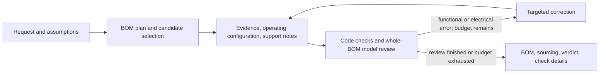

# Jigsaw: autonomous BOM selection and compatibility review

Documentation reconciled with implementation: 2026-10-05

Status: functional-component BOM with support notes; binary review; reliability remains unestablished
Scope: a small, free side project using the existing React, Flask, Pydantic, LangChain, and DigiKey integration\
Historical design review: [independent and adversarial review](practical-bom-workflow-review.md)

This document describes the implemented architecture and its design rationale. Scope is functional-component compatibility with support/configuration guidance, not a complete PCB parts inventory or schematic design. The earlier [design-compiler proposal](nl-to-validated-bom.md) and [pre-implementation review](practical-bom-workflow-review.md) are historical; their wiring deliverables and support-completeness gates are not current requirements. Commit `58876b4` records the September 14 cleanup, not the current prompt-41 scope alignment. Dated verification records distinguish successful examples from general reliability or hardware qualification.

## 1. Decision and product promise

The [verification history](../../backend/evaluations/results.md) records conditional successes,
the failed prompt-37 reliability gate, and subsequent practical reviews. Those records do not
establish broad reliability. Their broader support-inventory scope is not an implementation
requirement for the current workflow, and their original outcomes remain unchanged.

The current acceptance policy is narrower than those historical gates: completed reviews
fail only for identified functional or electrical compatibility errors. Unknowns and
evidence/reporting gaps remain inspectable details, not a third verdict. This policy change
does not repair historical BOMs, retroactively pass incomplete runs, or establish reliability.

Build one explicit Python workflow that interprets a request, selects actual functional components, reads manufacturer documentation, establishes an operating configuration, reviews compatibility, repairs identified problems within a budget, and exports a BOM with purchase links and source-grounded support notes. LangChain provides model integration. Ordinary application code owns state, checks, budgets, and completion.

The target experience is:

> “Make me a temperature and humidity sensor with WiFi and Bluetooth powered by USB-C for consumer use.”

The user receives an automatically selected pre-layout BOM, a binary result for a completed review, visible assumptions, and inspectable check details. Only identified functional or electrical errors appear as blocking concerns. The system makes ordinary design choices autonomously. It asks a question only when a reasonable assumption cannot preserve the requested function. It does not require an electrical-engineering questionnaire or a manually approved requirements baseline before every run.

“Checks passed” means the performed checks and completed source-assisted review identified no explicit functional or electrical compatibility error. “Checks failed” means at least one such error was identified. Check operating ranges, realistic current budgets, logic levels, available interfaces/resources, exact variants, and requested features. A pass is not a claim that the common operating configuration is fully proven or that every check has a resolved answer. This assesses the BOM, not wiring. The report distinguishes model interpretation from code calculations. A second model call is a useful review pass, not independent proof of electrical correctness.

The workflow selects necessary functional blocks, including regulators, level translators, or drivers, and records the supply domains, current assumptions, and communication interfaces that let the parts work together. Routine decoupling, pull-ups, reset/boot support, and regulator networks become source-grounded notes for schematic work, not mandatory passive procurement or exhaustive value/count proof. This does not claim those networks are electrically unnecessary. Explicitly requested passives and any parts actually selected remain subject to suitability checks. Wrong supply voltage, a missing conversion/driver function, or insufficient usable interface resources remains a material error. Pin assignments, nets, a complete programming-pad plan, and missing evidence alone are not failed compatibility verdicts.

Keep numerical/source validation and its individual pass/fail/unknown findings. Unknowns, missing coverage, and evidence/report-integrity failures remain inspectable details, without blocking acceptance, triggering correction alone, or appearing as warning banners. They are not silently converted into proven facts. Discarded unsupported observations, unused operating modes, and unnecessary wiring details remain guidance.

Start with common low-voltage embedded devices: controller modules or MCUs, digital sensors, modest power conversion, connectors, and other requested functional parts. These are the initial evaluation scope, not a prebuilt whitelist. Requests needing substantially different expertise can receive a partial result with explicit unsupported portions. The workflow does not silently reinterpret such requests as the supported example.

### Architecture choice

“Best fit” here means the smallest architecture that performs the agreed workflow, preserves evidence and complete design state, bounds resource usage, and can be tested and maintained in this repository. Model accuracy and operating cost remain empirical questions; no architecture document can prove a global optimum.

| Option | Decision and reason |
|---|---|
| Fix only the original prompts | Insufficient: actual documents, coherent component/configuration state, and honest outcome handling were missing. |
| Explicit Python workflow with LangChain calls | **Selected.** Predictable stages and bounded repair, while retaining model judgment and existing integrations. |
| One open-ended tool-using agent | Unnecessary as the outer controller: harder to bound searches, preserve state, and establish that required review stages ran. Models can request bounded evidence actions inside a stage. |
| Deterministic design compiler with admitted part profiles | Disproportionate to the product promise and available engineering content. It would require a different project before delivering this one. |
| Another orchestration or web framework | No demonstrated benefit for this workflow. |

The implementation retains React, Flask, Pydantic, LangChain, and the DigiKey MCP process, with the supplier data contract repaired in place. Moving that small integration into Python could later remove a process, but is not a prerequisite or a parallel migration project. There is no vector database, solver, general rule engine, agent supervisor, circuit language, distributed queue, or universal parts database.

## 2. The workflow

These are functions and structured model calls in one backend workflow, not separately deployed agents. `pipeline.py` owns their order and the complete working design. Model stages return proposed data; application code validates and applies it. `Requirement.component_ids` is the single active requirement mapping. Source extraction alone replaces verified observations; configuration proposals reference that ledger without rewriting it. Saved records, model context and exports are projections maintained in `run_store.py`, not parallel design states.

| Stage | Inputs and responsibility | Output and stopping behavior |
|---|---|---|
| Interpret and plan | Original request, optional previous design. Extract requested functions and hard constraints; disclose assumptions; propose blocks, supply domains, interface needs, operating modes, and selection order. | A small BOM plan and requirements list, not a pin-assignment plan. Preserve original user clauses so review can detect omitted requirements. No universal MCU-first rule. |
| Select primary parts | Plan, full current selections, and supplier results. Model may suggest exact common parts or capabilities to search. | Resolve exact variants from real catalog results. Inspect up to three candidates for a role, using one broader query if needed. Record “no candidate” or provider error explicitly; never choose the first rejected result as fallback. |
| Read evidence and configure | Selected variants, manufacturer documents, intended use, and shared supply/interface needs. | Source-backed operating facts, rails/interfaces/current assumptions, support notes, and any genuinely missing functional blocks. Newly added functional devices receive source reading within the existing bounded loop. No routine passive inventory expansion. |
| Check and review | Original request, complete current design, evidence, source-section inventory, and code results. | Specific pass/fail/unknown/not-applicable findings for each review area. Reviewer can request missing source pages, alternative evidence, or a correction. |
| Correct and recheck | Identified functional/electrical failures and remaining budget. | Change affected parts or operating configuration. Invalidate the prior review and rerun whole-design checks. Reread affected sources when correcting an identified error, including already-interpreted pages; retain unaffected source facts. At most two correction rounds. Unknowns, passive-inventory omissions, or coverage gaps alone do not trigger correction. Stop repeated identical unsuccessful proposals. |
| Finalize | Current consistent design, review results, and current supplier offers. | Derived BOM, sourcing status, review verdict when available, assumptions, and check details. Execution completion never implies a passing review by itself. |

Models return stage-specific records: component search queries, candidate indices, `DocumentRequest` URLs, `PageSelection` page numbers, and `Correction` changes. Python performs the corresponding supplier/document operations; the MCP tools are `search_components` and `get_product`. There is no generic model-controlled tool loop, shell, generated-code execution, or free-running recursive delegation. A reviewer receives at most one additional evidence-request round per review pass, then records remaining unknowns.

Available catalog selections still receive best-effort review when manufacturer source pages
are unavailable. A returned review with findings counts as completed even if it asks for more
evidence after that allowance is exhausted; an empty review does not count as a pass.

Whole-BOM review runs before correction even when numeric records have gaps, so the same bounded repair receives semantic source findings as well as code diagnostics. A numeric-first scheduling experiment consumed both corrections without reaching that review and was removed. Review retains every selected original PDF page and physical-page label but omits duplicate extracted PDF text; source extraction still receives both, and HTML text is retained. Mapping-only corrections do not regenerate the engineering record, but they still require a new complete review.

For unchanged selected parts and existing evidence, correction can return the complete
repaired compatibility record directly, avoiding a separate model call to reconstruct
the edit from instructions. It cannot simultaneously change parts, add placements,
or reread sources. The existing application and source-protection checks
apply, followed by a fresh whole-BOM review. Part/source changes retain the existing
instruction-led path; no patch language or extra correction allowance is introduced.

Correction routing rereads sources for part changes or explicit `reread_component_ids`.
Instruction-only configuration reuses existing sources and enters source reading if it
adds a selected nonpassive functional part. Unrelated evidence gaps or missing catalog-review findings
do not trigger a blanket source reread. Every changed design still receives whole-BOM review.
`OperatingConfiguration`, `_configure_bom`, and `_source_and_configure` keep this work in
the existing workflow; the bounded three-pass loop accommodates added functional blocks,
not exhaustive support-circuit completion.

Catalog selection rejects proven nominal-capacitance mismatches between an explicit
search value and the supplier's labeled field, both before selection and on confirmed
details. SI-equivalent values are accepted by this comparison; missing/ranged values
remain for source-assisted review. This is a narrow guard against observed wrong-value
selections, not a universal component specification parser or compatibility approval.

### Concrete behavior for the sensor example

The initial plan can prefer a WiFi/Bluetooth module with an integrated antenna, a digital temperature/humidity sensor, USB-C input, and a suitable regulated rail. Indoor use, modest sampling frequency, Bluetooth LE, prototype build quantity one, and a particular USB supply capability are explicit defaults rather than facts inferred from the word “consumer.” Explicit Bluetooth Classic, accuracy, budget, or environmental requirements override defaults.

The planning preference for a documented board-mountable controller assembly integrating requested power entry/regulation remains when it meets the constraints and reduces external circuitry. Disclose the result as a carrier-board BOM around a purchased assembly, checking available exposed interfaces, supply inputs, external-rail capacity after onboard loads, and form-factor suitability. Internal support is not purchased again. This is neither a fixed part whitelist nor a finished sensor-kit lookup. Earlier trials did not establish this route as a successful baseline.

The system selects actual variants and checks a feasible sensor bus, accessible controller resources, supply conversion, programming capability, and USB power role. A bare 3.3 V module cannot be treated as a 5 V development board; add a regulator when needed. Disclose an external programming tool instead of inventing an onboard USB bridge for a power-only request. The current budget follows the selected USB source/attachment mode, not just a charger nameplate. Record CC termination, regulator-network, decoupling, and bus pull-up dependencies as schematic-stage guidance with sources. Do not turn those notes into a required inventory of every capacitor/resistor or numbered pin. Optional convenience switches/connectors are not silently made mandatory, and support already inside a module is not purchased again.

If an LDO would dissipate too much power under the selected load assumptions, the workflow can choose a better power solution and review its operating requirements. It does not assume that a load below 500 mA automatically makes an LDO suitable. Sensor placement/thermal coupling becomes layout guidance; it does not create a requirement to simulate the future enclosure.

This example is the first integration case, not a hardcoded complete BOM returned for unrelated requests. Exact MPNs and prices belong in runnable evaluation fixtures and live results, not permanently in this architecture document.

## 3. One design record, with useful evidence

Use one nested Pydantic `DesignRun` object. Save validated JSON snapshots. The following is the implementation contract, not a new domain language:

| Record | Required information |
|---|---|
| Run | Server-generated ID, parent run for refinement, design revision, lifecycle, model/configuration/prompt version, original request, purchasing options, budgets consumed, terminal reason. Optional pending questions have stable IDs, the unresolved requirement, and concise answer guidance. |
| Requirements and assumptions | Stable IDs (`req:` prefix for requirements, separate from physical references), original clause or declared default, normalized meaning/value where useful, requested versus assumed, requirement-to-design mapping. |
| Component instances | Unique instance ID separate from category; purpose; manufacturer, exact MPN and package/form factor when selected; support parent/purpose where relevant; evidence and offer references. An unresolved selection remains a named slot. |
| BOM operating configuration | Proposed supply domains and their sources/loads; interface type, feasible logic levels/rate, address choices and resource availability where relevant; programming capability, module boundary, external supply and operating-mode assumptions. No required numbered pins, nets, or complete wiring record. |
| Evidence | Document ID, fetched URL, title when available, retrieval time, content hash, physical PDF page or HTML page 1 plus quotation; excerpt or figure reference; exact variant applicability; extracted fact and conditions. Source revision, when known, is captured in the observations rather than a separate metadata field. Numeric operands preserve units and min/max/typical/absolute-maximum meaning. |
| Support/configuration notes | Relevant external-network and implementation dependencies in source observations, configuration notes, or review guidance. No mandatory passive SKU/count inventory or fulfillment ledger. |
| Findings | Design revision, area, affected requirement/instance/operating claim, method (`code` or `model_review`), kind (`check` or `guidance`), status, evidence/operand references, explanation, and proposed remedy. Applicable material BOM code checks have fixed `check` kind. |
| Offers | Exact selected-part identity, supplier SKU and URL, region/currency, stock, MOQ/order multiple, quantity price breaks where returned, retrieval time; unknown fields stay null. |

One selected physical placement is one component instance. Two identical sensors or explicitly requested passive placements retain their separate purposes. Purchasing rows aggregate instances by manufacturer, exact MPN, and package; board quantity multiplies installed quantity. A supplier packaging SKU is not a physical component identity. Legacy `SourceSupportNeed`/`SupportNeed` fields remain readable and serializable for historical reports and the frontend contract, but are excluded from new response schemas and model context. New runs do not generate or enforce their fulfillment records.

The operating configuration is not a partial schematic to complete. “Both parts list I2C” alone is insufficient: check supply/logic levels, usable controller resources, addresses, and a feasible pull-up domain under a reasonable operating assumption. Selecting each pull-up resistor or assigning numbered pins is deferred. Wiring-only fields retained for saved-record compatibility must not be required to obtain `checked`.

Engineering changes increment the revision and invalidate all prior engineering findings. Reuse unchanged fetched documents and extracted observations; calculate and review the whole new design. For these small boards, this is simpler than implementing a dependency invalidation engine. A price-only refresh does not change the engineering revision or substitute parts.

`Correction.requirement_components` can repair mappings for existing requirement IDs to current component IDs without rewriting the clauses/descriptions or replacing parts. Invalid IDs are rejected; an applied repair increments the revision and requires renewed review. This closes a specific correction gap, not a new requirement-authoring stage.

### Document acquisition and interpretation

1. Start with the selected catalog item's datasheet URL and requested supplemental guides; use its product page only when no source URLs are present. Prefer documented parts, but a missing datasheet locator alone does not reject a real catalog selection. The model can request relevant manufacturer links found in PDF text/annotations or HTML to obtain hardware guides or application notes. A proposed URL is only a discovery hint until fetched and identified. There is no paid web-search service. Failure to discover a document remains an inspectable evidence gap, not an automatic failed verdict.
2. `documents.py` fetches bounded HTTPS documents and assigns source IDs. Use `pypdf` for PDF page count, page text, links, and slicing; use a small HTML parser for page text and links. Preserve original physical page numbers when supplying a sliced PDF. These are existing library capabilities, not a parser platform to build. [Text extraction](https://pypdf.readthedocs.io/en/stable/user/extract-text.html), [page selection](https://pypdf.readthedocs.io/en/stable/user/merging-pdfs.html). Preserve source text rather than storing a model-written summary as original evidence.
3. Give the model page-tagged text plus the actual PDF pages needed for figures and tables through LangChain's document input support. Choose pages for ordering/variant information, operating specifications, resource restrictions, power, interfaces, and relevant configuration dependencies. Do not request complete pinout or programming schematics merely to fill wiring fields. Record material sections read, absent, or unreadable. This is bounded retrieval within fetched documents, not a new RAG service.
4. A text-only provider cannot claim it inspected figures. An application diagram may establish a module boundary or necessary external function even though the product does not design schematics. If necessary pages cannot be read, retain an evidence gap rather than claiming equivalent review. Inspecting every passive value in every application circuit is not a completeness gate.
5. Extraction returns observations with evidence, not approval. Application code verifies that source/page IDs exist, quoted text matches the referenced extracted page when applicable, and numerical units are supported by the particular calculation. Figure observations retain the original page. These checks establish reference integrity; semantic interpretation is still fallible.
6. The whole-design reviewer sees the original request, full design, code results, extracted observations, and original relevant pages including application-circuit pages. It also sees the section inventory and may request additional pages. It does not receive only the selector's favorable summary.

Exact-part labeled supplier specifications can establish a selected commodity passive/connector's type, value, and ratings. The model receives those fields and the product URL and is instructed to assess and cite them. Code requires catalog parameters, a product URL, and a current passing evidence-review finding naming the component for that catalog-evidence check to pass; field interpretation remains model judgment. This is not a fabricated manufacturer citation or a replacement for active-device source interpretation. Missing ratings remain unknown; a PDF per purchasing row is not required.

Source extraction explicitly returns `applies` and `reason` for each selected owner. Only affirmative, explained applicability admits that owner's observations; an explanation of a mismatch is not approval. Saved document metadata retains the explanations as strings. For a selected USB-C connector, acquisition also includes the existing manufacturer Type-C hardware guide. Its port role and electrical operating assumptions pass through source interpretation and review; implementation details become notes, not automatic resistor selections.

The implementation retains focused per-document extraction followed by operating configuration: original selected pages → source/page/quotation validation → an observation ledger → configuration referencing that ledger → code checks and whole-BOM review against original relevant PDF pages. Configuration cannot rewrite the ledger or invent evidence records. A later evidence pass may replace observations after rereading their sources. Missing or invalid evidence remains a diagnostic, not by itself a failed verdict. This is the same sequence of structured Python calls, not another service or agent framework. Reference validation still does not prove semantic correctness.

Page selection receives existing observations and current issues to target missing/invalid/new context instead of repeating unchanged reading after a replacement. Whole-design review retains original observation pages even without new extraction; a same-source reread includes retained evidence pages and newly requested pages. Reuse does not preserve prior compatibility approval. Historical prompt-version experiments and their failures remain in the evaluation record.

Page selection also receives the latest refinement instruction; focused extraction receives the request/modification and operating assumptions. These inputs prevent guided corrections from disappearing at the source-reading boundary. They do not provide the reader with an approved answer or bypass source validation.

The source-packet handoff passes a reread its same-document prior observations after pruning obsolete owners. The model is instructed to retain correct facts and correct unsupported interpretations against original pages. The newly validated response replaces that source packet; code does not merge back omitted observations or guarantee their retention. This handoff can also anchor earlier mistakes, so reuse is not evidence of interpretation accuracy.

Selected components take their actual catalog MPN as their name. Proposed document URLs remain discovery hints, including alternate sources supplied in a correction; they do not establish applicability. Extraction receives manufacturer/MPN/package context and requires a per-component source-applicability explanation before accepting observations. Replacing a part still invalidates its previous evidence, including shared-document variants. Applicability interpretation remains fallible and is reviewed against original pages.

A live 821-page family manual exposed oversized navigation prompts. Source-selection navigation budgets approximately 10,000 characters per document and 30,000 total; whole-BOM review uses the smaller 3,000-character per-document budget. Both prioritize contents and useful sections. Omitted page cards remain requestable by original physical page number. These budgets affect navigation context, not which pages are considered inspected, and introduce no new retrieval service.

Original-page reading remains useful for operating tables and module/application diagrams. The [SHT4x datasheet](https://sensirion.com/resource/datasheet/sht4x), version 7.3, printed page 3, supplied a historical figure-reading fixture. Its passive values are not a current purchasing-completeness gate. Manufacturer guidance such as the [ESP32-S3 schematic checklist](https://docs.espressif.com/projects/esp-hardware-design-guidelines/en/latest/esp32s3/schematic-checklist.html) must be interpreted against the selected module boundary, not copied wholesale into the BOM.

Fetched documents are stored locally by content hash, with their source locators retained in each report. The workflow reuses available observations for unchanged parts and merges requested pages by document; an explicit reread still invokes extraction. There is no model-response cache keyed by part, source, prompt and configuration, within or across runs. Reuse never preserves compatibility approval after a relevant change: missing material context is reread and applicability reviewed on the new revision. No learned global part-profile registry is introduced. Published reports link to manufacturer sources; redistribution/caching permissions must be checked before serving retained documents publicly. Unavailable cached evidence is reported, never replaced by fabricated quotations.

Fetch controls belong in this one module: bounded size/time, HTTPS, recheck redirects, reject loopback/private/link-local destinations, and treat source text as untrusted data rather than instructions. Fetching documents never authorizes purchasing, sending messages, or executing document content.

## 4. What validation actually does

A short fixed checklist prompts review of every design. Each area is requested to receive at least one finding or an explicit reason it is not applicable. Python records missing coverage and invalid references without treating them alone as failed compatibility. Missing selected parts and necessary functional blocks are actual failures; routine passive inventory omissions are not. Review also compares the requirements list to the original user clauses, since a parser can omit a request before a reference check sees it. These checks do not establish every possible electrical obligation.

| Review area | Code where facts permit | Model review against original sources |
|---|---|---|
| Requested function and exact identity | Requirement/instance references, exact part/offer match, counts and package identifiers. | Requested sensing/radio features, selected variant, bare chip versus module versus development board, explicit constraints. |
| Power and operating conditions | Rail operating-range containment, summed load assumptions, regulator headroom and approximate dissipation. | Peak/typical distinctions, regulator suitability, startup/enable assumptions, supply capability and thermal/layout limitations. |
| Signals and resources | Selected endpoint/configuration references, applicable thresholds, proposed pull-up supply for open-drain static highs, and address conflicts. | Sufficient available interface resources, feasible bus/rate/loading assumptions, necessary pull-ups, accessible interfaces, relevant reserved resources, and supported programming capability. No numbered-pin assignment or programming-pad plan. |
| Support and configuration | No passive-fulfillment ledger or inventory-completeness check. Existing numerical checks still assess the selected operating configuration. | Identify missing functional dependencies and actual selected-part errors. Record decoupling, reset/boot, regulator-network, and pull-up dependencies as source-grounded schematic guidance rather than mandatory passive procurement. |
| Evidence and uncertainty | Valid references for active BOM claims, current revision, required operands and units; missing material facts produce unknown. | Footnotes, exact applicability, contradictory material facts, estimates and uncertainties. Discarded unused facts remain guidance, not blockers. |

Implement a handful of named functions in `checks.py`, each with explicit operands, units, applicability, and tests. Do not build a generic expression evaluator. Do not compare one generic voltage string or treat overlapping operating ranges as sufficient: the proposed source range must fit the particular receiving supply domain. Do not use absolute maximum ratings as recommended operating limits.

`numeric.py` binds those operands to source-owned `SourceNumber` records within each evidence
observation. Configuration references number IDs; code retains the source's value, units, parameter
role and conditions. Binding and checks share `numeric.convert_value` for supported units and
dimensions. Roles distinguish required input supply capacity, consumed current and
delivered output capacity. The bounded resolver handles direct ratings, output tolerance,
VDD-scaled logic limits at the correct supply corner, linear-regulator input headroom and input
demand. Linear input current always reuses downstream peak demand plus regulator own current;
thermal dissipation also includes input voltage times own current. There is no expression
language or extra review stage. The original-page review still checks extraction and applicability.
New executions enable numeric binding version 1; historical saved runs remain readable without
automatic promotion of historical incomplete outcomes. Unbound device ratings remain unknown
calculations in a newly executed/refined run; they cannot become proven numerical passes.
An explicit assumption may widen a source-derived delivered-voltage interval to cover relevant
operating effects. Code rejects inward changes, preserves the baseline sources and labels the
window an estimate. Review must justify that margin against source conditions; it does not become
a manufacturer guarantee. This deliberately avoids an extensible coefficient/expression system.

For direct voltage limits only, one mistyped numeric ID or an Evidence ID may resolve to an
existing, unique owner/parameter/bound/unit match. The canonical number ID is retained. This
does not infer missing facts or override known wrong-owner/role references, and is not applied
to current, thermal or formula selection. Equivalent microamp glyphs are normalized. A sensor's
active operating current may use the manufacturer's "quiescent current" terminology, with its
conditions preserved; converter own current is never treated as its complete input load.

Engineering estimates are allowed when appropriate. Label typical values, assumed operating modes, and calculated margins. A dissipation estimate is not a measured junction temperature; a documented recommendation can support a practical selection without requiring guaranteed bounds for every transient. A missing fact that prevents judging whether the selected parts can operate together remains unknown. An unspecified exact wire or pad does not. This balance avoids both invented certainty and the previous proposal's universal-proof requirement.

Peak rail loads determine supply capacity. Linear-regulator thermal screening defaults to the same conservative peak sum; one optional `average_output_current` can represent a separately justified sustained workload. It must have applicable evidence or an explicit workload assumption, stay between zero and the peak sum, and never reduce the capacity check. Code calculates the watt allowance from three quantities: `(junction_target - ambient_max) / theta_ja`. Package thermal resistance needs owner-matched source evidence; documented typical values are allowed as conditioned estimates. A model-written allowance cannot override this arithmetic or substitute for missing operands. Source-assisted review still assesses workload/burst plausibility, the junction target, and applicable board/copper conditions. No thermal-network simulator is introduced.

Interface provenance may be recorded on the interface or in a current, cited signals-review finding explicitly naming it. Repeating identical references in both places is not another compatibility check. Invalid nonempty references, stale/uncited reviews, missing participants/configuration, and failed numeric checks remain unresolved. By default, a two-selected-part I2C interface needs numerical assessment in both driving directions, not a per-wire pin plan.

When installing a review, source-number references resolve once to their underlying evidence IDs. This accepts an equivalent source-backed citation, not a new proof. Unknown IDs and invalid references remain unresolved; configuration notes do not become evidence by being cited.

Single-component capabilities have their own source-owned, current interface review and do not establish inter-part connectivity; a one-ended I2C record remains unresolved. New proposals should place built-in radio capability and ordinary external-programming assumptions in requirements/notes instead. The experimental manufacturer-guidance substitute for numeric interface checks was removed after live evaluation used shared supply voltage to excuse missing electrical evidence. Its legacy field is readable but hidden from new proposals/reports and ignored by checks.

Bare indicator LEDs and dry-contact switches use the existing passive source-policy category. Review covers current limiting, ratings and input/contact behavior rather than invented LED supply intervals or switch output-driver tables. LED current remains included in the supplying controller/rail budget. Smart LEDs and powered drivers remain active. An empty requirement mapping is retained as unknown, not a fatal correction-format error or a waived requirement.

A passive current-budget load may omit both IC-style operating-voltage bounds. Code still requires valid ordered rail bounds and a current power review naming the rail and load, backed by applicable load evidence or explicitly reviewed catalog ratings; its current is still summed. An active/module driver connected to a passive receiver with no digital input thresholds instead needs a current signals review naming both, source-owned driver evidence and applicable load evidence or reviewed catalog ratings. Supplied driver/pull-up limits still need valid provenance. Supplied receiver limits take the ordinary numerical path, and active/module receivers never receive this exception. These accommodate equivalent BOM representations, not a general waiver for missing electrical data.

The reviewer can flag an omitted regulator, level translator, driver, or other necessary functional block so correction/configuration can add it. It cannot override a failed applicable electrical calculation, invent evidence, dismiss an explicit user requirement, or make a stale finding current. A challenged calculation goes back to its operands and applicability. Confirmed functional or electrical problems, including wrong parts actually selected, are failed `check` findings in requirements, power, signals, or support. Unknowns and reporting defects remain nonblocking details. Missing routine passive procurement, pin assignments, complete reset/programming wiring, and layout instructions are not compatibility failures. Supporting-network notes must not be mistaken for a claim that the network is integrated or physically implemented.

### Outcomes and purchasing

Lifecycle and product outcome are separate:

- Lifecycle: `running`, `needs_input`, `finished`, `interrupted`, or `error`. `finished` means the workflow stopped normally, including with unresolved findings or exhausted work budget.
- Compatibility: a current failed `check` in requirements, power, signals, or support yields `issues_found` (Checks failed), even if execution later stops. Otherwise a completed current model review with check findings, components, and requirements yields `checked` (Checks passed). Unknowns, coverage gaps, evidence/report-integrity failures, and guidance do not block. Without a completed current review, or when interrupted, errored, or awaiting input, the field is `null`. A completed review may appear before the running workflow finalizes. This is no verdict, not a third review result. Legacy `incomplete` reads as `null`, never an automatic pass.
- Sourcing: `available` for a nonempty BOM with no unresolved selection slots, when every purchasing row has a matched offer, provider-supplied HTTP(S) purchase URL, known price, and sufficient stock for its order quantity; `partial` if only some rows do; `unknown` if none do. URL syntax is checked, not the landing page or checkout. Keep known out-of-stock and missing information distinct on each row even when the aggregate is `unknown`. Missing price or stock is never zero or presumed available.

Code derives these outcomes from the current record; models do not set an overall badge. Each finding remains inspectable even when the overall review passes. Use “Checks passed” or “Checks failed,” with methods and assumptions available, not “all parts guaranteed compatible” or “globally optimized.” The BOM may still be exported with errors or no verdict, with status attached.

The MCP service returns labeled parameters, supplier/manufacturer identities, product and datasheet URLs, offers, and retrieval time from search and exact-part `get_product` lookup. The latter uses DigiKey ProductDetails for the selected part and packaging choices. [DigiKey's API](https://developer.digikey.com/products/product-information-v4/productsearch) provides the catalog data; engineering interpretation stays in Python. Normalization retains relevant original labels so ambiguities remain visible.

Retrieve offers during selection. Before planning an inherited design, refresh an offer when its retrieval age plus the remaining run budget would exceed 15 minutes. Planning and price-constraint review then see the refreshed offers; do not silently mutate them after the final review. A failed refresh clears the affected offers so their price and availability remain unknown. This is an initial freshness policy, not a stock guarantee. Replacements caused by unavailable stock return through evidence and whole-design review. Rank eligible alternatives by requested fit, documented usability, availability, and then cost; do not assume the cheapest chip makes the cheapest complete board.

For the selected exact MPN, prefer available ordinary packaging over explicitly labeled Digi-Reel custom reeling, then apply the existing order-quantity price comparison. Standard Tape & Reel remains ordinary packaging. When only a custom-reel offer is available, retain it with an ordering note that quoted component prices exclude any unprovided setup fee. No fee estimate or new price-optimization system is introduced.

CSV rows contain reference IDs/purposes, manufacturer, exact MPN, package, installed quantity, order quantity, unit/extended price when known, currency, supplier SKU, purchase URL, datasheet URL, and review status. MOQ and order multiples can make order quantity exceed installed quantity. Keep unknown totals explicit and separate currencies. Shipping/tax are excluded. Quote CSV cells and escape formula-leading untrusted text. Export the full JSON report alongside the CSV for evidence and operating assumptions. Never place an order automatically.

## 5. Runtime, portability, and code ownership

Keep synchronous Flask POST/SSE execution for the first local/private milestone: one backend process with request threads so a running analysis does not prevent result retrieval or health requests. Disable debug and the reloader; bind to loopback by default and allow the configured frontend origin. Multiple WSGI workers are outside this initial serving configuration. One run executes in its request handler, with a nonblocking process-wide admission lock acquired before returning streaming headers. A second start returns 409 with a clear busy response. There is no background queue or promise of execution surviving a browser disconnect or process restart. Public hosting is a later deployment decision, not an assumed free resource.

Save an initial run before the first external call, then write each complete stage snapshot atomically to `backend/data/runs/<run_id>.json`; use safe server-generated IDs, a schema version, and ordinary temporary-file replacement. Terminal runs are retained for viewing/refinement. A restart marks unfinished records interrupted; it does not silently resume paid calls. Run files and source caches are runtime data, not committed fixtures. Use a generator `finally` path to release admission on every exit, including `GeneratorExit`, model/schema errors, and serialization failures. Save interrupted/error state when storage is available; a storage failure must not leave the run lock held or silently claim a saved result.

`/api/component-analysis` and `/api/refine` use coordinated backend/frontend contracts. Initial input is `{query, options}`; options are integer `board_quantity` (1–10,000, default 1), supplier `region` (default `US`), and `currency` (default `USD`). Options are stored on the run and inherited on refinement. `/api/refine` accepts exactly one of `{base_run_id, modification}` or `{base_run_id, answers: {question_id: answer}}`. Answers must match all pending questions on that saved run. Both start a new run from the last consistent saved design and requirements; a running base returns 409. Requirements should be preserved unless the user changes them. A client-supplied flattened BOM is not accepted as the authoritative prior design. The old `/api/query` and `/api/continue` routes return HTTP 410.

Events are `started`, `progress`, `snapshot`, and `complete`/`error`; a clarification ends with `complete` carrying lifecycle `needs_input`. Every event carries run ID and monotonic sequence. Snapshots replace the displayed design. The terminal snapshot and reason are saved before emitting `complete` or `error`; both include the outcome and snapshot while the transport is available. The API provides `GET /api/runs/<id>` and `GET /api/runs/<id>/export?format=csv|json`; unknown IDs return 404. EOF without a terminal event is an interruption, never completion. After a disconnect, retrieve the saved run by ID; it may still be running until the in-flight call finishes and disconnect is detected.

The React page stores one current snapshot and presents Map and Parts views, with component details on selection and Build notes beneath the workspace. Its system map projects recorded relationships, not wiring or physical layout. Physical placements stay distinct, while the purchasing table uses grouped BOM rows. Unknown prices remain explicit; stock shortages and extra order quantities appear when relevant. New device requests use the backend purchasing defaults of one board, US sourcing, and USD; the UI does not expose purchasing settings.

The frontend reporting contract is to foreground the functional BOM, purchase links, component roles, important operating assumptions, schematic-stage notes, and actual functional or electrical failures. Successful technical review prose, raw numeric records, and source-binding errors are diagnostic material, not compatibility proof. Do not present an unknown or unbound quantity as a verified figure; keep declared operating assumptions labeled as such. Retain the complete saved JSON as a diagnostic export and preserve the parts CSV. Historical support inventories remain viewable only where legacy records contain them, with no empty inventory section for new runs. The current frontend implements this reporting contract; backend evidence and checks remain intact. Frontend verification is recorded in the [project guide](../../README.md#verification).

The page records the current run in `/design?run=<id>`; opening or refreshing that URL restores the saved snapshot through GET without resubmitting or resuming work. Initial navigation requests are consumed once, including when their POST fails. Publishing a stream's ID does not restart it, and refinement updates the URL to the new run while preserving the parent link. The lifecycle hook ignores obsolete events and saved-result responses, exposes only snapshots matching the current URL, and retains the parent and form draft if a refinement fails before starting. Stop closes the connection without rewriting the saved lifecycle; Reload retrieves the latest saved status, and a still-running snapshot cannot be refined. Generation shows one plain-language stage derived from backend events. Operational errors use plain-language messages; full JSON retains backend diagnostics. The legacy `VITE_USE_MOCK=true` flag disables generation, displays a preview notice, and leaves saved designs available without fabricating a mock BOM.

Budget checks run before external operations and between stages. With request-scoped streaming, an in-flight call may finish before disconnect is detected; after detection, no new work starts and the saved run is interrupted. Model attempts request a timeout of at most 45 seconds and supplier/document operations 20 seconds, reduced by remaining run time. Supplier initialization, authentication and lookup share one deadline. DNS, local PDF parsing and in-flight calls can overrun nominal deadlines; this is not a hard real-time sandbox. Local rate-limit waits emit progress in chunks of at most 50 seconds; a required wait exceeding remaining run time ends the run. The opt-in live client has a 60-second read timeout. The browser keeps a separate 10-minute whole-run deadline active through body reading, including with an external AbortSignal. No worker or public-deployment proxy timeout configuration is implemented.

| Current bounded trial budget | Limit |
|---|---:|
| Whole run wall time | 8 minutes |
| Model requests, including schema repairs and retries | 30 |
| Cumulative model input/output tokens | 400,000 / 64,000 |
| Supplier calls, including detail lookup and retries | 60 |
| Downloaded documents / bytes per document | 20 / 15 MiB |
| PDF pages sent to models, including repeated reads | 120 |
| Primary functional blocks / physical placements | 8 / 40 |
| Corrections after first review | 2 |

The input ceiling increased from 300,000 to 400,000 after the [2026-09-30 budget evaluation](../../backend/evaluations/results.md#input-budget-evaluation-2026-09-30) measured a permitted final review that could not fit after two corrections. This provides practical room for the review and its optional source-follow-up pass, not a completion guarantee. The model remains Flash-Lite with provider-default thinking. Source extraction now requests up to 5,500 output tokens to retain the structured numeric facts; the total per-run output ceiling and other resource limits are unchanged. Local scheduling remains 15 RPM/250,000 input TPM, subject to actual project quotas. Existing saved limits remain readable and are inherited by refinements. Earlier budget/model experiments remain historical records, and there is no automatic paid-model fallback.

These are operating limits, not assertions about cost or completion speed. The workflow reuses evidence and groups identical supplier searches. Configuration selects only newly added functional parts; existing failed selections await an explicit correction rather than another unchanged search. Each model request must fit the configured context limit, including output allowance and PDF input. Requests reserve estimated input and maximum output against the remaining budget, then reconcile reported usage; missing usage retains the reservation. SDK retries are disabled. A malformed response or eligible transient provider failure, including a read timeout, gets at most one retry. Transient retries wait up to two seconds, except after a timeout has already elapsed. Quota exhaustion stops immediately rather than retrying. Every attempt consumes the same global budget. Exhaustion saves a consistent partial result with its cause. Actual free-tier quotas may be lower than the configured limits; there is no automatic paid-model fallback.

LangChain remains the model abstraction. One gateway handles provider/model construction, structured responses, the declared PDF capability, usage and retries; stages use that shared gateway rather than a provider-specific client. All stages, including review, use the same configured model. There is no separate review-model setting. The independent source audits in the evaluation records were additional development checks, not an automatic production stage. Changing providers requires verified structured-response and original-PDF support, not just a model-name change. [Model interface](https://docs.langchain.com/oss/python/langchain/models), [document messages](https://docs.langchain.com/oss/python/langchain/messages).

| Current location | Ownership |
|---|---|
| `backend/app.py` | Request validation, admission, SSE, run retrieval/export. |
| `backend/pipeline.py` | Stage sequence, working design, budgets, bounded repair, terminal handling. |
| `backend/models.py` | Nested design and stage-response schemas; no universal electronics ontology. |
| `backend/stages.py` | Plain request-planning, candidate-selection and whole-BOM review calls. |
| `backend/prompts.py` | Shared BOM/configuration rules and focused stage instructions. |
| `backend/tools.py` + existing MCP | Narrow supplier calls; provider errors are errors, not synthetic parts. |
| `backend/documents.py` | Bounded source discovery, acquisition, pages, and extraction/cache. |
| `backend/checks.py` | Explicit calculations, integrity checks, and outcome aggregation. |
| `backend/numeric.py` | Shared unit conversion and source-owned calculation operands. |
| `backend/run_store.py` | Atomic JSON run persistence and JSON/CSV projection. |
| `backend/llm.py` | LangChain model factory, provider capabilities, bounded calls and usage. |
| `frontend/app/components/DeviceRequest.tsx` | Device description form and wireless-sensor example. |
| `frontend/app/design/index.tsx` + `useDesignRun.ts` | Workspace views, clarification/refinement, stream lifecycle, and saved-run navigation. |
| `frontend/app/services/api/designRunApi.ts` | Snapshot types, POST event parsing, saved GET, and export URLs. |
| `frontend/app/design/SystemMap.tsx` + `systemRelationships.ts` + `systemLayout.ts` | Recorded placement relationships, support grouping, and diagram geometry. |
| `frontend/app/design/PartsList.tsx`, `ReviewPanel.tsx`, `ComponentDetail.tsx` | Purchasing rows, Build notes, current failures, and component details. |
| `frontend/app/design/componentPresentation.ts` + `PartIllustration.tsx` | Component role/title mapping and technical illustrations. |
| `frontend/app/design/reportHelpers.ts` + `runFeedback.ts` | Shared report predicates/formatting and user-facing run messages. |

Tracing is optional; LangSmith configuration is not required to produce a result. Direct Python dependency versions are pinned in `backend/requirements.txt` and were exercised by the recorded local and live verification. The pins do not replace capability checks when changing providers or dependencies. No database migration or endpoint framework rewrite is required.

Record provider and thinking configuration with the model and prompt version, currently `41`. The workflow uses Flash-Lite/provider-default thinking; the optional `MODEL_THINKING_LEVEL` setting remains available but is not a reason to change models or thinking for this task. Historical focused probes and full-device trials are recorded separately in the [live progress record](../../backend/evaluations/results.md). A successful extraction probe is not a successful full request-to-BOM run.

## 6. Implementation and evaluation

The earlier scope alignment removed mandatory wiring work. Prompt 41 also retires the supporting-parts inventory and fulfillment gate from new runs, keeping functional-component compatibility, source-grounded support notes, the operating-configuration stage, and bounded correction. Flash-Lite, budgets, API, persistence, and binary review remain. This is a scope reduction within the same workflow, not another architecture or evaluation platform. Current verification results belong in the dated [run results](../../backend/evaluations/results.md).

The historical scope-alignment verification below used the broader support-inventory scope.
Its original criteria and outcomes remain historical, not new requirements:

1. Relevant short local tests pass, including quantity/state/export integrity, material compatibility failures, necessary support, and used-versus-discarded evidence. Missing numbered pins or a programming-pad plan alone must not fail a valid BOM. Do not add exhaustive cases or live calls to the unit suite.
2. Run the user's sensor request through actual catalog selection, source interpretation, support selection, numeric checks, whole-BOM review, bounded correction, and export using Flash-Lite within the existing limits. Save the outcome and usage. An unfinished compatibility review is a recorded result, not a successful example. Report sourcing separately: unknown offers must stay unknown, even when the electrical compatibility assessment succeeds.
3. Independently audit that actual BOM against original sources: requested functions and exact variants; feasible shared supply/current/logic/resource assumptions; necessary support values, ratings, quantities, and module boundaries; material citation accuracy; purchasing identities/links and matching exports. Resolve concrete defects or report them. Do not demand a schematic, numbered-pin plan, or completed programming/reset wiring.

The 2026-09-14 verification passed 69 deterministic backend tests, the MCP tests/build, frontend typecheck/build, and saved-result regression checks. Original-query run `149dc533` established the earlier checked/partial baseline; post-cleanup run `29c85ccd` finished checked/available and passed independent source review under its saved assumptions without manual repair. Both are documented with their limitations in the [run results](../../backend/evaluations/results.md) and [cleanup review](../../backend/evaluations/cleanup-review.md). Failed trials, including a falsely checked result, remain failures. These successes establish conditional examples, not broad reliability or hardware qualification.

The earlier three-frozen-trial positive/mutation suite and held-out plan remain historical evaluation material, not mandatory gates for this narrowed task. Preserve their recorded outcomes without relabeling them. Applicable manufacturer facts remain useful references; former wiring requirements do not carry forward. Further repeated or held-out evaluation can measure breadth later, without expanding the current implementation scope.

If further evaluation fails, first identify whether the cause is unavailable evidence, unreadable pages, model interpretation, a missing small check, or inappropriate scope. Correct the demonstrated issue in the corresponding module or prompt, or report the unsupported claim. Add a targeted local regression for a code defect. Keep the agreed Flash-Lite constraint unless the user changes it; do not automatically expand into a compiler or another framework.

### Decision discipline

The architecture is settled for this implementation scope. Reopen a decision only with a failing example or measured operational problem, a smaller alternative considered, and a cost/benefit explanation. Examples: add page-image rendering for a provider that passes the other tasks but lacks PDF support; add a bounded worker only when surviving disconnects is a real product requirement; port MCP only when its operational cost warrants the migration. Generic future possibilities are not implementation prerequisites.

Remaining empirical questions are extraction/review accuracy, document availability across common parts, performance under the chosen free-tier quota, and usefulness on held-out requests. These are explicit experiments in the milestones, not unspecified architectural components.
