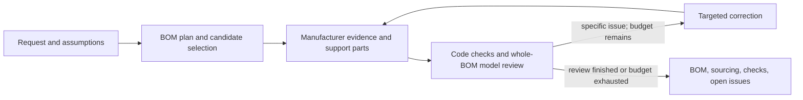

# Jigsaw: autonomous BOM selection and compatibility review

Date: 2026-09-14  
Status: BOM-only scope implemented; cleanup verified with a fresh conditional BOM success; general reliability unqualified
Scope: a small, free side project using the existing React, Flask, Pydantic, LangChain, and DigiKey integration  
Review record: [independent and adversarial review](practical-bom-workflow-review.md)

This document defines the implementation direction requested in the current product discussion. The latest scope is BOM compatibility, explicitly not schematic or wiring design. This narrows the existing workflow rather than introducing another architecture. The earlier [design-compiler proposal](nl-to-validated-bom.md) and prior review/evaluation records remain historical material; their wiring deliverables, qualification gates, and infrastructure are not requirements of this scope. The deterministic backend suite passes. Fresh Flash-Lite run `149dc533` completed compatibility review without developer-supplied parts/pages and passed the [independent source audit](../../backend/evaluations/prompt18-sensor-audit.md) under its operating assumptions. Its sourcing is partial for one capacitor. This is one unattended positive baseline, not a general reliability or hardware-qualification claim.

## 1. Decision and product promise

Current cleanup verification is recorded in the [cleanup review](../../backend/evaluations/cleanup-review.md).
Local regression checks pass, and fresh run `29c85ccd` passed independent original-source
review under its saved operating assumptions without manual repairs. Earlier cleanup trials
include a falsely checked result with a material support-part problem. Code findings match
the baseline across all saved terminal runs; general model-review reliability remains
unqualified. One success does not resolve that limitation or justify a larger architecture.

Build one explicit Python workflow that interprets a request, selects actual parts, reads manufacturer documentation, adds supporting components, reviews BOM compatibility, repairs identified problems within a budget, and exports a BOM with purchase links. LangChain provides model integration. Ordinary application code owns state, checks, budgets, and completion.

The target experience is:

> “Make me a temperature and humidity sensor with WiFi and Bluetooth powered by USB-C for consumer use.”

The user receives an automatically selected pre-layout BOM, concise explanations of compatibility checks, visible assumptions, and any unresolved concerns. The system makes ordinary design choices autonomously. It asks a question only when a reasonable assumption cannot preserve the requested function. It does not require an electrical-engineering questionnaire or a manually approved requirements baseline before every run.

“Compatibility checked” means the selected components have an evidence-backed feasible common operating configuration, with necessary support parts, and no unresolved material BOM conflict or evidence gap after the implemented checks and source-assisted model review. Check operating ranges, realistic current budgets, logic levels, available interfaces/resources, exact variants, and requested features. This assesses whether the parts can work together under stated assumptions; it does not design the wiring. The report distinguishes model interpretation from code calculations. A second model call is a useful review pass, not independent proof of electrical correctness.

The workflow includes necessary support components with values, ratings, quantities, parents, and purposes. It records enough operating context to justify the BOM—for example, the supply domain each device uses and which shared bus needs pull-ups—but does not require numbered pin assignments, named nets, a netlist, or a complete programming/reset pad plan. Ordinary later wiring/layout work remains guidance. A wrong operating voltage, missing necessary capacitor, insufficient usable interface resources, or unavailable evidence needed to judge one of those claims remains a material BOM issue.

Only evidence used or needed for a material BOM claim blocks the outcome. Discarded unsupported observations, unused operating modes, and unnecessary wiring details remain visible guidance and are not new proof obligations. They cannot support a passing claim. A failed citation for a used operating limit or necessary support value must still be corrected or reported unresolved.

Start with common low-voltage embedded devices: controller modules or MCUs, digital sensors, modest power conversion, connectors, and their support circuits. These are the initial evaluation scope, not a prebuilt whitelist of every accepted part. Requests needing substantially different expertise can receive a partial result with explicit unsupported portions. The first release does not silently reinterpret such requests as the supported example.

### Architecture choice

“Best fit” here means the smallest architecture that performs the agreed workflow, preserves evidence and complete design state, bounds resource usage, and can be tested and maintained in this repository. Model accuracy and operating cost remain empirical questions; no architecture document can prove a global optimum.

| Option | Decision and reason |
|---|---|
| Fix only the original prompts | Insufficient: actual documents, support components, complete BOM state, and honest outcome handling were missing. |
| Explicit Python workflow with LangChain calls | **Selected.** Predictable stages and bounded repair, while retaining model judgment and existing integrations. |
| One open-ended tool-using agent | Unnecessary as the outer controller: harder to bound searches, preserve state, and establish that required review stages ran. Models can request bounded evidence actions inside a stage. |
| Deterministic design compiler with admitted part profiles | Disproportionate to the product promise and available engineering content. It would require a different project before delivering this one. |
| Another orchestration or web framework | No demonstrated benefit for this workflow. |

Keep React, Flask, Pydantic, LangChain, and the current DigiKey MCP process for the first release. Repair the supplier data contract in place. Moving that small integration into Python could later remove a process, but is not a prerequisite or a parallel migration project. Add no vector database, solver, general rule engine, agent supervisor, circuit language, distributed queue, or universal parts database.

## 2. The workflow

These are functions and structured model calls in one backend workflow, not separately deployed agents. `pipeline.py` owns their order and the complete working design. Model stages return proposed data; application code validates and applies it. `Requirement.component_ids` is the single active requirement mapping. Source extraction alone replaces verified observations; configuration proposals reference that ledger without rewriting it. Saved records, model context and exports are projections maintained in `run_store.py`, not parallel design states.

| Stage | Inputs and responsibility | Output and stopping behavior |
|---|---|---|
| Interpret and plan | Original request, optional previous design. Extract requested functions and hard constraints; disclose assumptions; propose blocks, supply domains, interface needs, operating modes, and selection order. | A small BOM plan and requirements list, not a pin-assignment plan. Preserve original user clauses so review can detect omitted requirements. No universal MCU-first rule. |
| Select primary parts | Plan, full current selections, and supplier results. Model may suggest exact common parts or capabilities to search. | Resolve exact variants from real catalog results. Inspect up to three candidates for a role, using one broader query if needed. Record “no candidate” or provider error explicitly; never choose the first rejected result as fallback. |
| Read evidence and add support | Selected variants, manufacturer documents, intended use, and shared supply/interface needs. | Material BOM facts and source pages; necessary external support values/quantities and selected parts; operating assumptions and guidance. Batch identical passive specifications. Newly added active devices receive the same evidence/support treatment. |
| Check and review | Original request, complete current design, evidence, source-section inventory, and code results. | Specific pass/fail/unknown/not-applicable findings for each review area. Reviewer can request missing source pages, alternative evidence, or a correction. |
| Correct and recheck | Actionable findings and remaining budget. | Change affected parts/configuration/support. Invalidate the prior review and rerun whole-design checks. Reread affected sources explicitly when a necessary fact is absent/wrong, including already-interpreted pages; retain unaffected source facts. At most two correction rounds. Stop repeated identical unsuccessful proposals. |
| Finalize | Current consistent design, review results, and current supplier offers. | Derived BOM, sourcing status, compatibility outcome, assumptions, and unresolved issues. Completion never implies compatibility by itself. |

The model may request `search_parts`, `get_product`, `fetch_document`, or `read_pages` through structured action records. Python executes only the allowed actions in the relevant stage, within the global budget. There is no model-controlled shell, generated-code execution, or free-running recursive delegation. A reviewer receives at most one additional evidence-request round per review pass, then records remaining unknowns.

Whole-BOM review runs before correction even when numeric records have gaps, so the same bounded repair receives semantic source findings as well as code diagnostics. A numeric-first scheduling experiment consumed both corrections without reaching that review and was removed. Review retains every selected original PDF page and physical-page label but omits duplicate extracted PDF text; source extraction still receives both, and HTML text is retained. Mapping-only corrections do not regenerate the engineering record, but they still require a new complete review.

For unchanged selected parts and existing evidence, correction can return the complete
repaired compatibility record directly, avoiding a separate model call to reconstruct
the edit from instructions. It cannot simultaneously change parts, add support
placements or reread sources. The existing application and source-protection checks
apply, followed by a fresh whole-BOM review. Part/source changes retain the existing
instruction-led path; no patch language or extra correction allowance is introduced.

Catalog selection rejects proven nominal-capacitance mismatches between an explicit
search value and the supplier's labeled field, both before selection and on confirmed
details. SI-equivalent values are accepted by this comparison; missing/ranged values
remain for source-assisted review. This is a narrow guard against observed wrong-value
selections, not a universal component specification parser or compatibility approval.

### Concrete behavior for the sensor example

The initial plan can prefer a WiFi/Bluetooth module with an integrated antenna, a digital temperature/humidity sensor, USB-C input, and a suitable regulated rail. Indoor use, modest sampling frequency, Bluetooth LE, prototype build quantity one, and a particular USB supply capability are explicit defaults rather than facts inferred from the word “consumer.” Explicit Bluetooth Classic, accuracy, budget, or environmental requirements override defaults.

The planning preference for a documented board-mountable controller assembly integrating requested power entry/regulation remains when it meets the constraints and reduces external circuitry. Disclose the result as a carrier-board BOM around a purchased assembly, checking available exposed interfaces, supply inputs, external-rail capacity after onboard loads, and form-factor suitability. Internal support is not purchased again. This is neither a fixed part whitelist nor a finished sensor-kit lookup. Earlier trials did not establish this route as a successful baseline.

The system selects actual variants and verifies those assumptions against their documentation. It establishes a feasible sensor bus, sufficient accessible controller resources, a supported programming method, and the USB power role. It does not assign numbered pins or design programming pads. An external programming tool can be disclosed; USB-C power alone does not require an onboard USB bridge. The current budget follows the selected USB source/attachment mode; a charger nameplate or passive CC terminations alone do not establish permission to draw any desired current. Operation beyond the applicable default needs a documented detection/negotiation or explicit source-contract basis, otherwise the budget remains unresolved. Necessary external CC terminations, regulator capacitors, decoupling, bus pull-ups, and boot/reset support are sourced with values, quantities, and purposes. Optional convenience switches/connectors are not silently made mandatory. Support already inside the module is recorded as included, not bought twice.

If an LDO would dissipate too much power under the selected load assumptions, the workflow can choose a better power solution and review its support parts. It does not encode the existing prompt's “under 500 mA implies LDO” shortcut. Sensor placement/thermal coupling becomes layout guidance; it does not create a requirement to simulate the future enclosure.

This example is the first integration case, not a hardcoded complete BOM returned for unrelated requests. Exact MPNs and prices belong in runnable evaluation fixtures and live results, not permanently in this architecture document.

## 3. One design record, with useful evidence

Use one nested Pydantic `DesignRun` object. Save validated JSON snapshots. The following is the implementation contract, not a new domain language:

| Record | Required information |
|---|---|
| Run | Server-generated ID, parent run for refinement, design revision, lifecycle, model/configuration/prompt version, original request, purchasing options, budgets consumed, terminal reason. Optional pending questions have stable IDs, the unresolved requirement, and concise answer guidance. |
| Requirements and assumptions | Stable IDs (`req:` prefix for requirements, separate from physical references), original clause or declared default, normalized meaning/value where useful, requested versus assumed, requirement-to-design mapping. |
| Component instances | Unique instance ID separate from category; purpose; manufacturer, exact MPN and package/form factor when selected; support parent/purpose where relevant; evidence and offer references. An unresolved selection remains a named slot. |
| BOM operating configuration | Proposed supply domains and their sources/loads; interface type, feasible logic levels/rate, address choices and resource availability where relevant; programming capability, module boundary, external supply and operating-mode assumptions. No required numbered pins, nets, or complete wiring record. |
| Evidence | Document ID, fetched URL, title/revision when available, retrieval time, content hash, physical PDF page or HTML section; excerpt or figure reference; exact variant applicability; extracted fact and conditions. Numeric operands preserve units and min/max/typical/absolute-maximum meaning. |
| Support needs | Stable purpose ID; parent device or shared bus; necessary function and value/rating/quantity; required, recommended, or optional; satisfied by instance IDs, included internally, not applicable with explanation, or unresolved; supporting source. Distinguish input versus output capacitors without requiring a netlist. |
| Findings | Design revision, area, affected requirement/instance/operating claim, method (`code` or `model_review`), kind (`check` or `guidance`), status, evidence/operand references, explanation, and proposed remedy. Applicable material BOM code checks have fixed `check` kind. |
| Offers | Exact selected-part identity, supplier SKU and URL, region/currency, stock, MOQ/order multiple, quantity price breaks where returned, retrieval time; unknown fields stay null. |

One physical placement is one component instance. Repeated capacitors and two identical sensors retain separate purposes and parent devices. Purchasing rows aggregate instances by manufacturer, exact MPN, and package; board quantity multiplies installed quantity. Requirements can request multiple instances of a category. A supplier packaging SKU is not a physical component identity.

The compatibility configuration is not a partial schematic to complete. “Both parts list I2C” alone is insufficient: check compatible supply/logic levels, usable controller resources, addresses, and necessary pull-ups under a reasonable operating assumption. These claims do not require choosing exact numbered pins. Wiring-only fields retained for saved-record compatibility must not be required to obtain `checked`; no schema-renaming project is implied.

Engineering changes increment the revision and invalidate all prior engineering findings. Reuse unchanged fetched documents and extracted observations; calculate and review the whole new design. For these small boards, this is simpler than implementing a dependency invalidation engine. A price-only refresh does not change the engineering revision or substitute parts.

`Correction.requirement_components` can repair mappings for existing requirement IDs to current component IDs without rewriting the clauses/descriptions or replacing parts. Invalid IDs are rejected; an applied repair increments the revision and requires renewed review. This closes a specific correction gap, not a new requirement-authoring stage.

### Document acquisition and interpretation

1. Start with the selected catalog item's datasheet URL and manufacturer product page. Follow relevant manufacturer links to hardware guides or application notes, including links found in PDF text/annotations. A model-proposed URL is only a discovery hint until fetched and identified. Do not introduce a mandatory paid web-search service. Failure to discover a needed document remains visible and can motivate a different candidate.
2. `documents.py` fetches bounded HTTPS documents and assigns source IDs. Use `pypdf` for PDF page count, page text, links, and slicing; use a small HTML parser for page text and links. Preserve original physical page numbers when supplying a sliced PDF. These are existing library capabilities, not a parser platform to build. [Text extraction](https://pypdf.readthedocs.io/en/stable/user/extract-text.html), [page selection](https://pypdf.readthedocs.io/en/stable/user/merging-pdfs.html). Preserve source text rather than storing a model-written summary as original evidence.
3. Give the model page-tagged text plus the actual PDF pages needed for figures and tables through LangChain's document input support. Choose pages using the contents and section inventory: ordering/variant information, operating specifications, relevant resource restrictions, necessary support values, power, and relevant interfaces. Do not request complete pinout or programming schematics merely to fill wiring fields. Record material sections read, absent, or unreadable. Source-context selection is bounded retrieval within fetched documents, not a new RAG service.
4. A text-only provider can perform text tasks but cannot claim it inspected schematic figures. Support values may require reading an application figure even though the product does not design schematics. If a provider cannot consume necessary PDF pages, retain an explicit material evidence gap; do not silently substitute text and claim equivalent review. Unneeded figures are not a completeness gate.
5. Extraction returns observations with evidence, not approval. Application code verifies that source/page IDs exist, quoted text matches the referenced extracted page when applicable, and numerical units are supported by the particular calculation. Figure observations retain the original page. These checks establish reference integrity; semantic interpretation is still fallible.
6. The whole-design reviewer sees the original request, full design, code results, extracted observations, and original relevant pages including application-circuit pages. It also sees the section inventory and may request additional pages. It does not receive only the selector's favorable summary.

Exact-part labeled supplier specifications can establish commodity passive/connector type, value, and ratings when the current reviewer explicitly identifies the relevant fields and product URL for that component. This is supplier evidence, not a fabricated manufacturer-document citation. It does not replace manufacturer evidence for active devices/modules or the source-backed need for supporting parts. Missing material commodity ratings still remain unresolved; a PDF per purchasing row is not required.

The implementation retains focused per-document extraction followed by BOM/support synthesis: original selected pages → source/page/quotation validation → an observation ledger → a BOM proposal referencing that ledger → code checks and whole-BOM review against original relevant PDF pages. The proposal response cannot rewrite the ledger or invent evidence records. A later evidence pass may replace observations after rereading their sources. Only applicability and missing facts material to the current BOM remain blocking review obligations. This is the same sequence of structured Python calls, not another service or agent framework. Existing internal circuit-oriented names need not be renamed. Reference validation still does not prove semantic correctness.

Prompt version 5 gives page selection the existing observations, source-owned support obligations, and current issues to target missing/invalid/new context instead of repeating unchanged reading after a replacement. Whole-design review retains original observation pages even without new extraction; a same-source reread includes the retained evidence pages as well as newly requested pages. These narrow reuse changes do not preserve prior compatibility approval; the first live trial still exhausted input budget and retained material interpretation errors.

Page selection also receives the latest refinement instruction; focused extraction receives the request/modification and operating assumptions. These inputs prevent guided corrections from disappearing at the source-reading boundary. They do not provide the reader with an approved answer or bypass source validation.

The source-packet handoff also passes the reread its same-document prior observations/support after pruning obsolete owners. The response remains a complete replacement packet, preserving correct concrete values, conditions, and unrelated applicable facts while correcting or removing unsupported interpretations against original pages. This is a locally tested context handoff, not a merge system or new state. It can anchor earlier mistakes; prior broader-scope trials do not establish a positive BOM-only baseline.

Observed substitution failures led to two narrow identity controls: selected components take their actual catalog MPN as their name and discard preselection document hints; additional guides are then discovered for the selected part. Extraction receives manufacturer/MPN/package context and requires a per-component source-applicability explanation before accepting that component's observations. This prevents silent inheritance of a proposed ESP32/AP2114 guide by a different selected module/regulator; applicability interpretation remains fallible and is reviewed against original pages. Source-owned support obligations also survive circuit assembly as same-ID fulfillment obligations, rather than disappearing when a proposal omits them.

A live 821-page family manual exposed oversized navigation prompts. Current navigation summaries use approximately 10,000 characters per document and 30,000 across the selected documents, prioritizing contents and useful sections. Omitted page cards remain requestable by original physical page number. This cap changes navigation context, not which pages are considered inspected, and introduces no new retrieval service.

This is a real capability requirement: the [SHT4x datasheet](https://sensirion.com/resource/datasheet/sht4x), version 7.3, printed page 3, contains its typical application circuit as a figure whose component values are not all present in extracted text. That is an initial extraction fixture. Manufacturer guidance such as the [ESP32-S3 schematic checklist](https://docs.espressif.com/projects/esp-hardware-design-guidelines/en/latest/esp32s3/schematic-checklist.html) provides review areas and reference circuits; its chip-level recommendations must be interpreted against the selected module boundary.

Cache fetched documents locally by content hash for the development workflow and retain the source locator with each report. Deduplicate extraction requests with identical part, source, prompt, and configuration inputs within a run. Cross-run extraction caching is deferred. Source observations retain their stated conditions; reuse never preserves a conclusion that support is unnecessary or an operating configuration compatible after a relevant change. Re-extract missing material context and re-evaluate applicability on the new revision. No learned global part-profile registry is introduced. Published reports link to manufacturer sources; redistribution/caching permissions must be checked before serving retained documents publicly. Unavailable cached evidence is reported, never replaced by fabricated quotations.

Fetch controls belong in this one module: bounded size/time, HTTPS, recheck redirects, reject loopback/private/link-local destinations, and treat source text as untrusted data rather than instructions. Fetching documents never authorizes purchasing, sending messages, or executing document content.

## 4. What validation actually does

A short fixed checklist prompts review of every design. Each area gets at least one finding or an explicit reason it is not applicable. In addition, every explicit requirement must map to a current finding and the selected design; every unresolved component or required support slot must have an explicit current issue. Missing coverage prevents `checked`. Python checks these references and review areas; it does not pretend to know every possible electrical obligation. The review also compares the requirements list to the original user clauses, since a parser can omit a request before a reference check sees it.

| Review area | Code where facts permit | Model review against original sources |
|---|---|---|
| Requested function and exact identity | Requirement/instance references, exact part/offer match, counts and package identifiers. | Requested sensing/radio features, selected variant, bare chip versus module versus development board, explicit constraints. |
| Power and operating conditions | Rail operating-range containment, summed load assumptions, regulator headroom and approximate dissipation. | Peak/typical distinctions, regulator suitability, startup/enable assumptions, supply capability and thermal/layout limitations. |
| Signals and resources | Selected endpoint/configuration references, applicable thresholds, proposed pull-up supply for open-drain static highs, and address conflicts. | Sufficient available interface resources, feasible bus/rate/loading assumptions, necessary pull-ups, accessible interfaces, relevant reserved resources, and supported programming capability. No numbered-pin assignment or programming-pad plan. |
| Supporting parts | Every applicable necessary support need is resolved; referenced instances exist; values/ratings/quantities and distinct purposes are preserved. | Independently look for omitted decoupling, necessary reset/boot or clock parts, regulator networks, shared pull-ups, connector support, and module-internal circuitry. Do not externalize included or unused support. |
| Evidence and uncertainty | Valid references for active BOM claims, current revision, required operands and units; missing material facts produce unknown. | Footnotes, exact applicability, contradictory material facts, estimates and uncertainties. Discarded unused facts remain guidance, not blockers. |

Implement a handful of named functions in `checks.py`, each with explicit operands, units, applicability, and tests. Do not build a generic expression evaluator. Do not compare one generic voltage string or treat overlapping operating ranges as sufficient: the proposed source range must fit the particular receiving supply domain. Do not use absolute maximum ratings as recommended operating limits.

Engineering estimates are allowed when appropriate. Label typical values, assumed operating modes, and calculated margins. A dissipation estimate is not a measured junction temperature; a documented recommendation can support a practical selection without requiring guaranteed bounds for every transient. A missing fact that prevents judging whether the selected parts can operate together remains unknown. An unspecified exact wire or pad does not. This balance avoids both invented certainty and the previous proposal's universal-proof requirement.

Peak rail loads determine supply capacity. Linear-regulator thermal screening defaults to the same conservative peak sum; one optional `average_output_current` can represent a separately justified sustained workload. It must have applicable evidence or an explicit workload assumption, stay between zero and the peak sum, and never reduce the capacity check. Code calculates the watt allowance from three quantities: `(junction_target - ambient_max) / theta_ja`. Package thermal resistance needs owner-matched source evidence; documented typical values are allowed as conditioned estimates. A model-written allowance cannot override this arithmetic or substitute for missing operands. Source-assisted review still assesses workload/burst plausibility, the junction target, and applicable board/copper conditions. No thermal-network simulator is introduced.

Interface provenance may be recorded on the interface or in a current, cited signals-review finding explicitly naming it. Repeating identical references in both places is not another compatibility check. Invalid nonempty references, stale/uncited reviews, missing participants/configuration, and failed numeric checks remain unresolved. A two-selected-part I2C interface needs electrical assessment in both driving directions, not a per-wire pin plan.

The reviewer can add a necessary support need the selector omitted. Structural checks against a generated support list alone cannot establish completeness. Conversely, the reviewer cannot override an applicable failed numeric check, invent evidence, dismiss an explicit user requirement, or make a stale finding current. A challenged calculation goes back to its operands and applicability for correction. Explicit user requirements, missing selected parts, incompatible or unestablished material operating conditions, applicable necessary support, and applicable failed code checks are `check` findings. They cannot be downgraded to clear the outcome. Missing numbered-pin assignments, complete reset/programming wiring, and ordinary layout instructions are not BOM defects. Rejected facts that are neither used nor necessary stay visible as `guidance`; a required fact cannot be evaded by merely dropping its citation.

### Outcomes and purchasing

Lifecycle and product outcome are separate:

- Lifecycle: `running`, `needs_input`, `finished`, `interrupted`, or `error`. `finished` means the workflow stopped normally, including with unresolved findings or exhausted work budget.
- Compatibility: a current `check` failure takes precedence and yields `issues_found`; otherwise missing coverage, unfinished review, or an unknown `check` yields `incomplete`; otherwise the complete current review yields `checked`. Guidance and disclosed reasonable defaults do not alone force `incomplete`. An interrupted or unreviewed revision cannot inherit `checked`.
- Sourcing: `available` for a nonempty BOM with no unresolved required selection slots, when every required purchasing row has a matched offer, verified product URL, known price, and sufficient stock for its order quantity; `partial` if only some rows do; `unknown` if none do. Keep known out-of-stock and missing information distinct on each row even when the aggregate is `unknown`. Missing price or stock is never zero or presumed available.

Code derives these outcomes from the current record; models do not set an overall badge. Each finding remains inspectable even when another area passes. Use “Compatibility checked” with visible methods and assumptions, not “all parts guaranteed compatible” or “globally optimized.” The BOM may still be exported with issues, with status attached.

Extend the existing MCP search output to preserve labeled parameters, supplier/manufacturer identities, product and datasheet URLs, offers, and retrieval time. Add one `get_product` operation backed by DigiKey ProductDetails for the selected exact part and packaging choices. [DigiKey's API](https://developer.digikey.com/products/product-information-v4/productsearch) exposes search and detailed product lookup; engineering interpretation stays in Python. Record original relevant provider fields when normalizing so ambiguous labels remain visible.

Retrieve offers during selection. Before planning an inherited design, refresh an offer when its retrieval age plus the remaining run budget would exceed 15 minutes. Planning and price-constraint review then see the refreshed offers; do not silently mutate them after the final review. A failed refresh clears the affected offers so their price and availability remain unknown. This is an initial freshness policy, not a stock guarantee. Replacements caused by unavailable stock return through evidence and whole-design review. Rank eligible alternatives by requested fit, documented usability, availability, and then cost; do not assume the cheapest chip makes the cheapest complete board.

For the selected exact MPN, prefer available ordinary packaging over explicitly labeled Digi-Reel custom reeling, then apply the existing order-quantity price comparison. Standard Tape & Reel remains ordinary packaging. When only a custom-reel offer is available, retain it with an ordering note that quoted component prices exclude any unprovided setup fee. No fee estimate or new price-optimization system is introduced.

CSV rows contain reference IDs/purposes, manufacturer, exact MPN, package/value where relevant, installed quantity, order quantity, unit/extended price when known, currency, supplier SKU, purchase URL, datasheet URL, and review status. MOQ and order multiples can make order quantity exceed installed quantity. Keep unknown totals explicit and separate currencies. Shipping/tax are excluded unless actually known. Quote CSV cells and escape formula-leading untrusted text. Export the full JSON report alongside the CSV for evidence and operating assumptions. Never place an order automatically.

## 5. Runtime, portability, and code ownership

Keep synchronous Flask POST/SSE execution for the first local/private milestone: one backend process with request threads so a running analysis does not prevent result retrieval or health requests. Disable debug and the reloader; bind to loopback by default and allow the configured frontend origin. Multiple WSGI workers are outside this initial serving configuration. One run executes in its request handler, with a nonblocking process-wide admission lock acquired before returning streaming headers. A second start returns 409 with a clear busy response. There is no background queue or promise of execution surviving a browser disconnect or process restart. Public hosting is a later deployment decision, not an assumed free resource.

Save an initial run before the first external call, then write each complete stage snapshot atomically to `backend/data/runs/<run_id>.json`; use safe server-generated IDs, a schema version, and ordinary temporary-file replacement. Terminal runs are retained for viewing/refinement. A restart marks unfinished records interrupted; it does not silently resume paid calls. Run files and source caches are runtime data, not committed fixtures. Use a generator `finally` path to release admission on every exit, including `GeneratorExit`, model/schema errors, and serialization failures. Save interrupted/error state when storage is available; a storage failure must not leave the run lock held or silently claim a saved result.

Retain `/api/component-analysis` and `/api/refine`, with coordinated backend/frontend contract changes. Initial input is `{query, options}`; options are positive integer `board_quantity` (default 1), supplier `region`, and `currency` (default the configured DigiKey region/currency). Store these on the run and inherit them on refinement. `/api/refine` accepts exactly one of `{base_run_id, modification}` or `{base_run_id, answers: {question_id: answer}}`. Answers must match questions on that saved run. Both start a new run from the last consistent saved design and requirements; a running base returns 409. Preserve requirements unless the user changes them. Never trust a client-supplied flattened BOM as the authoritative prior design. The active design flow does not use the separate generic `/api/query` chat response to make engineering decisions.

Events are `started`, `progress`, `snapshot`, and `complete`/`error`; a clarification ends with `complete` carrying lifecycle `needs_input`. Every event carries run ID and monotonic sequence. Snapshots replace the displayed design. Save the terminal snapshot and reason before emitting `complete` or `error`; both include the outcome and snapshot while the transport is available. Add `GET /api/runs/<id>` and `GET /api/runs/<id>/export?format=csv|json`; unknown IDs return 404. EOF without a terminal event is an interruption, never completion. After a disconnect, retrieve the saved run by ID; it may still be running until the in-flight call finishes and disconnect is detected.

The React page stores one current snapshot. Parts list and exports derive from it. Keep the inferred PCB/wiring view hidden; generating a replacement diagram is not part of this scope. Ignore events from an obsolete run or with an older sequence. Display provisional selections as provisional. Render review outcomes from the backend, and keep mock mode visibly labeled.

Check cancellation/deadline before each external operation and between stages. With request-scoped streaming, disconnect is detected at the next yield and the in-flight operation may finish first; after detection, no new work starts and the last snapshot is interrupted. Initial model timeout is 45 seconds and document/supplier-operation timeout is 20 seconds, always reduced to the remaining run time. Supplier session initialization, authentication, lookup, and any internal retry share that logical-operation deadline rather than receiving separate full timeouts; reconcile Python and MCP cancellation/timeouts accordingly. If a provider cannot enforce a hard deadline, bound and document the possible in-flight overrun. Emit progress before every external attempt and retry. The serving configuration allows at least 60 seconds between bytes and 10 minutes per request. Local rate-limit waits emit progress before each sleep chunk of at most 50 seconds, then recheck availability and the remaining deadline. A required wait exceeding remaining run time ends the run; exceeding one sleep chunk alone does not. Do not add a worker solely for heartbeats. The browser keeps its whole-run deadline active through body reading, including with an external AbortSignal.

| Current bounded trial budget | Limit |
|---|---:|
| Whole run wall time | 8 minutes |
| Model requests, including schema repairs and retries | 30 |
| Cumulative model input/output tokens | 300,000 / 64,000 |
| Supplier calls, including detail lookup and retries | 60 |
| Downloaded documents / bytes per document | 20 / 15 MB |
| PDF pages sent to models, including repeated reads | 120 |
| Functional blocks / populated BOM rows | 8 / 40 |
| Corrections after first review | 2 |

These limits remain unchanged for the BOM-only task, using Flash-Lite with provider-default thinking and 4,000 requested output per source extraction. Local scheduling remains 15 RPM/250,000 input TPM, subject to actual project quotas. Earlier budget/model experiments are recorded in the [live progress record](../../backend/evaluations/results.md), not proof that the narrowed workflow succeeds. There is no automatic paid-model fallback or further budget increase in this task.

These are starting operating limits to measure, not assertions about cost or completion speed. Read cached evidence, reuse exact-part document reads, and group passive searches. Each request must also fit the configured model context limit, including output allowance and PDF input; retain source locators when selecting pages and mark required unread material unresolved. Every model request reserves its conservative input estimate and maximum output against the remaining budget, then reconciles reported usage; missing usage retains the reservation. Hidden SDK retries are disabled or counted at the application boundary. Retry transient failures at most once, respecting provider backoff and the total deadline. A retry or schema repair consumes the same global budget. Exhaustion saves a consistent partial result with its cause. Free-tier quotas may be lower than these limits; do not silently switch to a paid provider or increase spending.

LangChain remains the model abstraction: one factory selects provider/model, credentials, structured-output mode, and capabilities. Stage functions accept the common model interface, not `ChatGoogleGenerativeAI`. Baseline support requires structured responses; document/review capability additionally requires the actual PDF fixture. Configure one model initially; a separate review model is optional if evaluation shows benefit. LangChain supports standalone model calls and document content blocks, but provider-specific capabilities must be checked in our integration tests. [Model interface](https://docs.langchain.com/oss/python/langchain/models), [document messages](https://docs.langchain.com/oss/python/langchain/messages).

| Current location | Ownership |
|---|---|
| `backend/app.py` | Request validation, admission, SSE, run retrieval/export. |
| `backend/pipeline.py` | Stage sequence, working design, budgets, bounded repair, terminal handling. |
| `backend/models.py` | Nested design and stage-response schemas; no universal electronics ontology. |
| `backend/stages.py` | Plain request-planning, candidate-selection and whole-BOM review calls. |
| `backend/prompts.py` | Shared BOM/configuration rules and focused stage instructions. |
| `backend/tools.py` + existing MCP | Narrow supplier calls; provider errors are errors, not synthetic parts. |
| `backend/documents.py` | Bounded source discovery, acquisition, pages, and extraction/cache. |
| `backend/checks.py` | Explicit calculations, integrity checks, and outcome aggregation. |
| `backend/run_store.py` | Atomic JSON run persistence and JSON/CSV projection. |
| `backend/llm.py` | LangChain model factory, provider capabilities, bounded calls and usage. |

Preserve optional tracing but do not make LangSmith available or configured a condition of producing a result. Pin a mutually compatible dependency set after running the provider fixtures; current open-ended version ranges do not establish compatibility. No database migration or endpoint framework rewrite is part of this plan.

Record provider and thinking configuration with the model and prompt version. The current task uses Flash-Lite/provider-default thinking; the optional `MODEL_THINKING_LEVEL` setting remains available but is not a reason to change models or thinking for this task. Historical focused probes and full-device trials are recorded separately in the [live progress record](../../backend/evaluations/results.md). A successful extraction probe is not the positive-BOM milestone.

## 6. Implementation and evaluation

The current task is a narrow implementation alignment, not another architecture or evaluation-platform project. Keep Flash-Lite, the existing stages, and current resource budgets. Remove mandatory wiring work while preserving checks that establish whether the actual selected components can work together and which supporting parts must be bought.

Completion requires:

1. Relevant short local tests pass, including quantity/state/export integrity, material compatibility failures, necessary support, and used-versus-discarded evidence. Missing numbered pins or a programming-pad plan alone must not fail a valid BOM. Do not add exhaustive cases or live calls to the unit suite.
2. Run the user's sensor request through actual catalog selection, source interpretation, support selection, numeric checks, whole-BOM review, bounded correction, and export using Flash-Lite within the existing limits. Save the outcome and usage. An unfinished compatibility review is a recorded result, not a successful example. Report sourcing separately: unknown offers must stay unknown, even when the electrical compatibility assessment succeeds.
3. Independently audit that actual BOM against original sources: requested functions and exact variants; feasible shared supply/current/logic/resource assumptions; necessary support values, ratings, quantities, and module boundaries; material citation accuracy; purchasing identities/links and matching exports. Resolve concrete defects or report them. Do not demand a schematic, numbered-pin plan, or completed programming/reset wiring.

The deterministic backend suite passes. Fresh original-query Flash-Lite run `149dc53304e146f584d6159366e663ee` completed current review with compatibility `checked` in 131.60 seconds and passed the [independent source audit](../../backend/evaluations/prompt18-sensor-audit.md), without manual component/page guidance or run edits. Saved state, live response and JSON/CSV exports agree. Its 15 placements / 13 MPNs have purchase links; sourcing remains `partial` because C4 has no supplier price/stock offer, and the known $9.34 subtotal excludes it. See the [run results](../../backend/evaluations/results.md) for earlier failures and limits. This is one unattended positive baseline, not broad reliability or hardware qualification.

The earlier three-frozen-trial positive/mutation suite and held-out plan remain historical evaluation material, not mandatory gates for this narrowed task. Preserve their recorded outcomes without relabeling them. Applicable manufacturer facts remain useful references; former wiring requirements do not carry forward. Further repeated or held-out evaluation can measure breadth later, without expanding the current implementation scope.

If evaluation fails, first identify whether the cause is unavailable evidence, unreadable pages, model interpretation, a missing small check, or inappropriate scope. Change the corresponding module, prompt, model, or supported claim. Add a targeted regression. Do not automatically expand into a compiler or another framework.

### Decision discipline

The architecture is settled for this implementation scope. Reopen a decision only with a failing example or measured operational problem, a smaller alternative considered, and a cost/benefit explanation. Examples: add page-image rendering for a provider that passes the other tasks but lacks PDF support; add a bounded worker only when surviving disconnects is a real product requirement; port MCP only when its operational cost warrants the migration. Generic future possibilities are not implementation prerequisites.

Remaining empirical questions are extraction/review accuracy, document availability across common parts, performance under the chosen free-tier quota, and usefulness on held-out requests. These are explicit experiments in the milestones, not unspecified architectural components.
